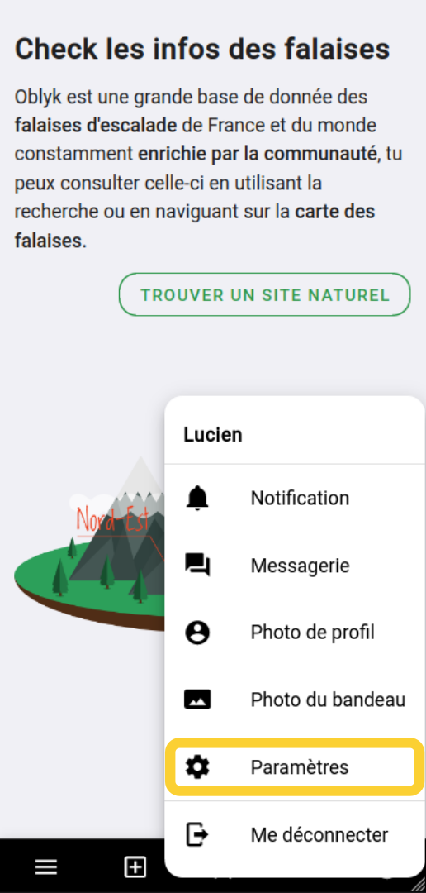

# Trouver mes paramètres

## Sur mobile

Cliquez sur l'icône de profil en bas à droit de l'écran puis cliquez sur "Paramètres"

{: .images .two}

## Sur ordinateur
Cliquez sur l'icône de profil en haut à gauche de l'écran puis sur "Paramètres"

{: .images}

