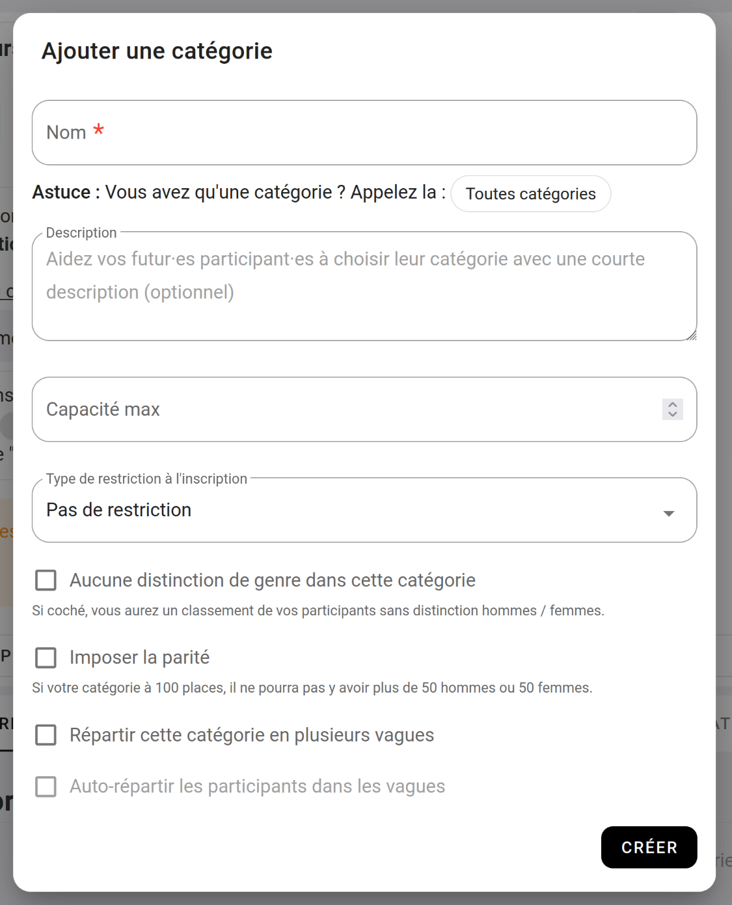

# Les catégories

Les catégories vous permet de différencier vos participants, et d'obtenir autant de classement que vous avez de catégorie.  
Si vous créez une catégorie Jeune, et une Catégorie Sénior, vous aurez un classement Jeune, et un classement Sénior. 
Avec à chaque fois la variante Homme et Femme qui sera faite automatiquement suivant le genre du participant.

La catégorie est la porte d'entrer de votre contest, c'est pour ça qu'il faut à minima en créer une.

Lorsque vous ajoutez une catégorie à votre contest, vous aurez un formulaire comme celui-ci :

{: .images }

Sur cette fenêtre, vous aurez les paramètres suivants :

**Le nom : (Obligatoire)**  
Le nom vous permet de nommer votre catégorie, exemple : Jeune, Sénior, U15, Loisir, etc.  
Si vous n'avez qu'une catégorie, nous vous suggérons de l'appeler "Toutes catégories"

**Description :**  
La description vous permet de mettre un petit message qui sera affiché à votre participant lors de leurs inscriptions.
Pour par exemple les orienter.

**Capacité maximum :**  
La capacité maximum vous permet de limiter le nombre de participants sur une catégorie.
Cette limite est pour l'ensemble des participants, si vous avez limité à 100, vous pourrez par exemple avoir maximum 80 hommes + 20 femmes.

_(voir la section : [La capacité](b-la-capacite) pour plus d'informations sur la gestion de la capacité)_

**Restriction :**  
Les restrictions vous permettre de mettre des règles d'âge. Par exemple votre catégorie "Jeune" vous pourriez vouloir la réserver au moins de 17 ans.

Vous aurez le choix entre :
- Age maximum / minimum pérsonnalisé : qui vous permet de choisir des classes d'âge non officiel.
- Les U6, U8, U10, etc. Suivant les UXX que vous ajoutez à votre contest le participant sera automatiquement inscrit dans l'une des catégories.

**Aucune distinction de genre dans cette catégorie :**  
Par défaut, vous aurez un classement "Homme" et un classement "Femme" pour chacune de vos catégories.
Vous pouvez cocher la case "Aucune distinction de genre" pour avoir un classement qui mélange homme et femme dans votre classement.

**Imposer la partité :**  
En cochant cette case, sur une catégorie de 100 places, vous aurez maximum 50 hommes, ou 50 femmes.  
Vous devez forcément définir une capacité et qu'elle soit paire pour activer cette fonctionnalité.

**Répartir cette catégorie en vagues :**  
Si vous cochez cette case, les participants de cette catégorie auront le choix entre plusieurs vagues.

**Auto-répartir les participants dans les vagues :**  
Si cochez vos participants n'auront pas le choix de leurs vagues, mais seront automatiquement inscrit dans la vague avec le moins de participant.

{: .text-right }
[L'inscription des participants](inscription-des-participants){: .btn }