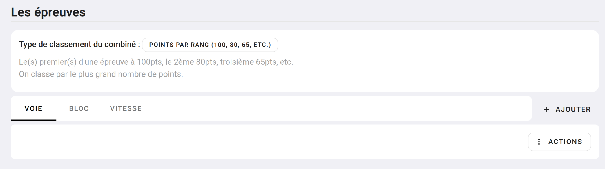
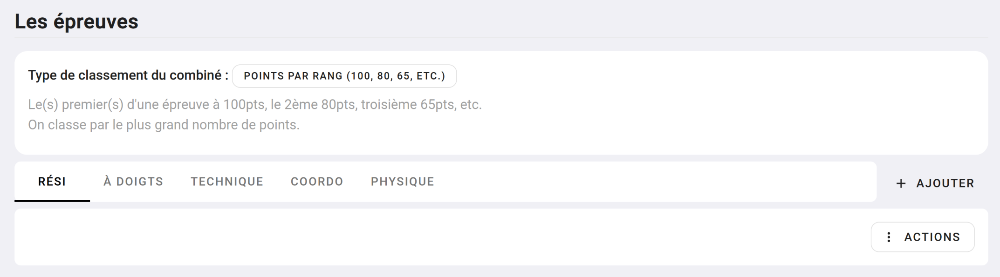
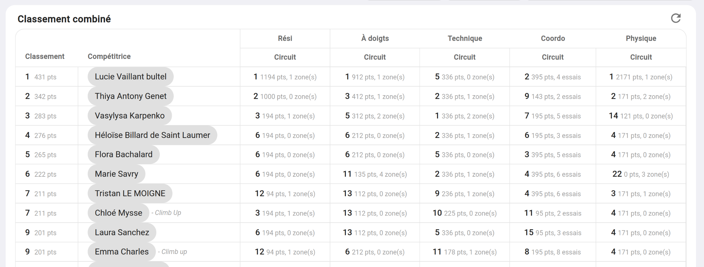

# Les combinés

Les combinés vous permettent de faire plusieurs épreuves au sein du même contest. Celui ou celle qui se classe le mieux
dans les différentes épreuves remporte le classement général.

Les combinés sont constitué de 2 à X épreuves, même si habituellement un combiné est constitué de 3 épreuves : Voie + Bloc + Vitesse,
rien de vous limite à ça, vous pouvez construire un combiné de 5 épreuves de bloc pour faire, par exemple, des circuits par thématique.

Vous pouvez construire un combiné depuis n'importe quel contest, une fois passé les étapes de configuration de vos catégories et de vos vagues _(si vous en avez)_ 
vous pourrez ajouter des épreuves à votre contest.

Voici ce que vous devriez voir sur votre interface si vous faites un combiné Voie + Bloc + Vitesse : 

{: .images }

Ou plus original, un combiné de 5 épreuves de bloc

{: .images }

Qui vous donnera un classement qui ressemble à ça :

{: .images }

## Le classement d'un combiné

Le combiné à un classement par épreuve, par exemple, vous aurez un classement "Bloc", un classement "Voie", un classement "Vitesse".

Dans chaque épreuve, vous pourrez définir une ou plusieurs étapes avec leurs propres systèmes de point et donc de classement.

Vous pouvez ainsi avoir un combiné tel que :
- Épreuve de Bloc
  - Étape de bloc : 1000 points divisés par le nombre d'ascensions + zone
- Épreuve de Voie
  - Étape de voie : Prise la plus haute atteinte
- Épreuve de vitesse
  - Étape de vitesse : Meilleurs temps

Vos compétiteurs participent à chaque épreuve et étape, et se classe dans chacune d'elle.

Pour établir le classement général de vos différentes épreuves, il faut que vous choisissiez comment vous classer vos classements.

Vous aurez le choix entre quatre méthodes qui donne différents résultats en fonction de ce que vous souhaitez. Rendez-vous dans la prochaine section [le classement des combinés](classement-des-combines). 

{: .text-right }
[Classement des combinés](classement-des-combines){: .btn }