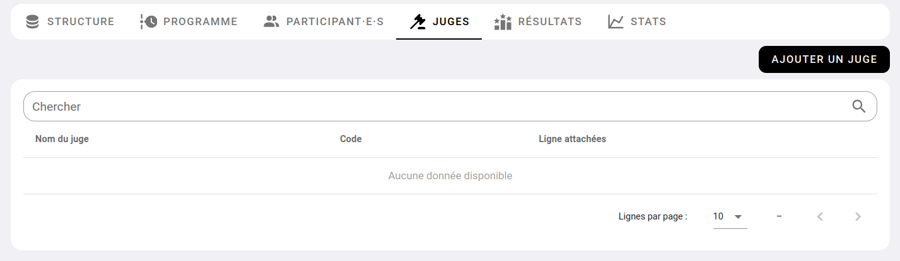
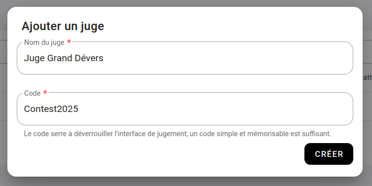
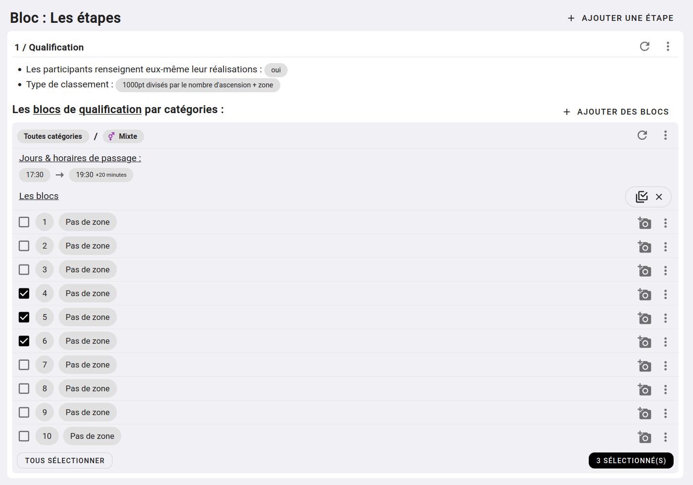
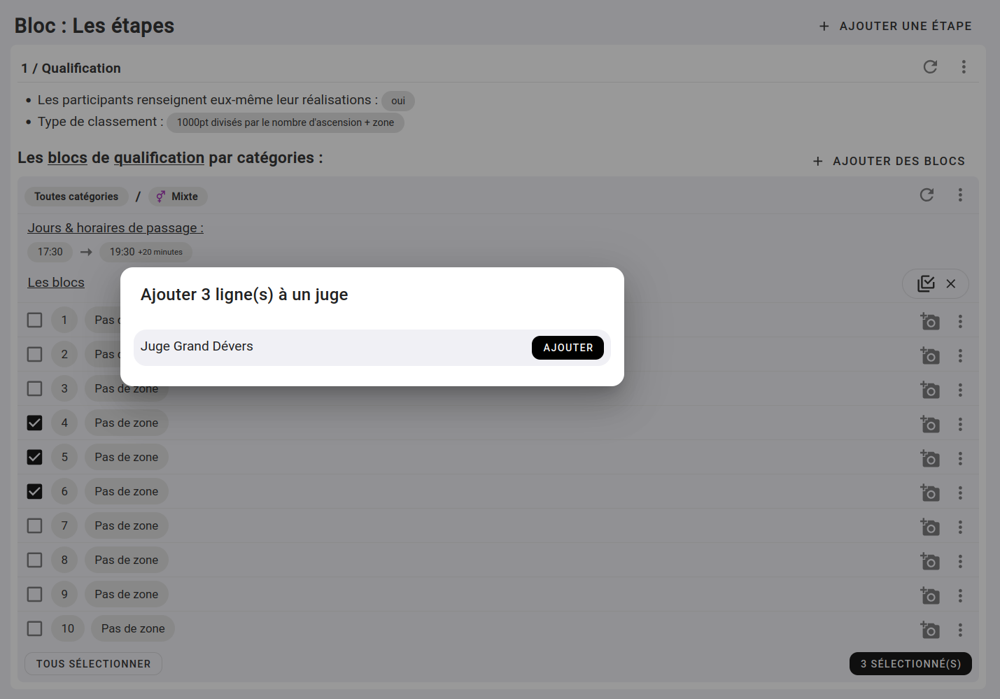
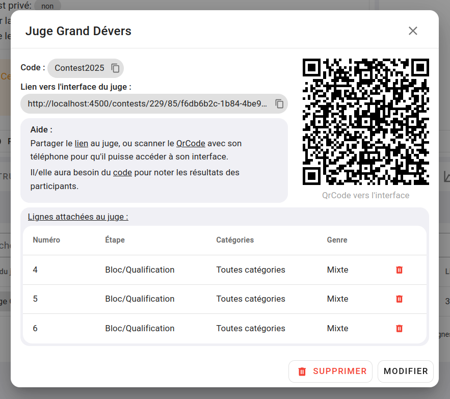
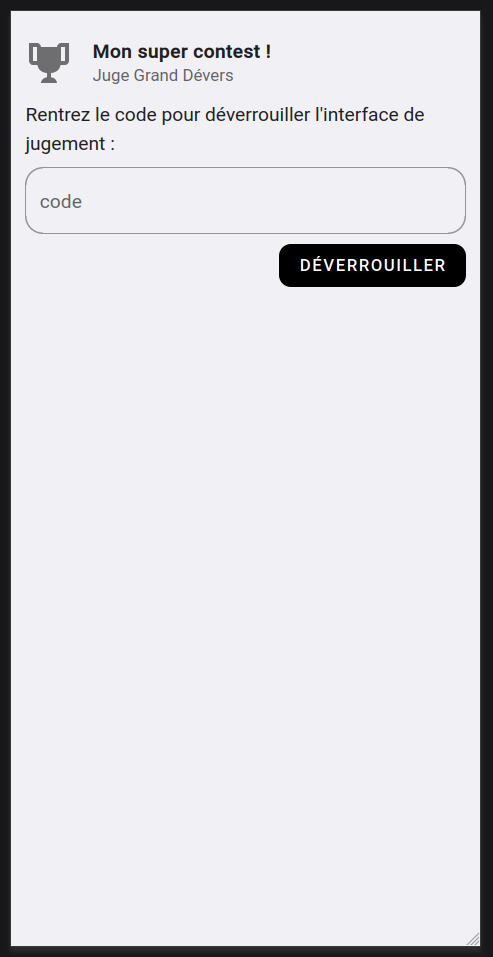
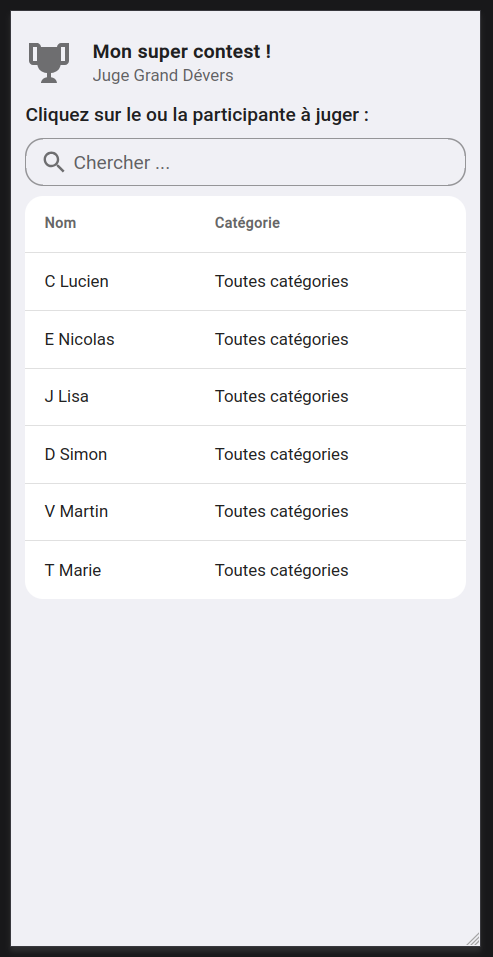
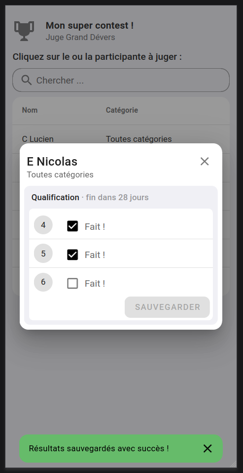

# Les juges

Les _"juges"_ ou _"interface de jugement"_ est une fonctionnalité qui vous permet de donner à un juge extérieur une liste de voies / blocs à juger sans qu'il ait besoin d'un compte Oblyk et sans qu'il ait besoin d'accéder à l'administration de votre contest.

## 1. Créer les juges

Pour créer un **"juge"** rendez-vous sur votre contest, puis allez dans l'onglet **"Juge"** et fait [AJOUTER UN JUGE](){: .black-btn }

{: .images }

Compléter la fenêtre avec les informations suivante :
- **Nom :** exemple : Juge Grand Dévers, Voie à 1 à 4, Marcel J., etc ;
- **Code :** donnez un code simple et mémorisable pour que le juge puisse déverrouiller son interface.

{: .images }

**Comment nommer votre juge ?**  

Selon l'organisation de votre contest, vous allez vouloir créer plus moins de juges, qui pourront juger plus ou moins de voies.
Donner un nom de juge qui vous permet de savoir rapidement ce que le juge va faire. Si vous avez des tables avec des numéros, sur lesquelles seront installer les juges, donner par exemple comme nom _"Table 1"_, _"Table 2"_, si c'est des secteurs : _"Dalle D"_, _"Proue"_, etc.

À vous de voir ce qu'il vous correspond le mieux à votre organisation.

**À quoi serre le code ?**

Chaque juge aura un lien unique pour accéder à son interface, ce lien est délibérément compliqué pour qu'il ne puisse pas être deviné facilement.
Exemple : oblyk.org/contests/229/85/f6db6b2c-1b84-4be9-8499-6eaa1ef11c52  
Chaque juge aura aussi un QRCode unique pour accéder à son interface.
Vous pourriez imprimer ce QrCode sur une fiche scotchée à la table de jugement par exemple. 
Hors si vous faites ça, n'importe qui qui flasherait le QrCode accéderait à l'interface. 

_C'est là qu'intervient le code de déverrouillage !_

Dans le cas où le lien "fuite" il faudra toujours le code pour pouvoir noter les réalisations des participants.

C'est pourquoi le code ne doit pas être facilement devinable, mais n'a pas besoin d'être extrêmement complex.

## 3. Ajouter les voies/blocs aux juges.

Une fois votre juge créé, il faut lui affecter les voies/blocs de votre contest.

Pour ça, rendez-vous sur l'onglet **"Structure"** de votre contest.

Dans la liste des blocs / voies de votre contest, trouvez un icon de deux case à cocher superposé en haut à droit de la liste des voies.

Cliquez dessus et sélectionner les blocs/voies que vous souhaitez ajouter à votre juge.

{: .images }

Une fois sélectionné, cliquez sur le bouton [X sélectionné(s)](){: .black-btn } qui est apparu en bas à droite de votre liste.

Sélectionnez **"Affécter à un juge"**, puis sélectionnez votre juge

{: .images }

Faite ainsi pour toutes les voies que vous voulez affécter à vos différents juges.

## 3. Donner à vos juges l'accès à leur interface

Pour donner à vos juges accès à leur interface, aller dans l'onglet **"Juges"** de votre contest, et cliquez sur le nom d'un juge.

Vous tomberez sur une fenêtre telle que celle-ci :

{: .images }

Sur cette fenêtre, vous retrouvez les infos de votre juge, comme le nom, le code, la liste des voies qu'il peut juger, etc.

Mais vous trouverez aussi : 
- **un lien**, que vous pouvez copier et envoyer au juge correspondant.
- **un QrCode** que peut scanner votre juge directement.

Dans les deux cas, votre juge arrivera sur une interface telle que celle-ci :

{: .images }

Une fois le code rentré et l'interface déverrouillée, le juge aura accès à la liste des participants qui sera amené à juger.

{: .images }

Le juge peut filtrer la liste en tapant le nom du participant, puis selectionner le compétiteur à juger.

Une fenêtre s'ouvre, et donne accès aux voies que peut juger le juge. Il pourra noter le résultat et sauvegarder.  

{: .images }

## 4. Conclusion

Vous venez de voir comment créer et configurer les juges de votre interface, ainsi que ce qu'ils seront amené à voir dans leur interface dédiée.

{: .text-right }
[Table des matières](/docs/indoor/contest){: .btn }