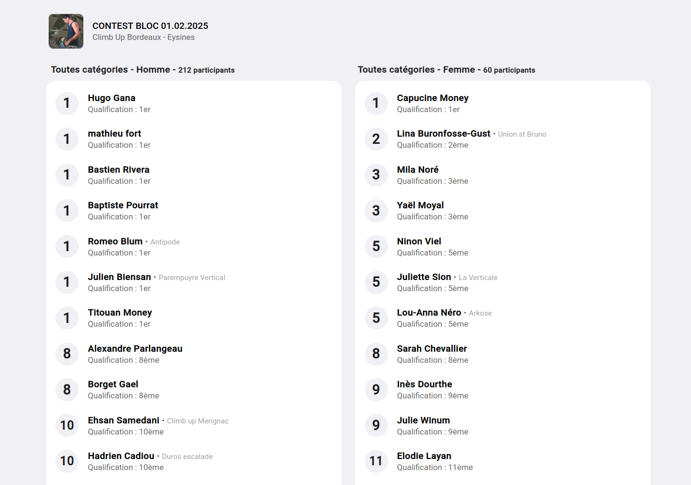

# Les résultats en directe

La page en directe est une page connectée en temps réel à votre contest. Chaque fois qu'un participant met à jour ses résultats,
la page du classement se met à jour aussi et anime le nouveau classement de votre compétition.

Vous pouvez trouver la page de classement en directe sur la page d'administration de votre contest en cliquant sur (RÉSULTAT EN DIRECT)

Vous pouvez présenter cette page sur un écran, ou la projeter sur une toile ou un mur.

Exemple d'une page en directe :

{: .images }

{: .text-right }
[La tombola](tombola){: .btn }