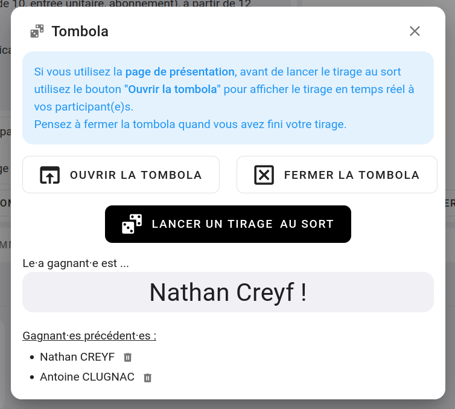

# La tombola

La tombola est un petit module qui vous permet de tirer au sort parmi vos participants.

Pour ouvrir la tombola aller sur la page d'administration de votre contest et cliquer sur (TOMBOLA)

Une fenêtre telle que celle-ci s'ouvrira :

{: .images }

Si vous avez plusieurs vagues et/ou catégorie, vous pourrez affiner votre tirage.

Les participants que vous tirez au sort sont sauvegardé pour ne pas être tiré deux fois.

Si vous avez une page en directe d'affichée, vous pouvez affiche le tirage de la tombola en directe dessus aussi. 

{: .text-right }
[Les combinés](les-combines){: .btn }