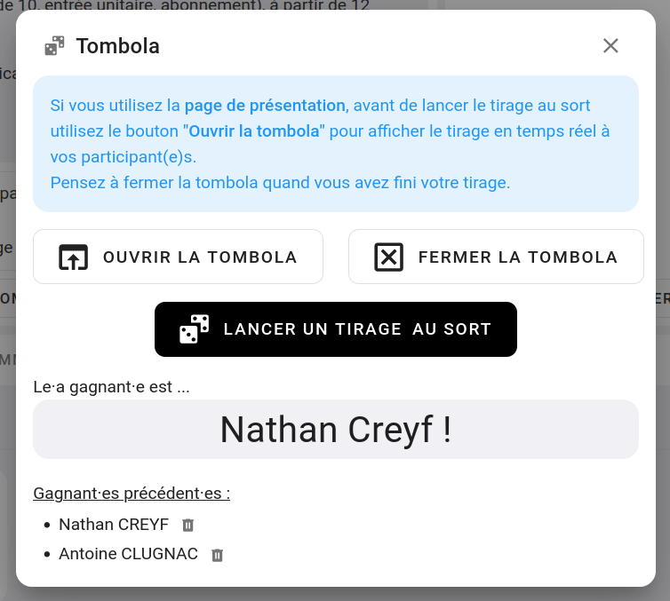

# La tombola

La tombola est un petit module qui vous permet de tirer au sort parmi vos participants.

Pour ouvrir la tombola, allez sur la page d'administration de votre contest et cliquez sur (TOMBOLA).

Une fenêtre telle que celle-ci s'ouvrira :

{: .images }

Si vous avez plusieurs vagues et/ou catégories, vous pourrez affiner votre tirage.

Les participants que vous tirez au sort sont sauvegardés pour ne pas être tirés deux fois.

Si vous avez une page en direct affichée, vous pouvez afficher le tirage de la tombola en direct dessus aussi. 

{: .text-right }
[Les combinés](les-combines){: .btn }
