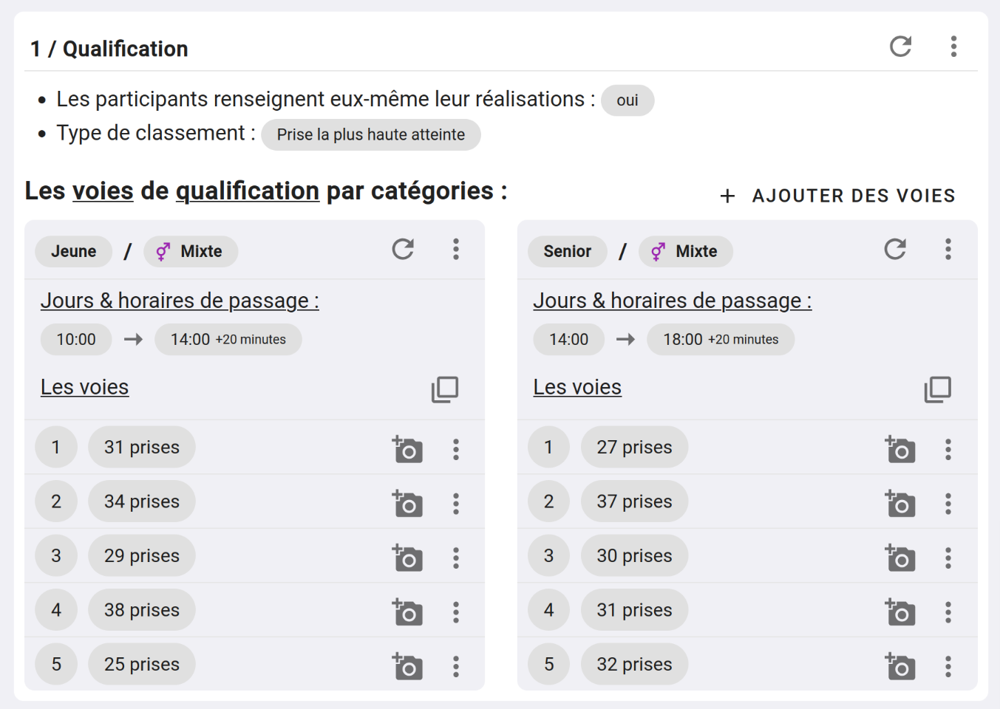

# Tuto - Contest combiné Voie + Bloc + Vitesse 

Dans ce tutoriel, nous allons voir comment créer un contest qui combine trois épreuves, que seront : Voie + Bloc + Vitesse.  
Chaque épreuve aura son système de points, vous obtiendrez un classement par épreuve, et le gagnant/gagnante sera celui qui se classe le mieux dans le 3 épreuves.

## 1. Créez votre contest

Rendez-vous sur le dashboard de votre salle, cliquez sur [CONTEST](){: .black-btn } puis faite : [NOUVEAU CONTEST](){: .black-btn }  
Vous arriverez sur ce formulaire :

{: .images }

Renseigner à minima :
- **Un titre :** Exemple "Contest fin d'année".
- **Date de début et fin du contest :** La date du jour de votre contest.
- **Date de début et fin des inscriptions :** La période sur laquelle vous autorisez les inscriptions à votre contest.
- **Type de catégorisation :** choisissez "Catégorisation personnalisée (loisir, expert, etc.)"

Laissez le reste des informations par défaut.

## 2. Créez votre catégorie

Même si vous ne voulez pas faire de catégorie différente _(comme dans le cadre de ce tuto)_, il faut quand même créer une catégorie.

Dans le bandeau **"Les catégories"** faite [+ AJOUTER](){: .light-btn } :

Cette fenêtre s'ouvre :

{: .images }

Renseignez **"Toutes catégories"** dans le nom, laissez le reste des paramètres tel-quel, et cliquer sur [CRÉER](){: .black-btn }

## 3. Créer l'épreuve de voie

Dans le bandeau Épreuve, cliquez sur [+ AJOUTER](){: .light-btn }.

Dans la fenêtre qui s'ouvre :

{: .images }

Choisissez **"Voie"** dans **"Type d'escalade de l'épreuve"**, et fait [CRÉER](){: .black-btn }

## 4. Créez votre étape de qualification

Notre épreuve de voie aura deux étapes, une étape de **"Qualification"** et une étape de **"Finale"**, commençons par les qualifications.

Dans le bandeau **"Voie : Les étapes"** faite [+ AJOUTER UNE ÉTAPE](){: .light-btn }.

Cette fenêtre s'ouvre :

{: .images }

Quand le nom de l'étape, nous allons renseigner **"Qualification"** et nous choisissons **"Prise la plus haute atteinte"**.

## 5. Ajouter les voies

Il est temps d'ajouter les voies, pour ça cliquer sur [+ AJOUTER DES VOIES](){: .light-btn } dans le bandeau **"Les voies de qualifications par catégories"**.

Cette fenêtre s'ouvre :

{: .images }

Pour ce tuto, nous allons imaginer que l'épreuve de voie est composée de 5 voies.

Donc, nous allons compléter le formulaire de la manière suivante :

- **Nombre de voies à faire :** 5
- **À qui sont déstiné ces 5 voies :** Voies hommes et femmes
- **Ces 5 voies sont communes à quelles catégories :** Toutes catégories
- Remplissez ensuite le début et fin de l'étape, exemple de 10h à 18h

Pour chaque voie, vous devez renseigner le nombre de prises de la voie.

{: .images }

## 6. Ajouter l'épreuve de bloc

Comme pour la voie, cliquez sur [+ AJOUTER UNE ÉPREUVE](){: .light-btn }, dans la fenêtre qui s'ouvre, choisissez **"bloc"** dans le type d'épreuve.

## 7. Ajouter une étape pour l'épreuve de bloc

Dans le bandeau **"Bloc : Les étapes"**, cliquez sur [+ AJOUTER UNE ÉTAPE](){: .light-btn }, 

Dans la fenêtre qui s'ouvre, nommer votre étape Qualification, et choisissez **"1000 points divisés par le nombre d'ascensions + zone"**.

## 8. Ajouter les blocs

Comme nous l'avons fait pour la voie, cliquez sur [+ AJOUTER DES BLOCS](){: .light-btn }, dans la fenêtre qui s'ouvre :

{: .images }

Dans la liste des blocs qui sera créée, vous pouvez cocher les blocs qui ont une zone.

## 9. Créer l'épreuve de vitesse

Comme pour la voie et le bloc, créer une épreuve que vous nommerez **"Vitesse"**, puis créer une étape de qualification avec le mode **"Meilleurs temps"** pour le compte de point.

## 10. Ajouter les voies de vitesse

Faites [+ AJOUTER DES VOIES DE VITESSE](){: .light-btn } dans le bandeau **"Les voies de vitesse de qualifications par catégories"**

Et remplissez le formulaire suivant : 

{: .images }

- **Nombre de voies à faire :** 2
- **À qui sont déstiné ces 2 voies :** Voies hommes et femmes
- **Ces 2 voies sont communes à quelles catégories :** Toutes catégories
- Remplissez ensuite le début et fin de l'étape, exemple de 10h à 18h

Vous pouvez ensuite renommer les deux voies créées en **"bleu"** et **"rouge"** par exemple.

## 11. Choisissez comment sont classées vos épreuves

Vous remarquerez qu'une fois que vous avez plus d'une épreuve, une boîte à fait son apparition : **"Type de classement du combiné"**.

{: .images }

Par défaut le type de classement est **"Point par rang"**.

_Consulté la documentation [classement des combinés](classement-des-combines.html) pour en savoir plus._

## 12. Conclusion

Voilà, vous avez terminé votre contest !

Vous devriez avoir une structure qui ressemble à celle-ci :

{: .images }

{: .text-right }
[Tuto : Contest par équipe](tuto-contest-par-equipe){: .btn }