# Tuto - Contest de bloc 1000 points

Dans ce tutoriel, nous allons voir comment créer l'un des genres de contest le plus courant, un contest constitué de : une phase de qualification ou chaque bloc vaut 1000 points divisés par le nombre d'ascensions.  
Et une phase de finale où l'on compte le nombre d'essais pour atteindre la zone et le top.

## 1. Créez votre contest

Rendez-vous sur le dashboard de votre salle, cliquez sur [CONTEST](){: .black-btn } puis faite : [NOUVEAU CONTEST](){: .black-btn }  
Vous arriverez sur ce formulaire :

{: .images }
[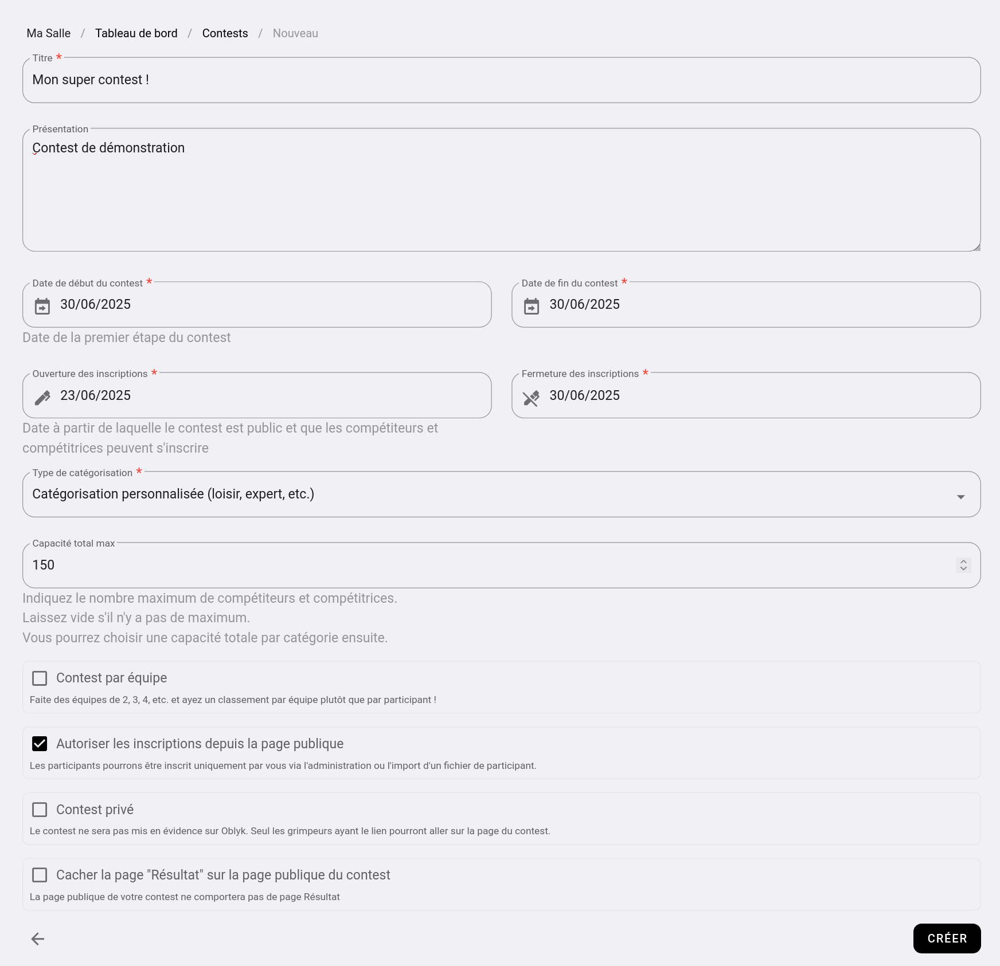](../../../assets/images/nouveau-contest_desktop.png)

Renseigner à minima :
- **Un titre :** Exemple "Contest fin d'année".
- **Date de début et fin du contest :** La date du jour de votre contest.
- **Date de début et fin des inscriptions :** La période sur laquelle vous autorisez les inscriptions à votre contest.
- **Type de catégorisation :** choisissez "Catégorisation personnalisée (loisir, expert, etc.)"

Laissez le reste des informations par défaut.

## 2. Créez votre catégorie

Même si vous ne voulez pas faire de catégorie différente _(comme dans le cadre de ce tuto)_, il faut quand même créer une catégorie.

Dans le bandeau "Les catégories" faite [+ AJOUTER](){: .light-btn } :

{: .images }
[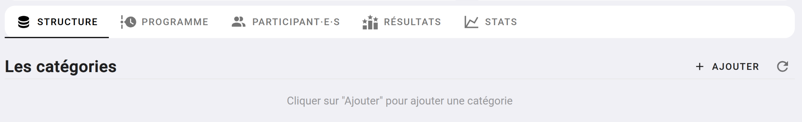](../../../assets/images/contest-nouvelle-categorie.png)

Cette fenêtre s'ouvre :

{: .images }
[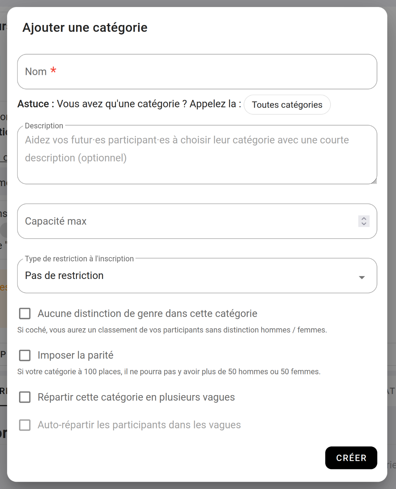](../../../assets/images/contest-nouvelle-categorie-popup.png)

Renseignez "Toutes catégories" dans le nom, laissez le reste des paramètres tel-quel, et cliquer sur [CRÉER](){: .black-btn }

## 3. Créez une épreuve

Oblyk vous permet de créer des combinés, dans le cadre de ce tuto, nous allons juste faire un contest d'une épreuve de bloc.

Dans le bandeau Épreuve, cliquez sur [+ AJOUTER](){: .light-btn }.

{: .images }
[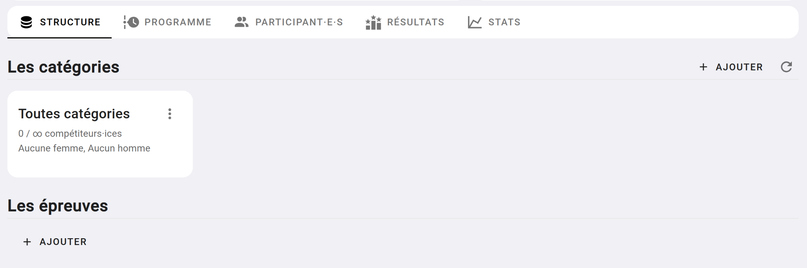](../../../assets/images/contest-nouvelle-epreuve.png)

Dans la fenêtre qui s'ouvre :

{: .images }
[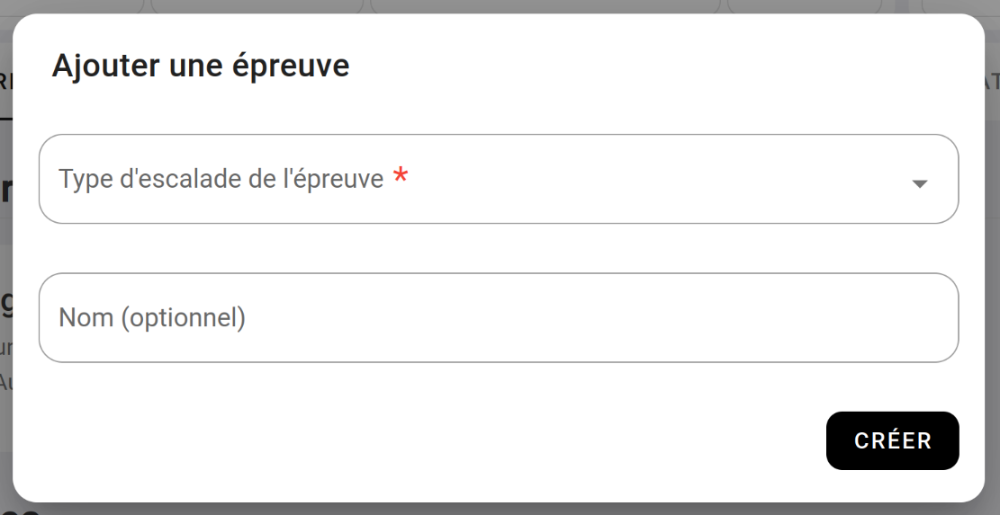](../../../assets/images/contest-nouvelle-epreuve-popup.png)

Choisissez **"Bloc"** dans **"Type d'escalade de l'épreuve"**, et fait [CRÉER](){: .black-btn }

## 4. Créez votre étape de qualification

Notre épreuve de bloc aura deux étapes, une étape de **"Qualification"** et une étape de **"Finale"**, commençons par les qualifications.

Dans le bandeau **"Bloc : Les étapes"** faite [+ AJOUTER UNE ÉTAPE](){: .light-btn }.

{: .images }
[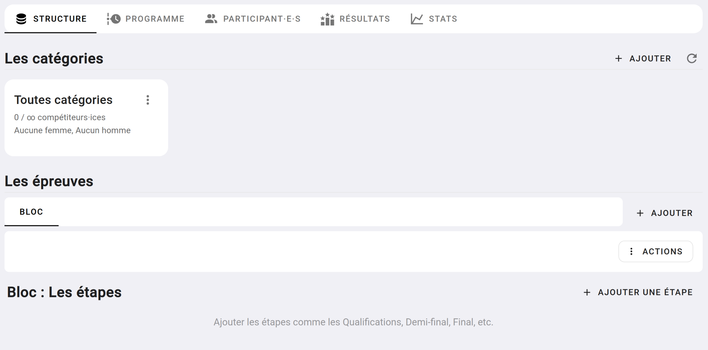](../../../assets/images/contest-nouvelle-etape.png)

Cette fenêtre s'ouvre :

{: .images }
[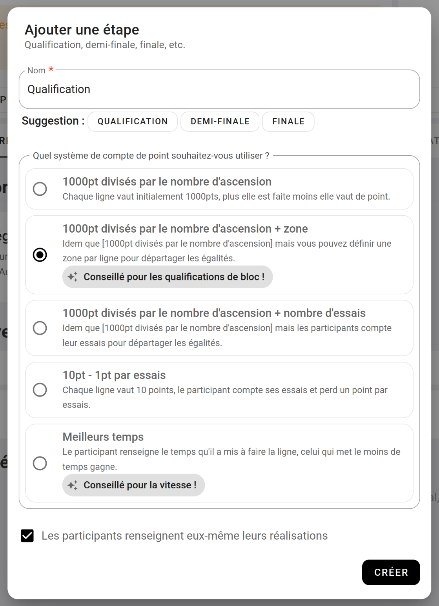](../../../assets/images/contest-nouvelle-etape-popup.png)

Quand le nom de l'étape, nous allons renseigner **"Qualification"** et nous choisissons **"1000pt divisé par le nombre d'ascensions + zone"**(*).  
En choisissant _"+ zone"_ vous pourrez stipuler quel bloc aura une zone. La zone ne vaut pas de point, mais elle permet de départager les égalités.

_* En savoir plus sur [les systèmes de classements](les-systemes-de-classements)_

## 5. Ajouter les blocs de qualification

Il est temps d'ajouter les blocs de qualifications, pour ça cliquer sur [+ AJOUTER DES BLOCS](){: .light-btn } dans le bandeau **"Les blocs de qualifications par catégories"**.

{: .images }
[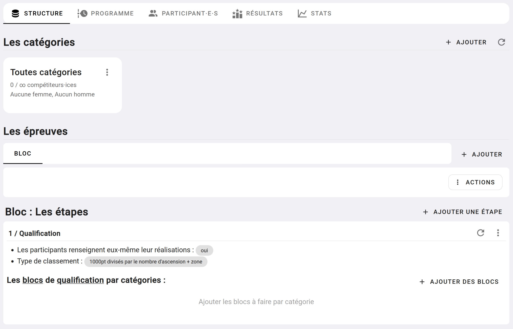](../../../assets/images/contest-nouveau-bloc.png)

Cette fenêtre s'ouvre :

{: .images }
[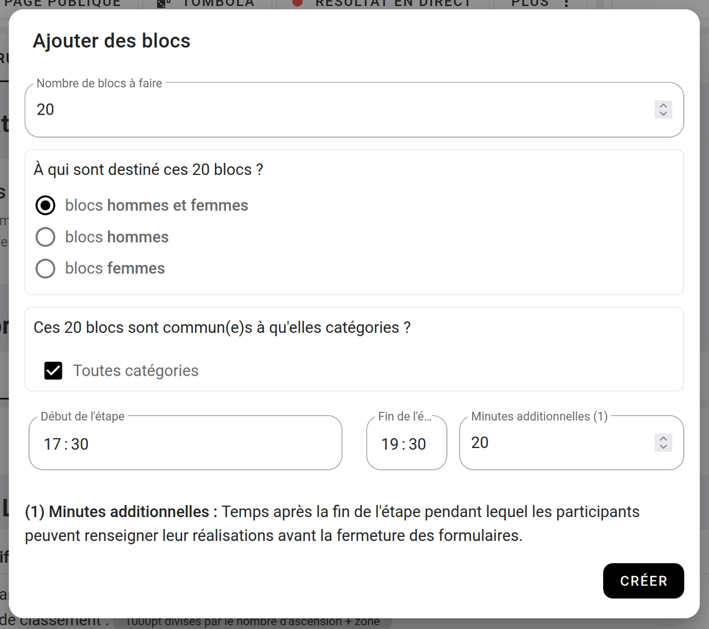](../../../assets/images/contest-nouveau-bloc-popup.png)

Ici, nous donnons le **nombre de blocs** qu'il y a dans notre qualification, les blocs sont fait par **les femmes et les hommes**, les blocs concernent notre unique **catégorie**, puis nous donnons la **plage horaire** pendant laquelle nos participants pourront grimper.

Une fois que vous aurez cliqué sur [CRÉER](){: .black-btn }

La liste de vos 20 blocs apparaîtra.

{: .images }
[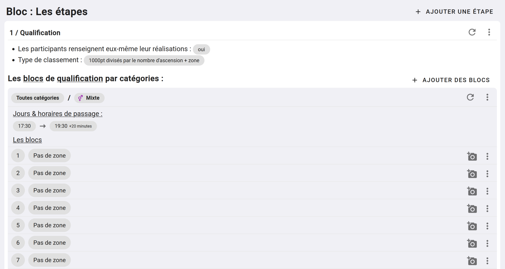](../../../assets/images/contest-les-blocs.png)

Pour chaque bloc, vous pouvez y **ajouter une photo**, en cliquant sur l'appareil photo à droite, et stipuler si ce **bloc à une zone**, en cliquant sur (Pas de zone) 

## 6. Ajouter les blocs de final

Maintenant que nous avons nos blocs de qualifications, nous allons créer notre final.

On remonte dans la page jusqu'à trouver le bandeau **"Bloc : Les Étapes"** et on re-clique sur [+ AJOUTER UNE ÉTAPE](){: .light-btn }

Cette fenêtre s'ouvre :

{: .images }
[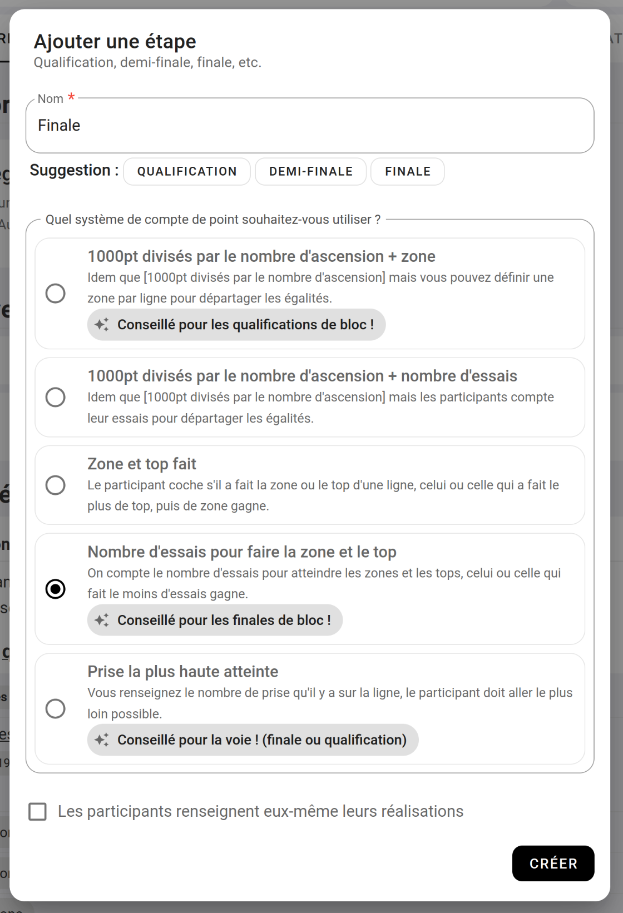](../../../assets/images/contest-finale-bloc.png)

Cette fois-ci, notre étape s'appelle **"Finale"**, nous choisissons le système de compte **"Nombre d'essais pour faire la zone et le top"**  
Et on décoche **"[ ] Les participants renseignent eux-mêmes leurs réalisations"**.

Une fois notre étape créée, on se rend en bas de notre page et on clique sur [+ AJOUTER DES BLOCS](){: .light-btn }

{: .images }
[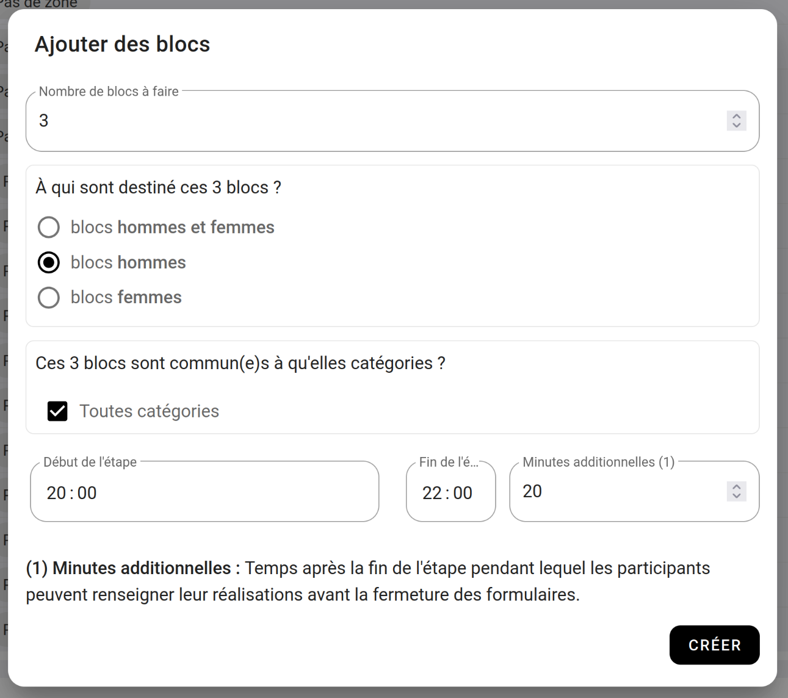](../../../assets/images/contest-bloc-finale-popup.png)

À la différence des qualifications, on va ajouter **3 blocs hommes**, puis **3 blocs femmes**.

Donc, répétez deux fois l'opération, une fois pour les blocs hommes, et une fois pour les blocs femmes.

Et vous devriez vous retrouver avec des finales qui ressemblent à ça :

{: .images }
[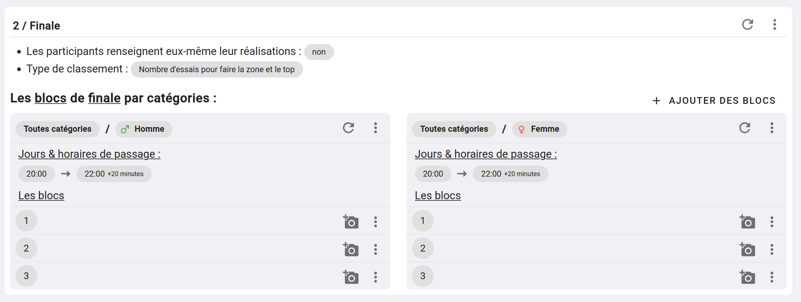](../../../assets/images/contest-bloc-finale-homme-femme.png)

## 7. Conclusion

Nous avons fini de paramétrer notre contest !

Votre page devrait ressembler à ça :

{: .images }
[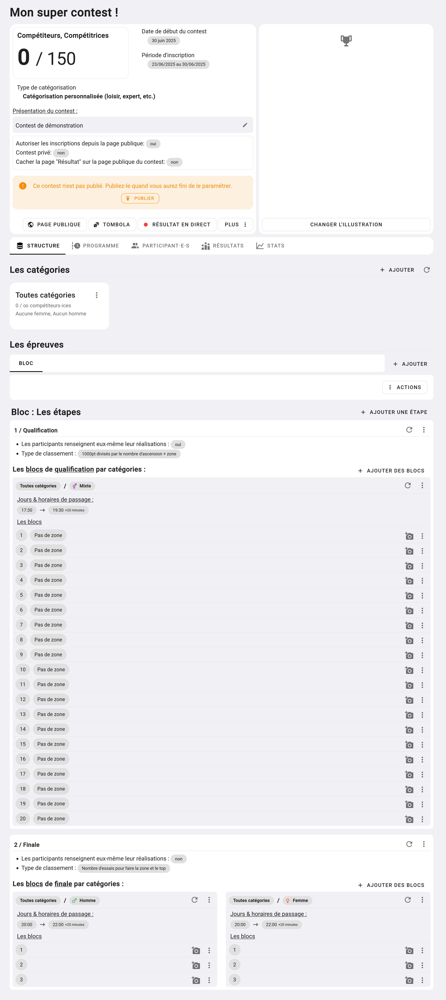](../../../assets/images/contest-tuto-1-overview.jpg)

Si la structure vous semble correcte, vous pouvez **"Publier"** votre contest pour que les futurs participants puissent s'inscrire.

{: .text-right }
[Tuto : Contest de voie](tuto-contest-voie){: .btn }
