# Tuto - Contest de bloc 1000 points

Dans ce tutoriel, nous allons voir comment créer l'un des types de contest les plus courants : un contest constitué d'une phase de qualification où chaque bloc vaut 1000 points divisés par le nombre d'ascensions, et d'une phase de finale où l'on compte le nombre d'essais pour atteindre la zone et le top.

## 1. Créez votre contest

Rendez-vous sur le dashboard de votre salle, cliquez sur [CONTEST](){: .black-btn } puis faites [NOUVEAU CONTEST](){: .black-btn }  
Vous arriverez sur ce formulaire :

{: .images }

Renseignez à minima :
- **Un titre :** Exemple "Contest fin d'année".
- **Date de début et fin du contest :** La date du jour de votre contest.
- **Date de début et fin des inscriptions :** La période sur laquelle vous autorisez les inscriptions.
- **Type de catégorisation :** choisissez "Catégorisation personnalisée (loisir, expert, etc.)"

Laissez le reste des informations par défaut.

## 2. Créez votre catégorie

Même si vous ne voulez pas faire de catégories différentes _(comme dans ce tuto)_, il faut quand même créer une catégorie.

Dans le bandeau **"Les catégories"**, faites [+ AJOUTER](){: .light-btn } :

{: .images }
[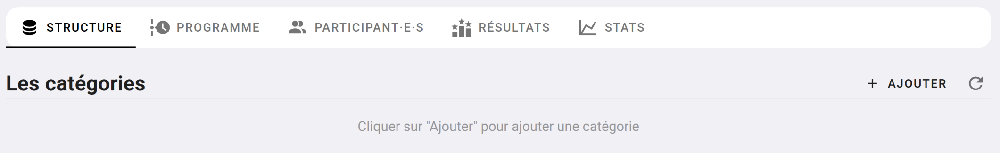](../../../assets/images/contest-nouvelle-categorie.png)

Cette fenêtre s'ouvre :

{: .images }
[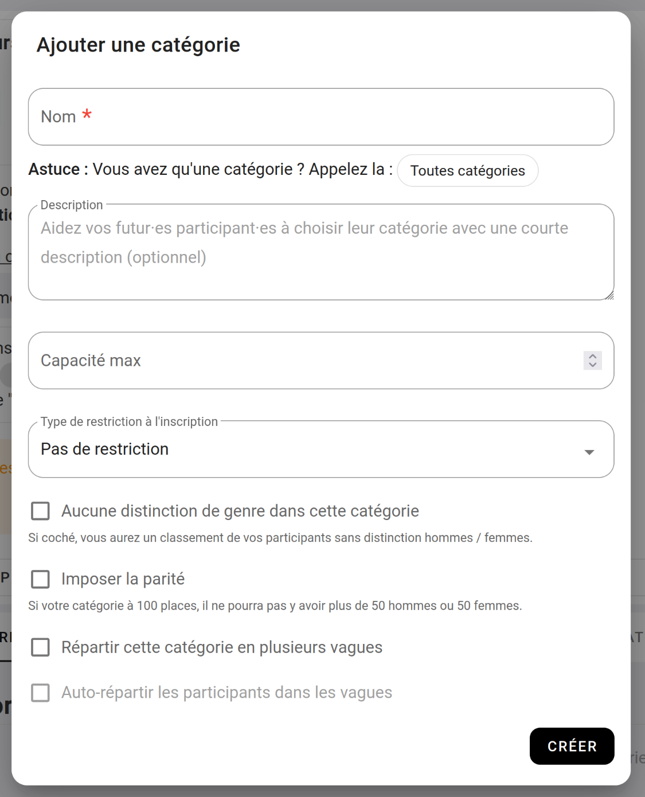](../../../assets/images/contest-nouvelle-categorie-popup.png)

Renseignez **"Toutes catégories"** dans le nom, laissez le reste des paramètres tel quel, et cliquez sur [CRÉER](){: .black-btn }

## 3. Créez une épreuve

Oblyk vous permet de créer des combinés, dans le cadre de ce tuto, nous allons juste faire un contest d'une épreuve de bloc.

Dans le bandeau **Épreuve**, cliquez sur [+ AJOUTER](){: .light-btn } :

{: .images }
[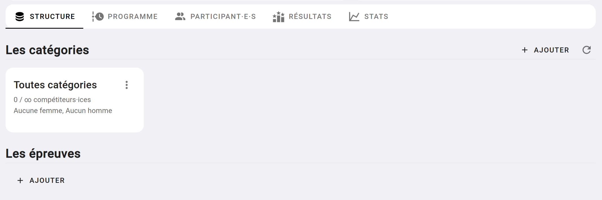](../../../assets/images/contest-nouvelle-epreuve.png)

Dans la fenêtre qui s'ouvre :

{: .images }

Choisissez **"Bloc"** dans **"Type d'escalade de l'épreuve"**, et faites [CRÉER](){: .black-btn }

## 4. Créez votre étape de qualification

Notre épreuve de bloc aura deux étapes : **"Qualification"** et **"Finale"**, commençons par les qualifications.

Dans le bandeau **"Bloc : Les étapes"**, faites [+ AJOUTER UNE ÉTAPE](){: .light-btn } :

{: .images }
[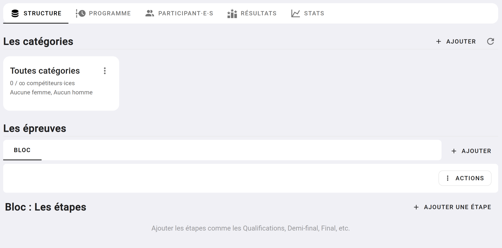](../../../assets/images/contest-nouvelle-etape.png)

Cette fenêtre s'ouvre :

{: .images }

Pour le nom de l'étape, renseignez **"Qualification"** et choisissez **"1000 pt divisés par le nombre d'ascensions + zone"** (*).  
En choisissant _"+ zone"_, vous pourrez stipuler quels blocs auront une zone. La zone ne vaut pas de point mais permet de départager les égalités.

_* En savoir plus sur [les systèmes de classement](les-systemes-de-classements)_

## 5. Ajouter les blocs de qualification

Cliquez sur [+ AJOUTER DES BLOCS](){: .light-btn } dans le bandeau **"Les blocs de qualifications par catégories"** :

{: .images }
[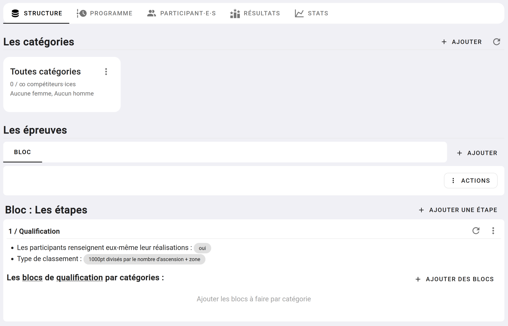](../../../assets/images/contest-nouveau-bloc.png)

Cette fenêtre s'ouvre :

{: .images }
[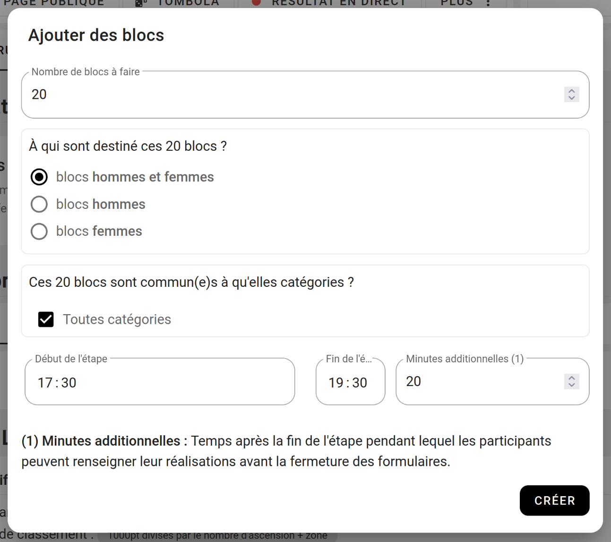](../../../assets/images/contest-nouveau-bloc-popup.png)

Ici, renseignez :
- le **nombre de blocs** de votre qualification,
- les blocs sont destinés à **hommes et femmes**,
- la **catégorie concernée** (ici unique),
- la **plage horaire** pendant laquelle les participants grimperont.

Cliquez sur [CRÉER](){: .black-btn }

La liste de vos blocs apparaît :

{: .images }
[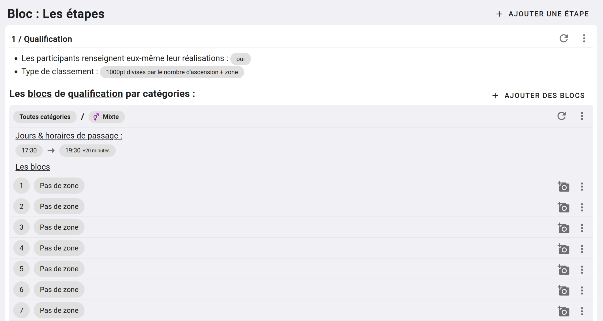](../../../assets/images/contest-les-blocs.png)

Pour chaque bloc, vous pouvez ajouter une **photo**, et indiquer si ce **bloc a une zone**, en cliquant sur (Pas de zone).

## 6. Ajouter les blocs de finale

Dans le bandeau **"Bloc : Les Étapes"**, cliquez sur [+ AJOUTER UNE ÉTAPE](){: .light-btn } pour créer la finale.

{: .images }
[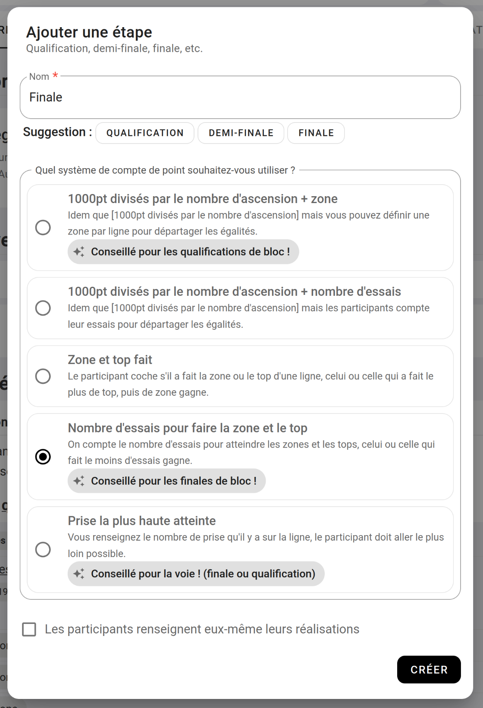](../../../assets/images/contest-finale-bloc.png)

Nom de l'étape : **"Finale"**, système de comptage : **"Nombre d'essais pour faire la zone et le top"**, et décochez **"[ ] Les participants renseignent eux-mêmes leurs réalisations"**.

Cliquez ensuite sur [+ AJOUTER DES BLOCS](){: .light-btn } :

{: .images }
[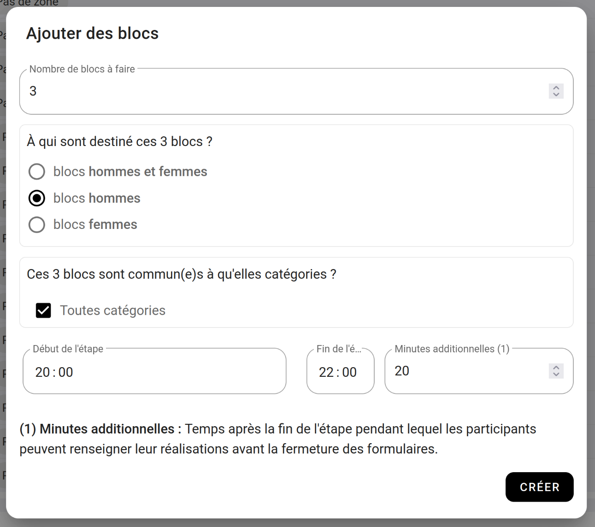](../../../assets/images/contest-bloc-finale-popup.png)

Ajoutez **3 blocs hommes**, puis **3 blocs femmes**.

Votre finale devrait ressembler à ceci :

{: .images }
[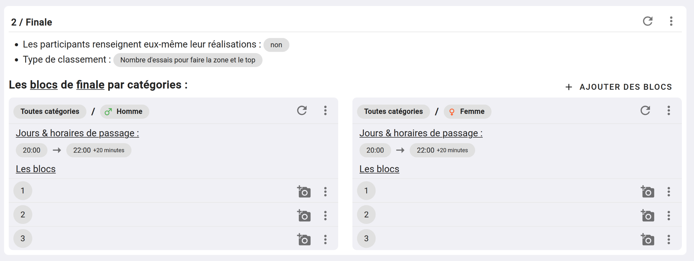](../../../assets/images/contest-bloc-finale-homme-femme.png)

## 7. Conclusion

Votre contest est maintenant paramétré !

La page devrait ressembler à ceci :

{: .images }
[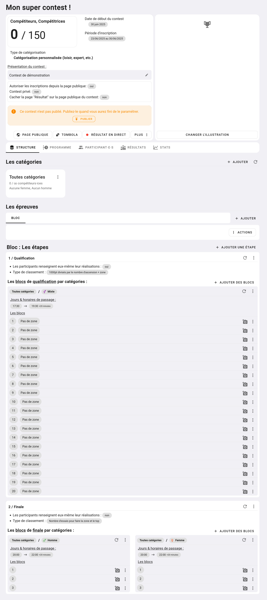](../../../assets/images/contest-tuto-1-overview.jpg)

Si la structure vous semble correcte, vous pouvez **Publier** votre contest pour permettre les inscriptions.

{: .text-right }
[Tuto : Contest de voie](tuto-contest-voie){: .btn }
