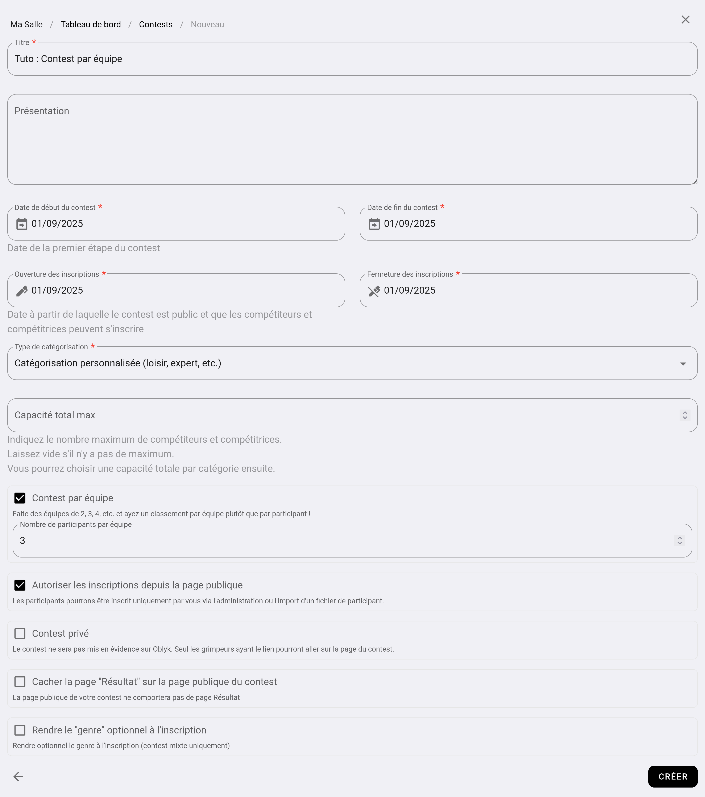
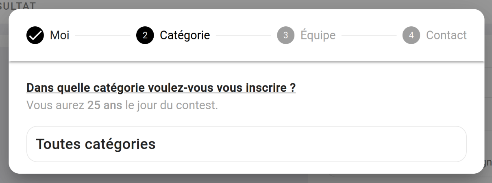
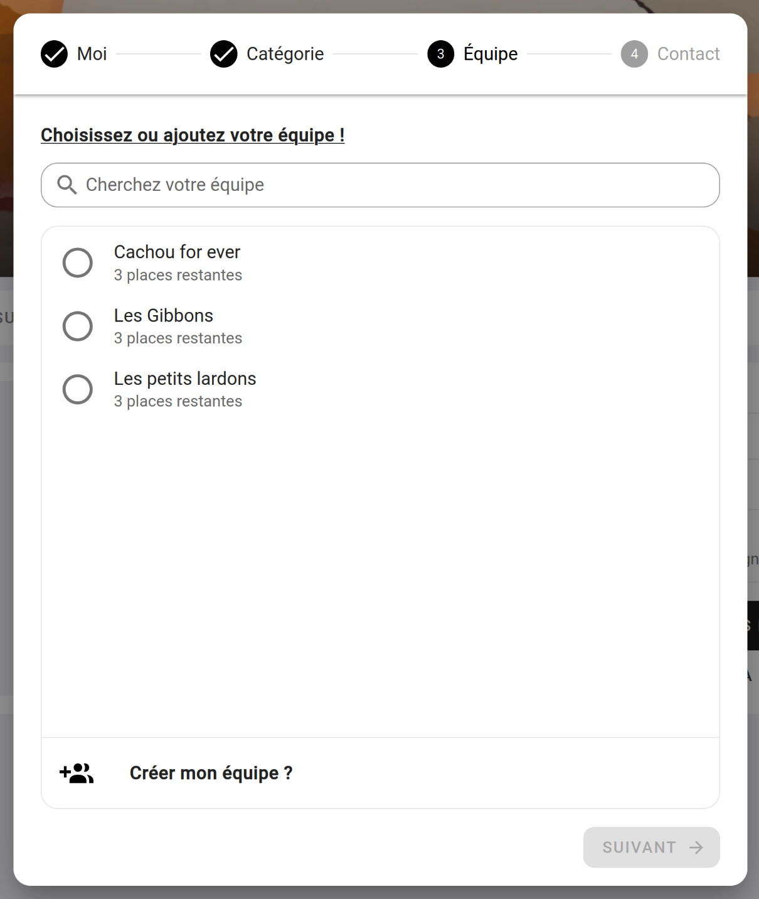
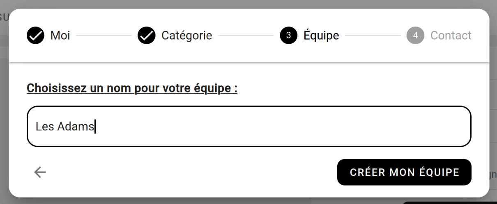
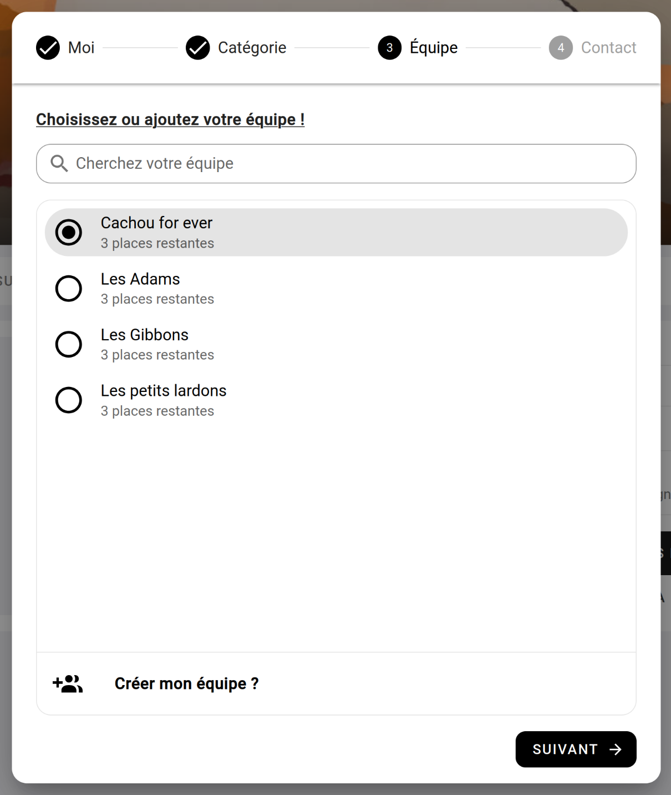
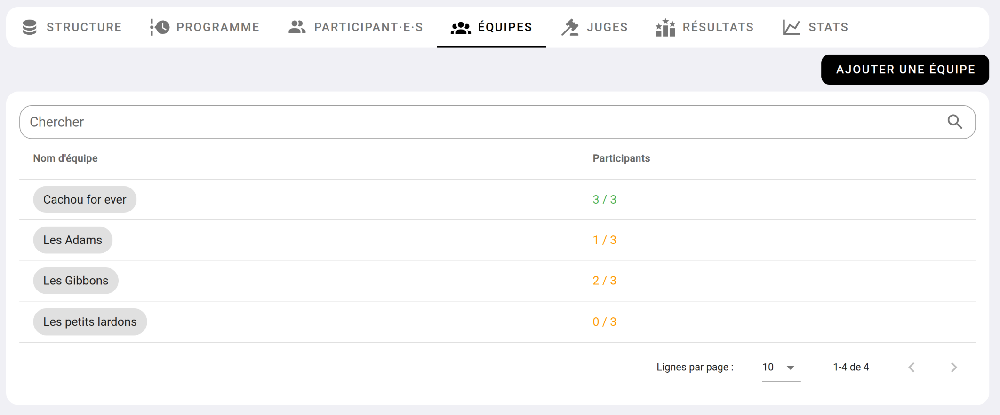
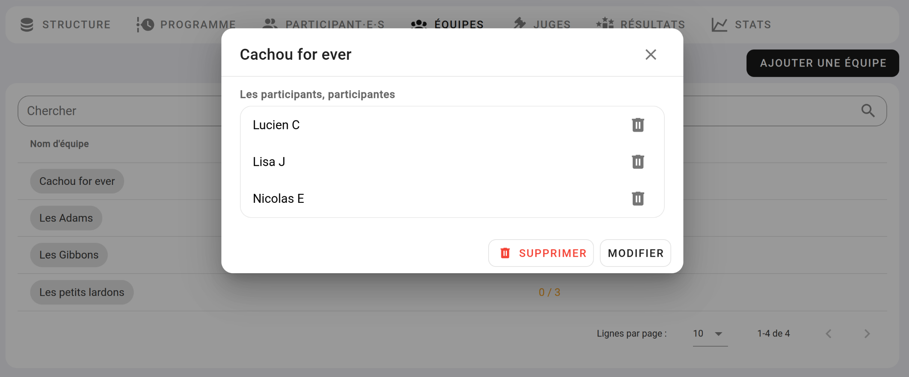
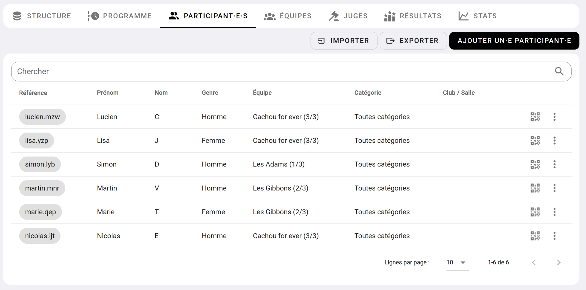
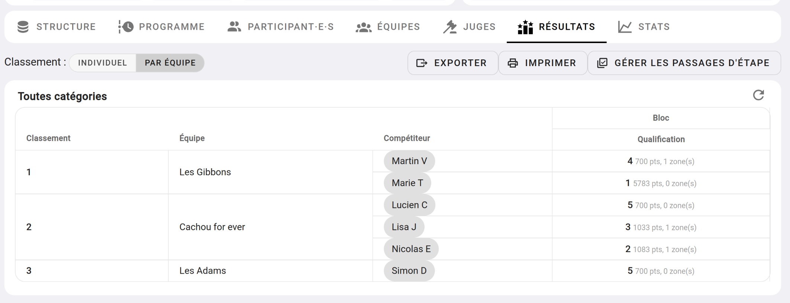
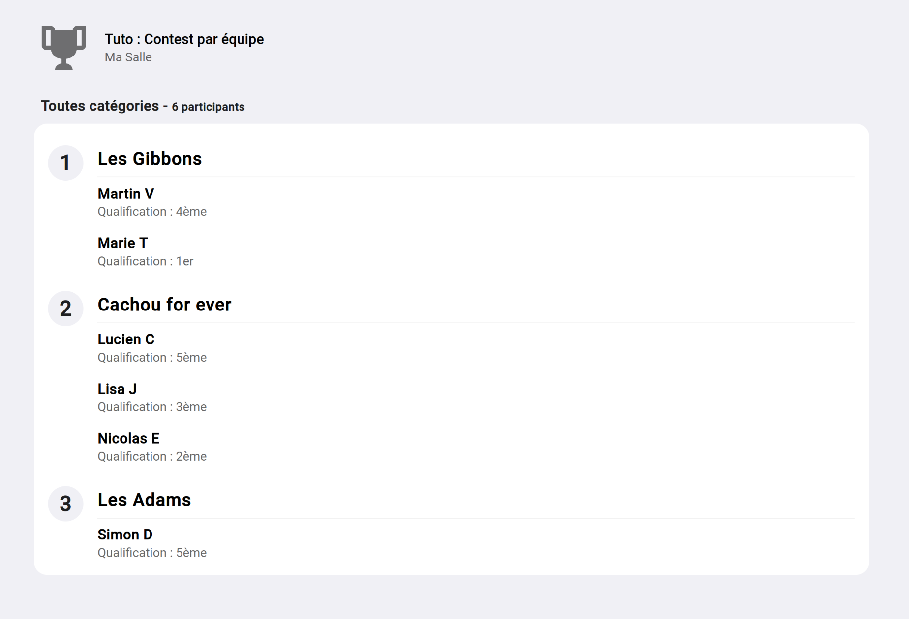

# Tuto - Contest par équipe 

Les contests par équipe vous permettent de créer facilement un contest dans lequel vos compétiteurs se groupent en binôme, trinôme, etc.  
Le résultat final sera un classement par équipe.

## 1. Créez votre contest

Rendez-vous sur le dashboard de votre salle, cliquez sur [CONTEST](){: .black-btn } puis faite : [NOUVEAU CONTEST](){: .black-btn }  
Vous arriverez sur ce formulaire :

{: .images }

Renseigner à minima :
- **Un titre :** Exemple "Contest par équipe".
- **Date de début et fin du contest :** La date du jour de votre contest.
- **Date de début et fin des inscriptions :** La période sur laquelle vous autorisez les inscriptions à votre contest.
- **Type de catégorisation :** choisissez "Catégorisation personnalisée (loisir, expert, etc.)"
- **Contest par équipe :** cocher cette case.
- **Nombre de participants par équipe :** choisissez le nombre de participants par équipe, par exemple 3.

Laissez le reste des informations par défaut.

## 2. Créer votre contest de bloc 

Dans le cadre de ce toto, nous allons créer un contest de bloc de 1000 points divisé par le nombre d'ascensions avec une seule catégorie.

Suivez le tutoriel [contest de bloc](tuto-contest-bloc-1000-points) de l'étape 2 à 6 pour créer la structure de votre contest. 

## 3. Comment vos participants rejoignent ou ajoutent leur équipe ?

À l'inscription, les participants passent par 4 étapes

**Étape 1 : Nom, prénom, date de naissance**

Première étape, on demande au futur participant de renseigner son : nom, prénom, date de naissance et finalement son genre.

{: .images }

**Étape 2 : Choix de la catégorie**

Deuxième étape, on demande la catégorie, dans notre cas, il y en a qu'une seule.

{: .images }

**Étape 3 : Choix ou création de l'équipe**

Après avoir sélectionné la catégorie, le participant va arriver sur cette page :

{: .images }

Soit le participant choisit une équipe existante, soit il crée une nouvelle équipe.

Par exemple, s'il veut créer une équipe, il clique sur **Créer mon équipe ?**

Il renseigne le nom de son équipe et valide

{: .images }

Soit, il choisit l'équipe créée par son coéquipier avant lui.

{: .images }

**Étape 4 : Valider l'inscription**

Enfin, le participant valide l'inscription en renseignant son email.

{: .images }

## 4. En tant qu'administrateur du contest

En tant qu'administrateur du contest, vous avez la main pour ajouter, supprimer, modifier une équipe, ainsi que déplacer ou affecter un participant à une équipe.

Pour gérer les équipes de votre contest, rendez-vous sur la page d'administration du contest, et allez dans l'onglet **"Équipes"**.

{: .images }

En cliquant sur une équipe, vous pouvez supprimer des participants, modifier le nom de l'équipe ou la supprimer.

{: .images }

Dans l'onglet **"Participant·e·s"**, vous retrouverez les participants et leur équipe.

{: .images }

## 5. Le classement

Pour classer les équipes, Oblyk fait la somme des points des participants de chaque équipe. L'équipe qui a le plus de points prend la tête !

Exemple de classement :

{: .images }

Le classement en directe sera aussi organisé par équipe.

{: .images }

## 6. Conclusion

Vous venez de voir comment créer un contest de bloc par équipe !  
Mais le contest par équipe peut être fait sur tous les modes de contest, comme les combinés ou les contests de voie. 

{: .text-right }
[Tuto : Contest par vague](tuto-contest-par-vague){: .btn }
