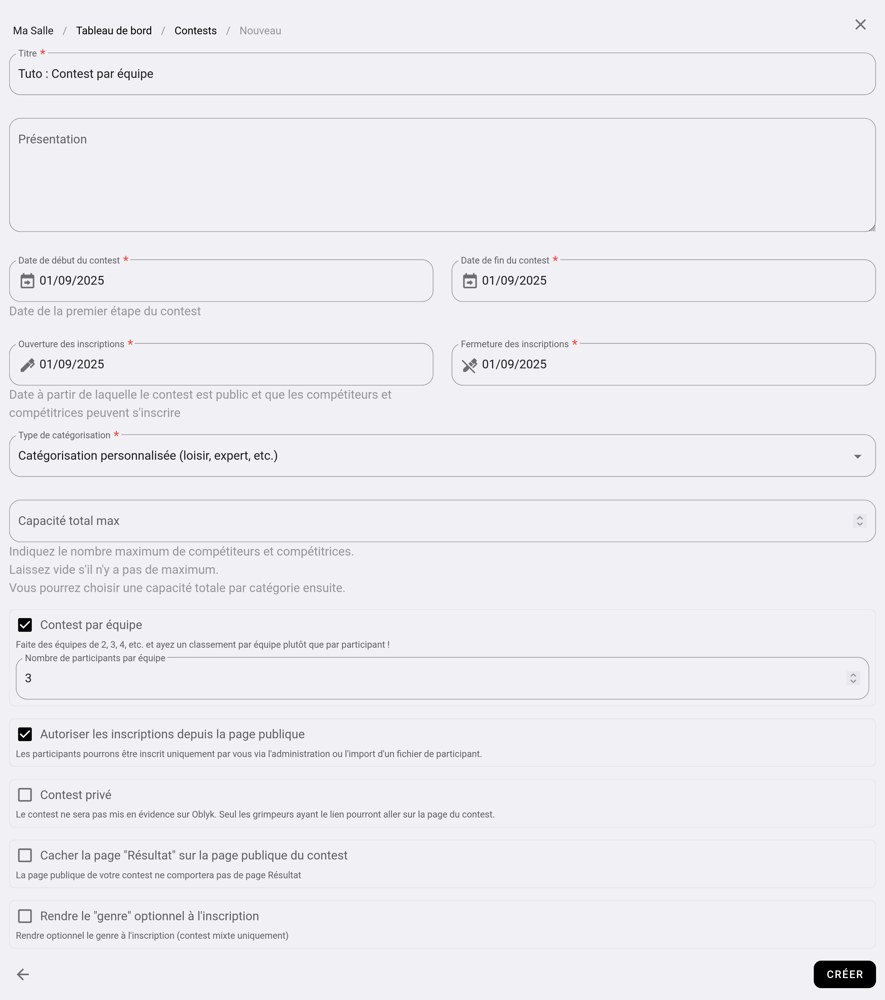
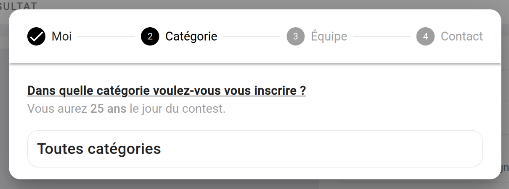
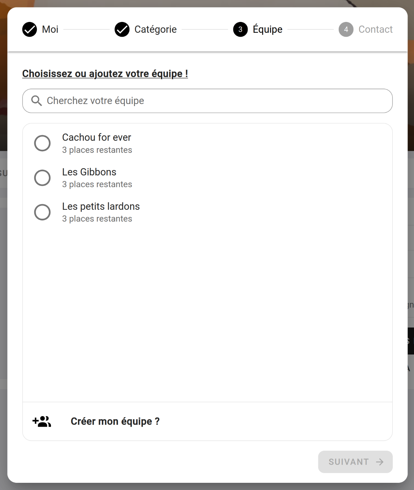
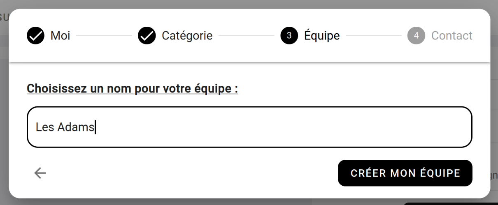
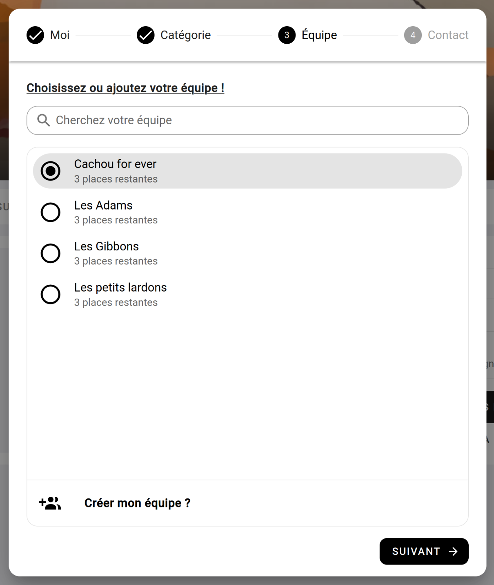
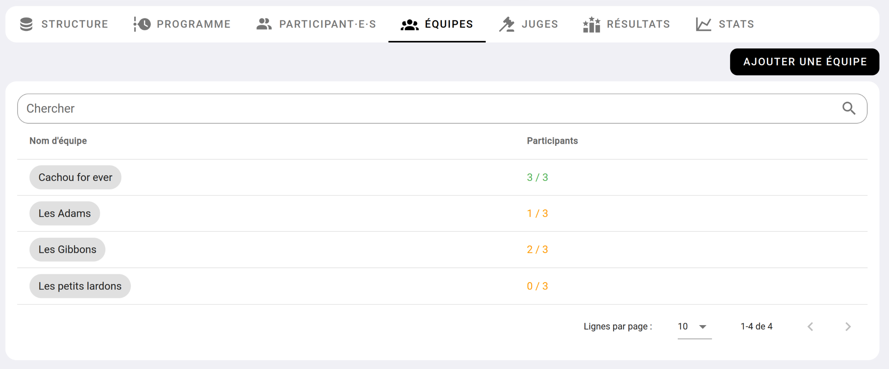
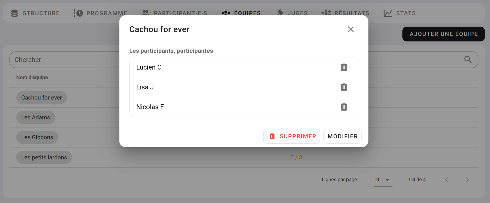
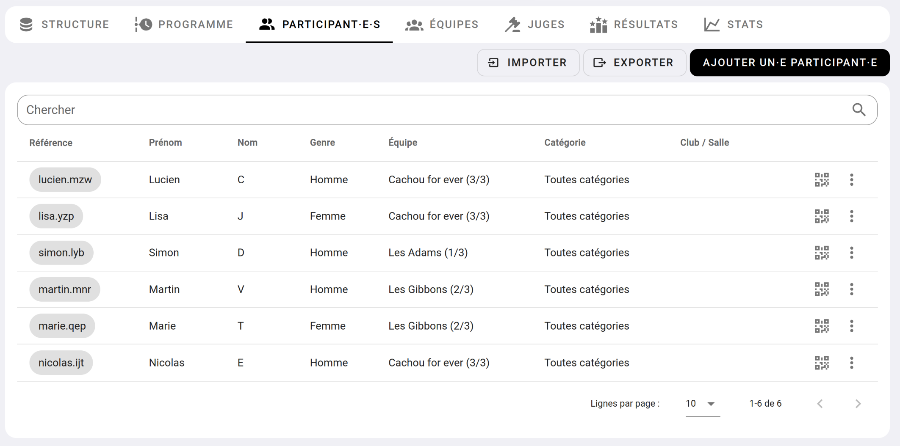
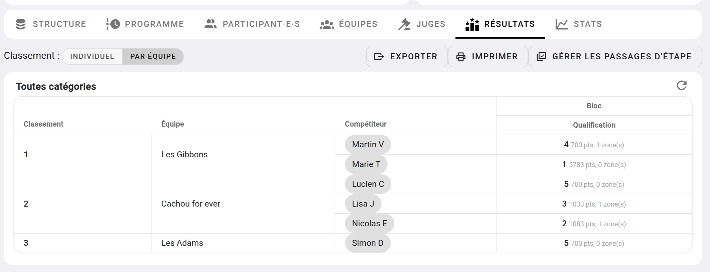
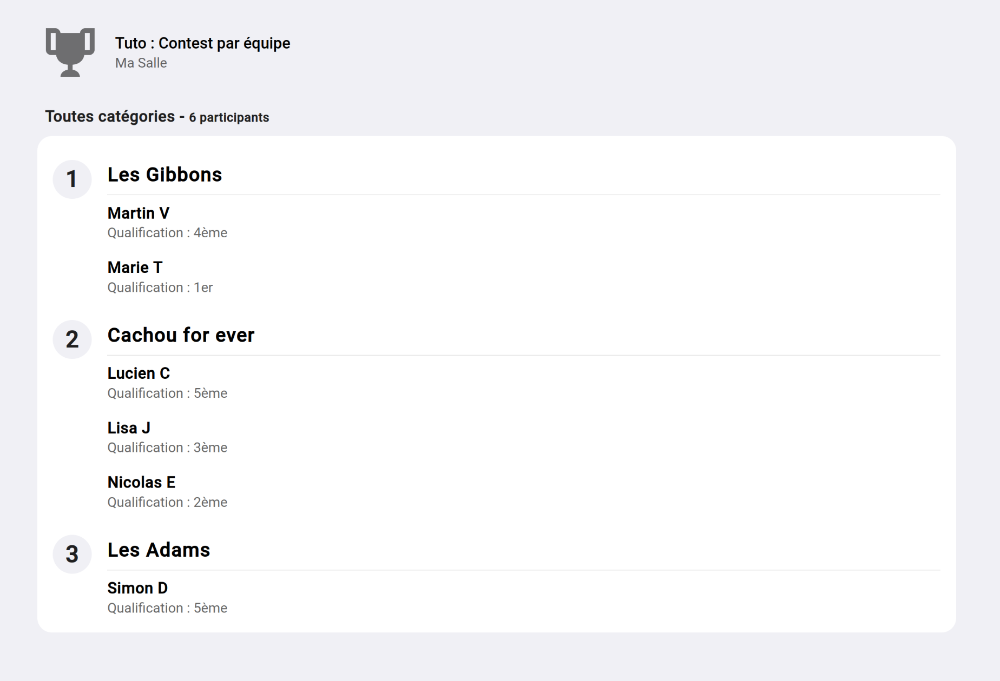

# Tuto - Contest par équipe 

Les contests par équipe permettent de créer un contest où vos compétiteurs se regroupent en binôme, trinôme, etc.  
Le résultat final sera un classement par équipe.

## 1. Créez votre contest

Rendez-vous sur le dashboard de votre salle, cliquez sur [CONTEST](){: .black-btn } puis faites [NOUVEAU CONTEST](){: .black-btn }  
Vous arriverez sur ce formulaire :

{: .images }

Renseignez à minima :
- **Un titre :** Exemple "Contest par équipe".
- **Date de début et fin du contest** : la date du jour de votre contest.
- **Date de début et fin des inscriptions** : la période d'inscription.
- **Type de catégorisation** : choisissez "Catégorisation personnalisée (loisir, expert, etc.)"
- **Contest par équipe** : cochez cette case.
- **Nombre de participants par équipe** : par exemple 3.

Laissez le reste par défaut.

## 2. Créer votre contest de bloc 

Pour ce tuto, nous créons un contest de bloc 1000 points divisé par le nombre d'ascensions avec une seule catégorie.

Suivez le tutoriel [Contest de bloc](tuto-contest-bloc-1000-points) de l'étape 2 à 6 pour créer la structure.

## 3. Comment les participants rejoignent ou créent leur équipe ?

À l'inscription, les participants passent par 4 étapes :

### Étape 1 : Nom, prénom, date de naissance

Le participant renseigne son nom, prénom, date de naissance et genre.

{: .images }

### Étape 2 : Choix de la catégorie

Le participant sélectionne la catégorie. Ici, il n'y en a qu'une seule.

{: .images }

### Étape 3 : Choix ou création de l'équipe

Le participant peut choisir une équipe existante ou en créer une nouvelle.

{: .images }

Pour créer une équipe :

{: .images }

Ou choisir l'équipe déjà créée :

{: .images }

### Étape 4 : Validation de l'inscription

Le participant valide son inscription en renseignant son email.

{: .images }

## 4. En tant qu'administrateur

Vous pouvez ajouter, supprimer, modifier une équipe, et déplacer ou affecter un participant à une équipe.

Allez sur la page d'administration du contest, onglet **"Équipes"** :

{: .images }

Cliquez sur une équipe pour modifier son nom, supprimer l'équipe ou retirer des participants.

{: .images }

Dans l'onglet **"Participant·e·s"**, vous retrouvez les participants et leur équipe.

{: .images }

## 5. Le classement

Oblyk fait la somme des points des participants de chaque équipe. L'équipe avec le plus de points prend la tête.

Exemple de classement :

{: .images }

Le classement en direct est aussi affiché par équipe.

{: .images }

## 6. Conclusion

Vous avez vu comment créer un contest de bloc par équipe.  
Le contest par équipe peut également être utilisé pour des combinés ou des contests de voie.

{: .text-right }
[Tuto : Contest par vague](tuto-contest-par-vague){: .btn }
