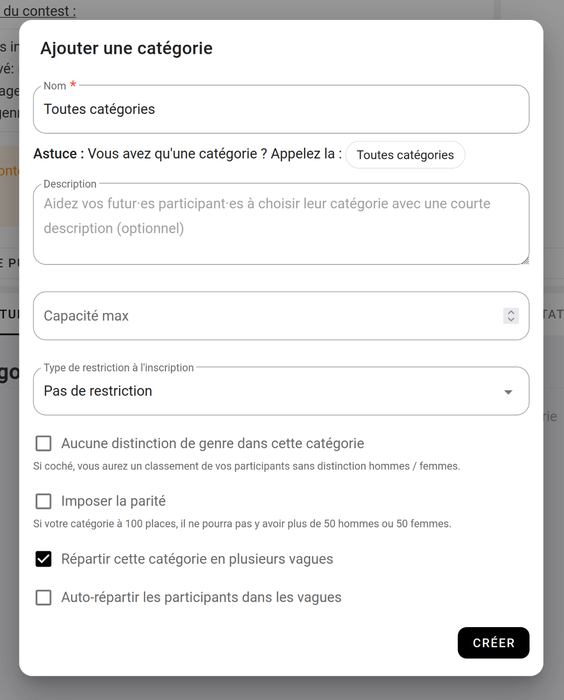
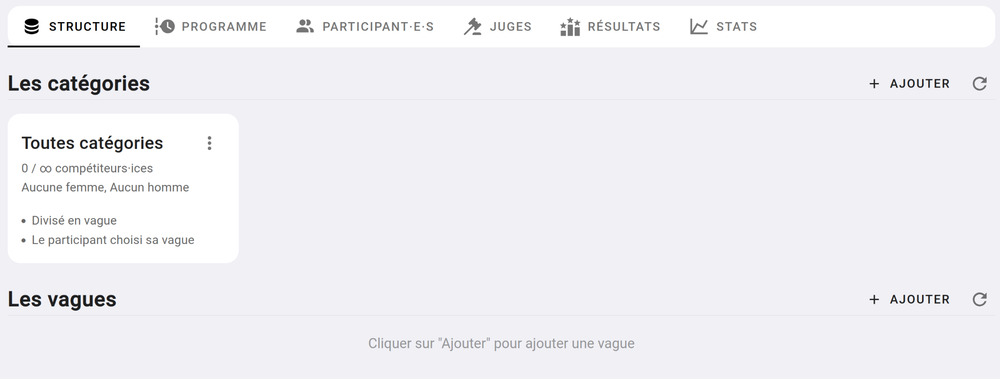
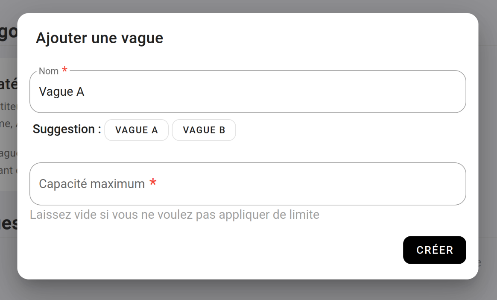
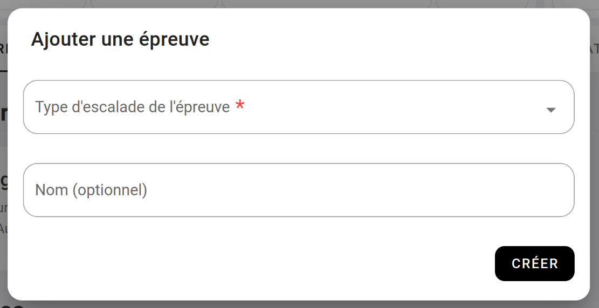
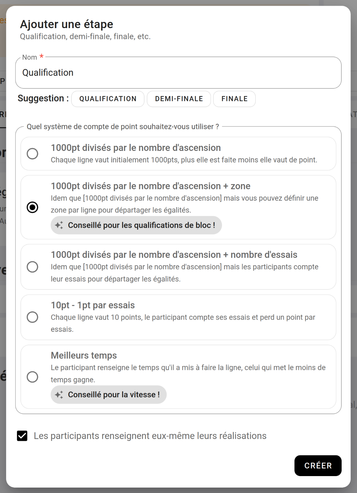
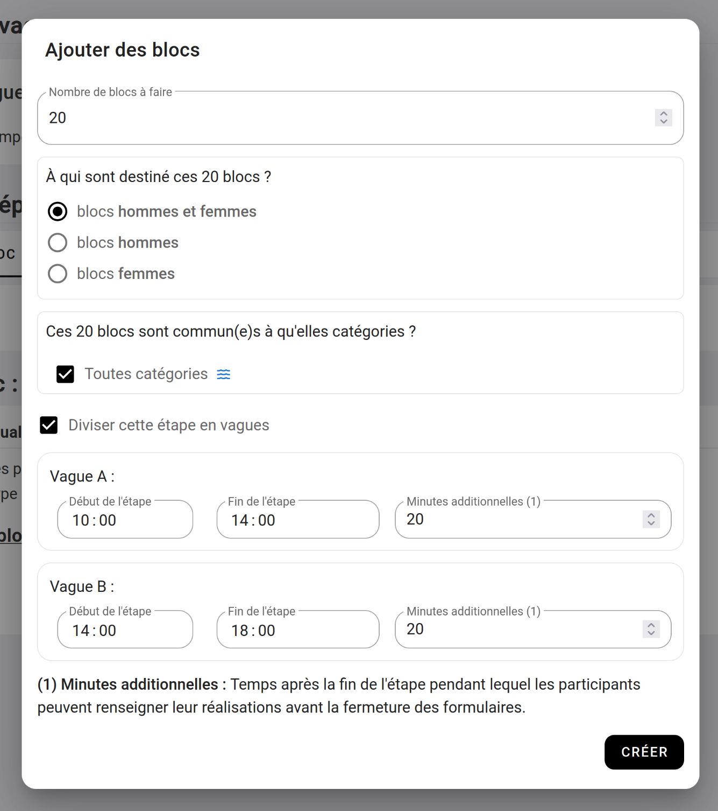
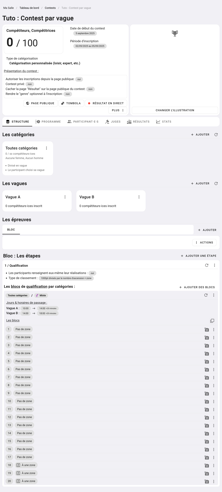
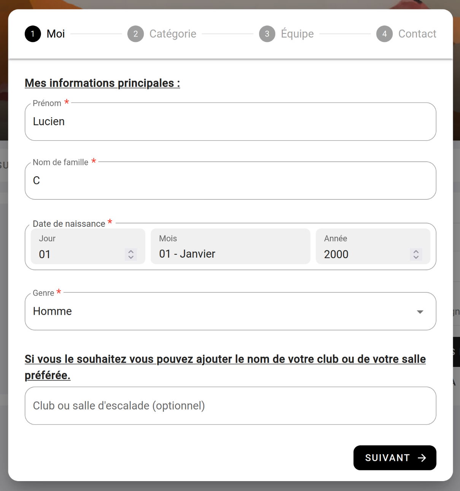
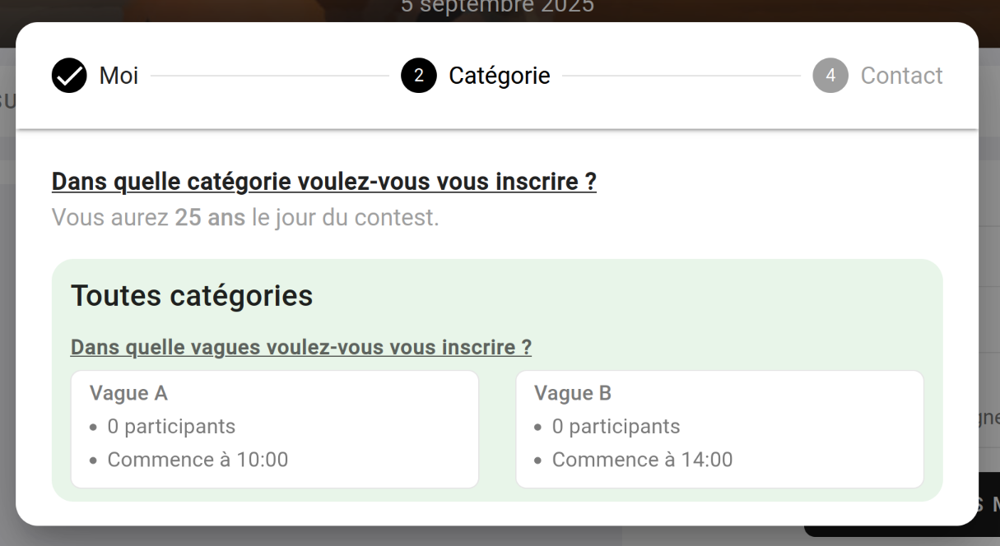
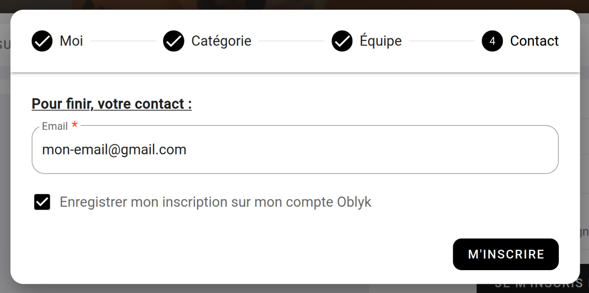

# Tuto - Contest par vague 

Dans ce tutoriel, nous allons voir comment créer un contest où vos participants sont répartis par vague.

## 1. Créez votre contest

Rendez-vous sur le dashboard de votre salle, cliquez sur [CONTEST](){: .black-btn } puis faites [NOUVEAU CONTEST](){: .black-btn }  
Vous arriverez sur ce formulaire :

{: .images }

Renseignez à minima :
- **Un titre :** Exemple "Contest fin d'année".
- **Date de début et fin du contest** : la date du contest.
- **Date de début et fin des inscriptions** : période autorisée pour les inscriptions.
- **Type de catégorisation** : choisissez "Catégorisation personnalisée (loisir, expert, etc.)"

Laissez le reste par défaut.

## 2. Créez votre catégorie

Le choix de diviser vos participants en vagues se fait au niveau de la catégorie.  
Lors de la création de votre catégorie, cochez **"[ ] Répartir cette catégorie en plusieurs vagues".**  

Par défaut, vos participants pourront choisir dans quelles vagues ils veulent grimper.  
Pour laisser Oblyk répartir automatiquement les participants dans les vagues, cochez **"[ ] Auto répartir les participants dans les vagues".**  

{: .images }

## 3. Créez vos vagues

Après avoir créé vos catégories, un nouveau bandeau **"Les vagues"** apparaît.

{: .images }

Cliquez sur [+ AJOUTER](){: .light-btn } et renseignez :
- **Nom de la vague :** Exemple : Vague A

{: .images }

Vous pouvez limiter le nombre(*) de participants par vague pour éviter une surcharge.

_* En savoir plus sur [La capacité](la-capacite)_

## 4. Créez une épreuve

Dans le bandeau **"Épreuve"**, cliquez sur [+ AJOUTER](){: .light-btn }.

{: .images }

Choisissez **"Bloc"** comme type d'escalade, puis cliquez sur [CRÉER](){: .black-btn }

## 5. Créez votre étape de qualification

Dans le bandeau **"Bloc : Les étapes"**, cliquez sur [+ AJOUTER UNE ÉTAPE](){: .light-btn }.

{: .images }

Nom de l'étape : **"Qualification"**  
Système de points : **"1000pt divisés par le nombre d'ascensions + zone"**(*)

_* En savoir plus sur : [Les systèmes de points](les-systemes-de-classements)_ 

## 6. Ajouter les blocs de qualification

Cliquez sur [+ AJOUTER DES BLOCS](){: .light-btn } dans le bandeau **"Les blocs de qualifications par catégories"**.

{: .images }

Renseignez :
- **Nombre de blocs à faire** : exemple 20
- **À qui sont destinés ces blocs** : hommes et femmes
- **Ces blocs sont communs à quelles catégories** : Toutes catégories
- **Diviser cette étape en vagues** : oui
- choisissez les heures de passage pour chaque vague.

Votre page devrait ressembler à ceci :

{: .images }

## 7. Comment les participants choisissent leurs vagues ?

À l'inscription, les participants passent par 3 étapes principales :

### Étape 1 : Nom, prénom, date de naissance

{: .images }

### Étape 2 : Choix de la catégorie et de la vague

{: .images }

### Étape 3 : Validation de l'inscription

Le participant valide son inscription en renseignant son email.

{: .images }

## 8. Conclusion

Vous avez appris à créer un contest de bloc avec vos participants répartis sur plusieurs vagues.

{: .text-right }
[Tuto - Les championnats](tuto-les-championnats){: .btn }
