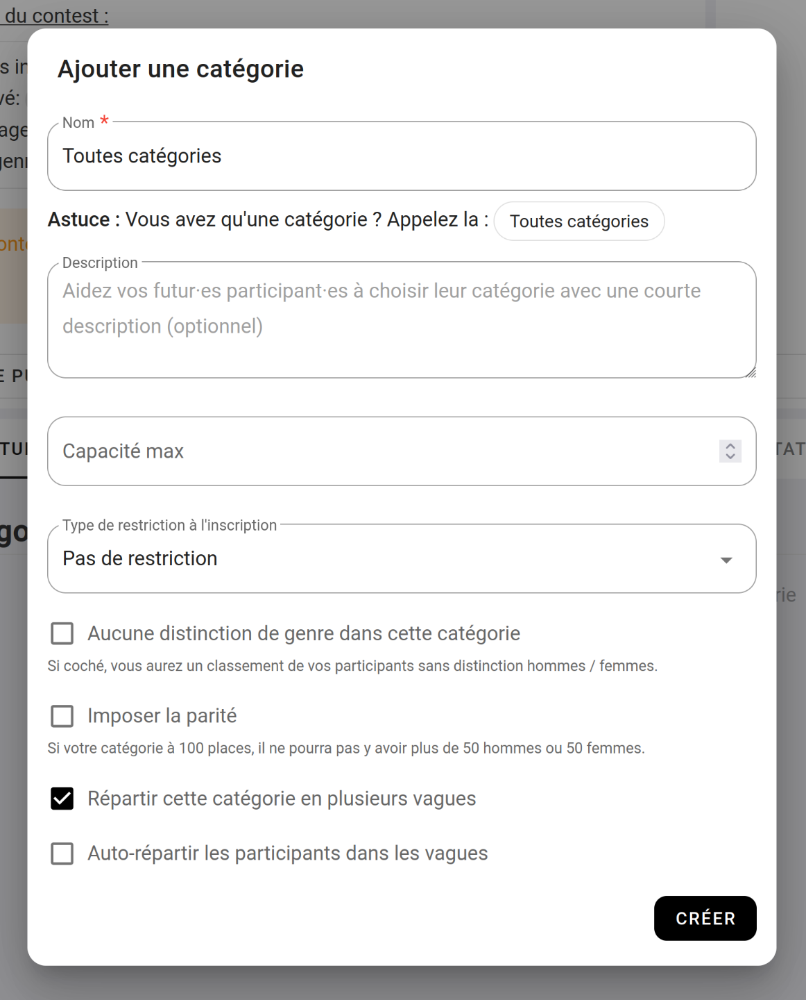
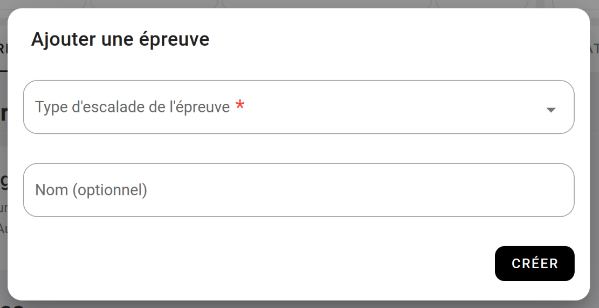
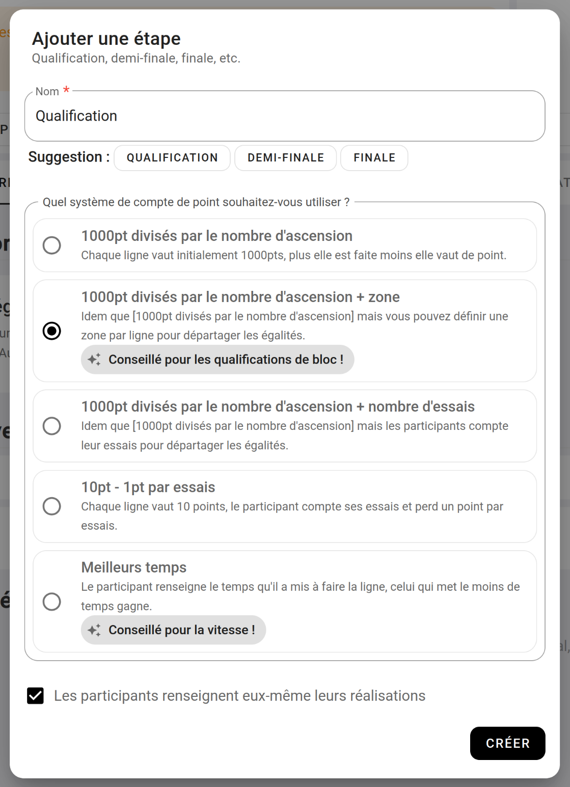

# Tuto - Contest par vague 

Dans ce tutoriel, nous allons voir comment créer un contest où vos participants seront répartie par vague.

## 1. Créez votre contest

Rendez-vous sur le dashboard de votre salle, cliquez sur [CONTEST](){: .black-btn } puis faite : [NOUVEAU CONTEST](){: .black-btn }  
Vous arriverez sur ce formulaire :

{: .images }

Renseigner à minima :
- **Un titre :** Exemple "Contest fin d'année".
- **Date de début et fin du contest :** La date du jour de votre contest.
- **Date de début et fin des inscriptions :** La période sur laquelle vous autorisez les inscriptions à votre contest.
- **Type de catégorisation :** choisissez "Catégorisation personnalisée (loisir, expert, etc.)"

Laissez le reste des informations par défaut.

## 2. Créez votre catégorie

Le choix de diviser vos participants en vagues se fait au niveau de la catégorie.  
Lors de la création de votre catégorie, choisissez **"[ ] Répartir cette catégorie en plusieurs vagues".**  

Par défaut vos participants pourront choisir dans quelles vagues ils veulent grimper. Mais vous pouvez cocher la case **"[ ] Auto répartir les participants dans les vagues".**  
Si cette case est cochée, Oblyk les inscrira les compétiteurs dans la vague où il y a le moins de participants.

{: .images }

## 3. Créez vos vagues

Après avoir créé vos catégories, un nouveau bandeau fait son apparition **"Les vagues"**.

{: .images }

Dans ce bandeau **"Les vagues"** faite [+ AJOUTER](){: .light-btn }

Dans la fenêtre qui s'ouvre, renseignez :
- **Nom de la vague :** Exemple : Vague A

{: .images }

Vous pouvez limiter le nombre(*) de participants dans la vague pour, par exemple, éviter qu'il n'y ait pas plus de la moitié de vos participants sur une vague.

Créer ainsi autant de vagues que vous voulez.

_* En savoir plus sur [La capacité](la-capacite)_

## 3. Créez une épreuve

Dans le bandeau **"Épreuve"**, cliquez sur [+ AJOUTER](){: .light-btn }.

Dans la fenêtre qui s'ouvre :

{: .images }

Choisissez **"Bloc"** dans **"Type d'escalade de l'épreuve"**, et fait [CRÉER](){: .black-btn }

## 4. Créez votre étape de qualification

Dans le bandeau **"Bloc : Les étapes"** faite [+ AJOUTER UNE ÉTAPE](){: .light-btn }.

Cette fenêtre s'ouvre :

{: .images }

Dans le nom de l'étape, nous allons renseigner **"Qualification"** et nous choisissons **"1000pt divisés par le nombre d'ascensions + zone"**(*).

_* En savoir plus sur : [Les systèmes de points](les-systemes-de-classements)_ 

## 5. Ajouter les blocs de qualification

Pour ajouter vos blocs de qualifications, cliquer sur [+ AJOUTER DES BLOCS](){: .light-btn } dans le bandeau **"Les blocs de qualifications par catégories"**.

Cette fenêtre s'ouvre :

{: .images }

Renseignez :
- **Nombre de blocs à faire :** Exemple : 20
- **À qui sont destiné ces 20 blocs :** blocs hommes et femmes
- **Ces 20 blocs sont commun(e)s à quelles catégories :** Toutes catégories
- **Diviser cette étape en vagues :** oui
- choisissez les heures de passage pour chacune de vos vagues.

Une fois paramétré, la page de votre contest devrait ressembler à ça :

## 6. Comment vos participants choisissent leurs vagues ?

À l'inscription, les participants passent par 4 étapes

**Étape 1 : Nom, prénom, date de naissance**

Première étape, on demande au futur participant de renseigner son : nom, prénom, date de naissance et finalement son genre.

{: .images }

**Étape 2 : Choix de la catégorie**

Deuxième étape, choix de la catégorie, et choix de la vague !

{: .images }

**Étape 3 : Valider l'inscription**

Enfin, le participant valide l'inscription en renseignant son email.

{: .images }

## 7. Conclusion

Vous venez de voir comment créer un contest de bloc, avec vos participants réparti sur deux vagues.

{: .text-right }
[Tuto - Les championnats](tuto-les-championnats){: .btn }

