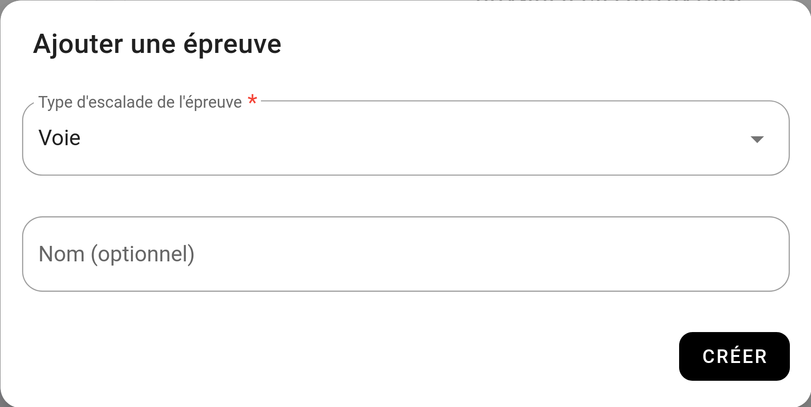

# Tuto - Contest de voie qualification + finale

Dans ce toto, nous allons voir comment faire un contest de voie avec qualification et finale avec une catégorie Jeune et une catégorie Sénior.

## 1. Créez votre contest

Rendez-vous sur le dashboard de votre salle, cliquez sur [CONTEST](){: .black-btn } puis faite : [NOUVEAU CONTEST](){: .black-btn }  
Vous arriverez sur ce formulaire :

{: .images }

Renseigner à minima :
- **Un titre :** Exemple "Contest fin d'année".
- **Date de début et fin du contest :** La date du jour de votre contest.
- **Date de début et fin des inscriptions :** La période sur laquelle vous autorisez les inscriptions à votre contest.
- **Type de catégorisation :** choisissez "Catégorisation personnalisée (loisir, expert, etc.)"

Laissez le reste des informations par défaut.

## 2. Créez vos catégories

Pour ce tuto, nous allons créer 2 catégories :
- **Jeune** de 0 à 16 ans (inclus)
- **Sénior** 17 ans et +

Dans le bandeau **"Les catégories"** faite [+ AJOUTER](){: .light-btn }

Cette fenêtre s'ouvre :

{: .images }

Renseignez **"Jeune"** dans le nom, dans **"type de restriction"** vous pouvez choisir **"Age minium / maximum personnalisé"** et renseignez 16 dans l'age maximum.
Puis cliquer sur [CRÉER](){: .black-btn }

## 3. Créez une épreuve

Oblyk vous permet de créer des combinés, dans le cadre de ce tuto, nous allons juste faire un contest d'une épreuve de voie.

Dans le bandeau Épreuve, cliquez sur [+ AJOUTER](){: .light-btn }.

Dans la fenêtre qui s'ouvre :

{: .images }

Choisissez **"Voie"** dans **"Type d'escalade de l'épreuve"**, et fait [CRÉER](){: .black-btn }

## 4. Créez votre étape de qualification

Notre épreuve de voie aura deux étapes, une étape de **"Qualification"** et une étape de **"Finale"**, commençons par les qualifications.

Dans le bandeau **"Voie : Les étapes"** faite [+ AJOUTER UNE ÉTAPE](){: .light-btn }.

Cette fenêtre s'ouvre :

{: .images }

Quand le nom de l'étape, nous allons renseigner **"Qualification"** et nous choisissons **"Prise la plus haute atteinte"**.  

## 5. Ajouter les voies de qualification

Il est temps d'ajouter les voies de qualifications, pour ça cliquer sur [+ AJOUTER DES VOIES](){: .light-btn } dans le bandeau **"Les voies de qualifications par catégories"**

Cette fenêtre s'ouvre :

{: .images }

Pour ce tuto, nous allons imaginer qu'il y a 5 voies de qualifications jeunes, et 5 voies de qualification seniors. Mais les hommes et les femmes font les mêmes voies.

Donc, nous allons compléter le formulaire de la manière suivante :

- **Nombre de voies à faire :** 5
- **À qui sont déstiné ces 5 voies :** Voies hommes et femmes
- **Ces 5 voies sont communes à quelles catégories :** Jeune
- Remplissez ensuite le début et fin de l'étape, exemple de 10h à 14h

Faite de même pour les voies de qualification seniors. À la seule différence que vous choisirez la catégorie Sénior.

Pour chaque voie, vous devez renseigner le nombre de prises de la voie.

{: .images }

## 6. Ajouter les blocs de final

Maintenant que nous avons nos voies de qualifications, nous allons créer notre final

On remonte dans la page jusqu'à trouver le bandeau "Voies : Les Étapes" et on re-clique sur [+ AJOUTER UNE ÉTAPE](){: .light-btn }

Dans la fenêtre qui s'ouvre, donne le nom de "Finale" et choisissez "Prise la plus basse atteinte".

Une fois votre étape créée, on va ajouter les voies de finale. 
Pour ce tuto, on va imaginer qu'il y a une voie jeune femme, une voie jeune homme, une voie seniors femme et une voie seniors homme.

On commence par ajouter la voie jeune femme. Cliquer sur [+ AJOUTER DES VOIES](){: .light-btn } dans le bandeau "Les voies de finale par catégories".

Dans la fenêtre qui s'ouvre :

{: .images }

Compléter le formulaire de la manière suivante :

- **Nombre de voies à faire :** 1
- **À qui sont déstiné ces 1 voie :** Voies femmes
- **Ces 1 voie sont communes à quelles catégories :** Jeune
- Remplissez ensuite le début et fin de l'étape, exemple de 19h à 20h

Faite de même pour la voie : jeune homme, seniors femme et seniors homme.

Pour chaque voie, vous devez renseigner le nombre de prises de la voie.

Vous devriez vous retrouver avec une étape de final qui ressemble à ça :

{: .images }

## 7. Conclusion

Nous avons fini de paramétrer notre contest !

Votre page devrait ressembler à ça :

{: .images }

Si la structure vous semble correcte, vous pouvez **"Publier"** votre contest pour que les futurs participants puissent s'inscrire.

{: .text-right }
[Tuto : Combiné](tuto-combine){: .btn }
