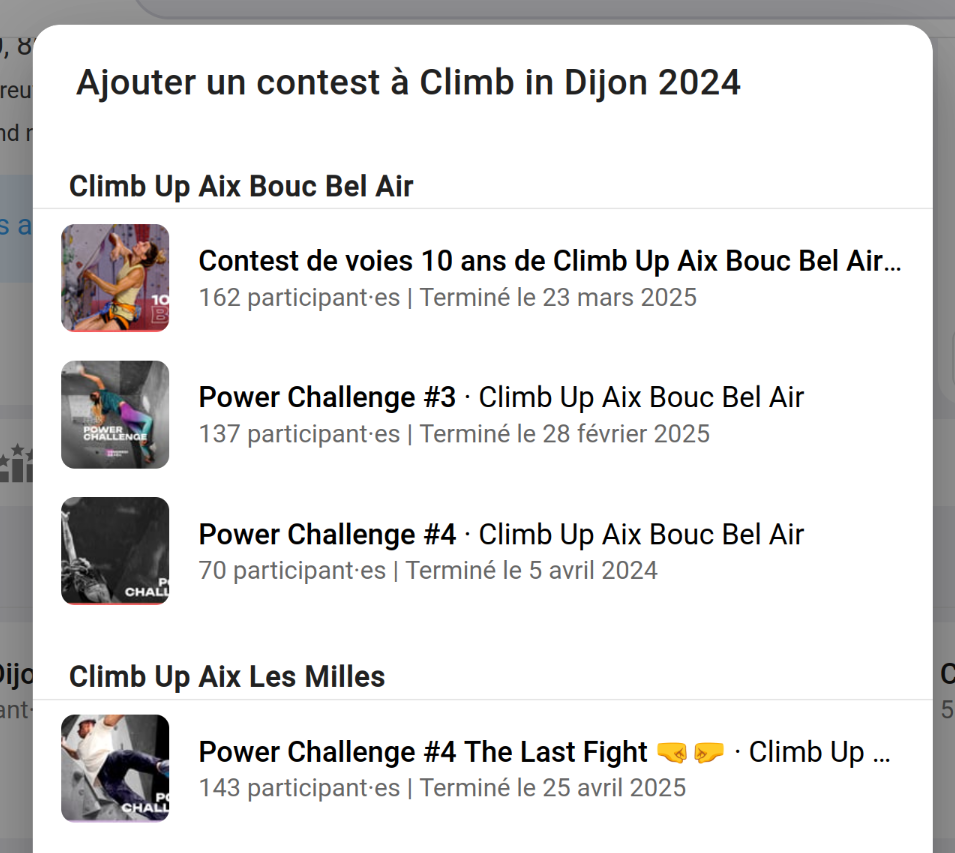

# Tuto - Les championnats

Les championnats vous permet de lier entre eux plusieurs contest que vous avez réalisé, ou que les salles de votre réseau ont fait.

Oblyk rapprochera les participants de vos différents contest par _"nom / prénom / date de naissance"_ pour établir un classement générale de tous les contests de votre championnat.

## Créer un championnat

Pour créer un championnat, rendez-vous sur la page d'administration de votre salle. Allez dans championnat, puis [NOUVEAU CHAMPIONNAT](){: .black-btn }

Vous arriverez sur ce formulaire :

{: .images }

Vous pouvez donner un nom, une présentation et comment vous voulez classer les différents contests de votre championnat.

_plus d'infos sur les classements ici : [Les classements combinés](classement-des-combines.md)._

## Lier les contests

Une fois votre championnat créé, vous pouvez y ajouter vos contests, cliquez sur [+ LIER UN CONTEST](){: .light-btn }.

Vous arriverez sur la liste des contests de votre salle ou de votre réseau :

{: .images }

Choisissez le contest à ajouter à votre championnat. 

Répétez l'action jusqu'à avoir ajouté tous les contests de votre championnat.

Après avoir lié vos contests, vous devriez avoir quelque chose comme ça :

{: .images }

## Faire la correspondance des catégories

Dans chacun de vos contests, vous avez pu avoir des catégories différentes, ou nommé différemment.  
Pour qu'Oblyk puisse établir un classement, il faut que vous fassiez correspondre les catégories de vos contests entre elles.

Pour faire les correspondances, cliquer sur [CRÉER UNE CORRESPONDANCE](){: .light-btn } dans le bandeau **"Correspondance entre les catégories"**.

Vous arriverez sur un formulaire tel que celui-ci :

{: .images }

Cocher les catégories similaires dans les différents contests et donner un nom final à votre catégorie.

Vous obtiendrez un résultat tel que celui-ci :

{: .images }

Dans l'onglet résultat, vous aura le classement général de vos différents contests !

{: .images }

Vous pouvez partager la page publique à vos compétiteurs pour qu'ils/elles puissent consulter leur classement général.

{: .text-right }
[Table des matières](/docs/indoor/contest){: .btn }
