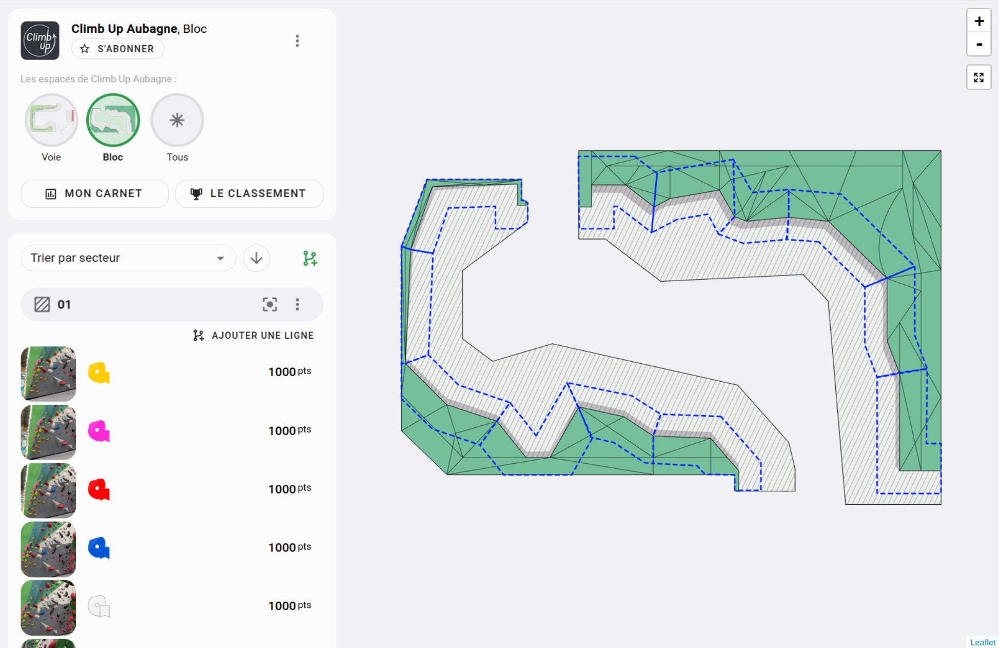

# Les espaces

Les espaces sont fait pour diviser votre salle en plusieurs grandes parties.

Exemple : L'espace "bloc", l'espace "voie", l'espace "enfant", etc.

Mais vous pouvez aussi diviser en ensemble plus petit si ça vous semble pertinent. Par exemple si votre salle n'a que du bloc, mais à deux étages, vous pouvez faire un espace "Rez de chaussée" et un Espace "1er étage".  
Ou encore, divisez un espace de voie en grande typologie, par exemple : Les dévers, Les dalles _(même si ce n'est pas la division la plus conseillée, fair un espace "voie" divisé en secteur qui contiennent un ou plusieurs relais reste la meilleure division)_

Un espace peut ensuite être sous divisé en secteur (un secteur sera un pan de mur ou un couloir de voie par exemple)

Et finalement, pour un secteur, vous pouvez indiquer quels relais s'y trouve.

Gardez à l'esprit lors de la division de votre salle en espace que vous allez devoir représenter par une image ou un fichier 3D les espaces en question. 
Si vous prenez des ensembles trop grands, il sera compliqué pour vous de les représenter, mais une division trop petite segmente trop votre topo et le rend moins pratique à utiliser.

N'hésitez pas à lire la suite de la documentation sur les espaces avant de vous lancer dans la création de vos espaces, vous aurez une meilleure idée de ce que peut représenter un espace sur Oblyk.

**Exemple d'un espace "bloc" représenté par une image :**

{: .images }

**Exemple d'un espace "bloc" représenté en 3D :**

<video class="videos" controls loop autoplay>
  <source src="../../../assets/videos/exemple-salle-3d.webm" type="video/webm" />
</video>

{: .text-right }
[Créer un espace](creer-un-espace){: .btn }
