# Créer mon espace en 3D

Pour faire son espace en 3D, il faut déjà le dessiner sur un logiciel de dessin en 3D.
Dans notre exemple, nous allons prendre SketchUp parce qu'il a une version navigateur et qu'il est facile à prendre en main.

D'autres logiciels de dessin 3D peuvent être utilisés du moment que vous pouvez exporter votre modèle au format .gltf ou .obj _(les deux formats actuellement supportés par Oblyk)_

**Note :** si vous découpez votre salle en plusieurs espaces, il faudra un fichier 3D par espace.

**Note 2 :** il est très probable que le constructeur de votre mur ai déjà les plans. Demandez-lui, ça sera beaucoup plus rapide que de les redessiner vous-mêmes.

Dans ce tutoriel, je vais partir du principe que vous avez déjà les fichiers 3D de votre salle, sinon je vous invite à trouver des tutoriels en ligne pour apprendre les bases de SketchUp pour dessiner votre mur, ou de plutôt faire [vos espaces en 2D](le-plan-d-un-espace).

## Étape 1 : Lancer Sketchup, Faite une copie et importer le modèle

Dans un premier temps, assurez-vous de bien conserver une copie du modèle d'origine fourni par votre constructeur, faite une copie sur laquelle on va travailler.

Ouvrez SketchUp sur votre navigateur [https://app.sketchup.com/](https://app.sketchup.com/), fait la procédure d'inscription.

Fait "Créer nouveau" ... "Décimal - mètres".

{: .images }
[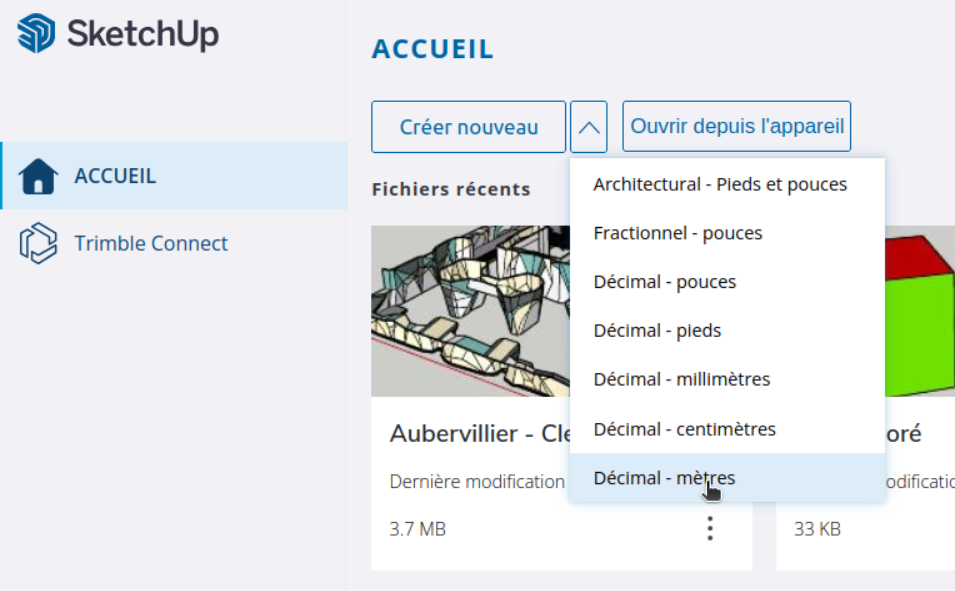](../../../assets/images/sketchup-nouveau-model.png)

Cliquez en haut à gauche, "Importation" / "Mon appareil" et récupérer le fichier SketchUp de votre salle

{: .images }
[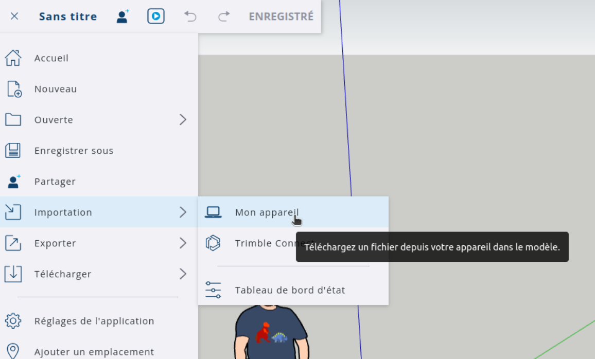](../../../assets/images/sketchup-importer.png)

## Étape 2 : Rendre votre mur d'escalade le plus léger possible !

Dans le fichier que vous a fourni votre constructeur, il va y avoir des éléments qui ne nous sont pas utile, comme : trous d'inserts, du bâti comme les vestiaires, etc.

Le but est de conserver uniquement les structures d'escalade (et pourquoi pas les tapis, à vous de voir).  
Le fichier 3D pour un espace doit être le plus léger possible !

Voici comment faire :

### Supprimer les éléments en trop

Sur votre modèle, supprimez tous les éléments comme les poutres, piliers, murs du bâtiment, sol, toit, accueil, etc.  

Supprimer aussi certains détails des murs comme les trous d'inserts, les relais, l'emplacement pour les fiches, les autos enrouleurs, etc.

_Vous pensez avoir tout supprimé ? pas sûr ..._

Il se peut qu'il reste des éléments cachés, ou des éléments que vous n'arrivez pas à sélectionner.  
Ce sont souvent des éléments qui font partie d'un groupe.

Pour vous assurer qu'il n'y a rien de caché : Sélectionnez tous les éléments de votre modèle (ctrl + a) fait un clic gauche, et choisissez "éclater".

{: .images }
[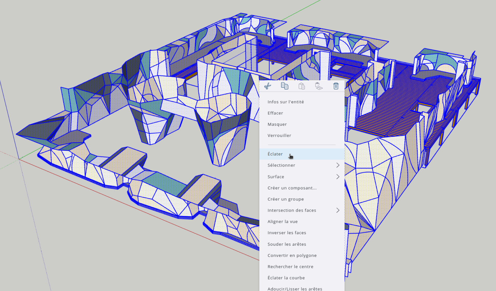](../../../assets/images/3d-purge-ecalter.png)

Répéter l'opération jusqu'à ce que SketchUp grise cette option. C'est que vous avec bien dégroupé tous les groupes et sous groupes.

Vous pourrez supprimer les éléments inaccessible ou caché.

### Supprimer les textures

Toujours dans un but d'alléger votre modèle 3D, il faut supprimer les textures pour les remplacer par des couleurs.

Vous avez par exemple des tapis qui ont une texture qui ressemble à du feutre, ou des murs en bois ? Tout ça doit être replacé par des couleurs.

Pour gagner du temps, vous pouvez sélectionner toutes les faces qui ont la même texture est les remplacer par une couleur proche en une seule fois.

{: .images }
[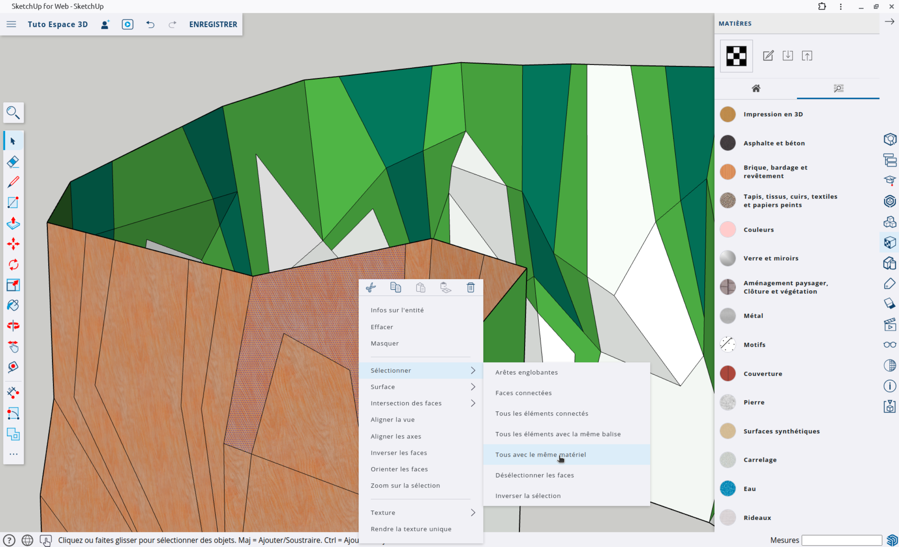](../../../assets/images/sketchup-selectionner-texture.png)

### Fusionner les arêtes

Dernière étape de l'allégement de votre modèle 3D : Souder les arêtes 

Pour réduire le nombre d'arêtes de votre modèle et rendre plus beau le rendu final sur Oblyk, il faut que vous soudiez les arêtes !  

_Heureusement s'est très simple : )_

Sélectionnez tous `[ctrl + A]`, faite clic droit et choisissez "souder les arêtes".

{: .images }
[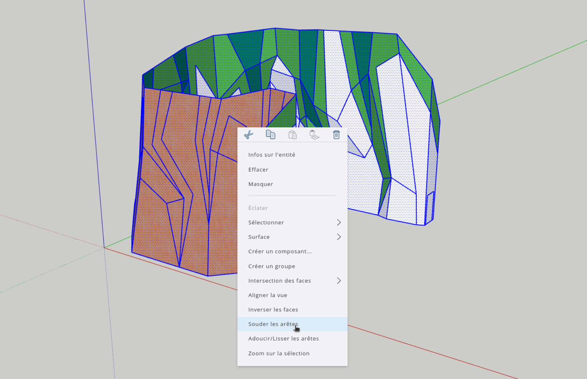](../../../assets/images/sketchup-souder-les-aretes.png)

Notre allègement est fini !  
Voici à quoi pourrait ressembler votre salle avant et après l'avoir "purgé"

**Avant la purge des éléments inutiles :**

{: .images }
[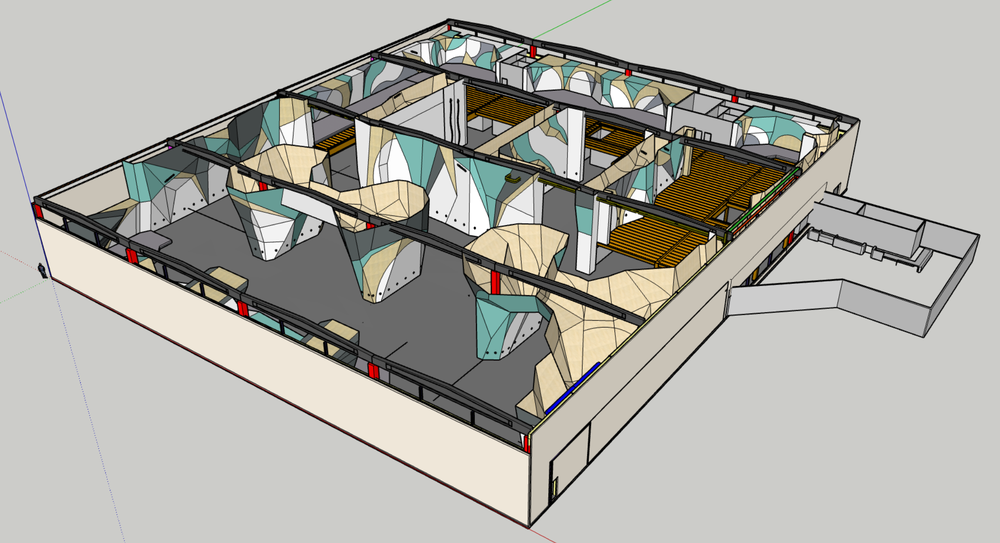](../../../assets/images/3d-purge-avant.png)

**Après la purge :**

{: .images }
[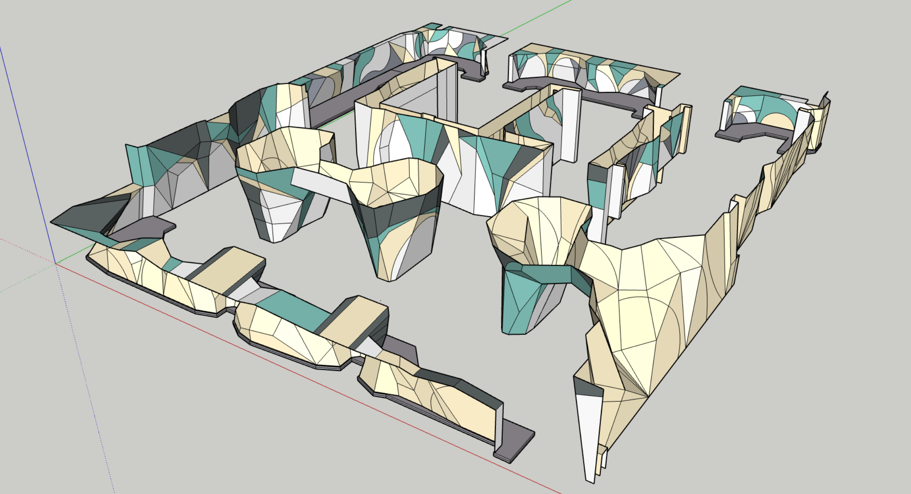](../../../assets/images/3d-purge-apres.png)

## Étape 3 : Un fichier par espace

Maintenant que vous avez purgé votre salle des éléments en trop, des textures et que vous avez fusionnées les arêtes,
vous devez créer un fichier 3D par espace que vous voulez importer sur Oblyk.

Par exemple pour une salle avec un espace de bloc et un espace de voie, copier-coller votre bloc dans une autre fichier et enregistrez-le, fait de même pour votre espace de voie.

{: .images }
[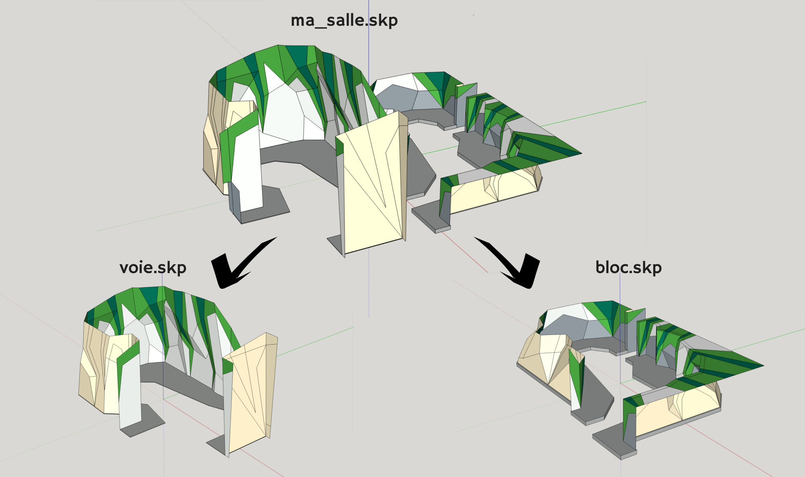](../../../assets/images/sketchup-division.png)

## Étape 4 : Exporter vos fichier 3D

Pour importer les 3D comme espace sur Oblyk, il faut déjà les exporter au format .obj sur SketchUp.  
Malheureusement cette fonctionnalité est payante sur SketchUp. Vous pouvez profiter de l'essai gratuit de 7 jours pour faire vos exports, ou, envoyez-nous vos fichiers .skp nous vous ferons l'export.

Pour faire l'export aller dans : _Menu / Exporter / OBJ_

- [X] Cochez "Permuter les coordonnées YX (Z vertical)"  
- Choisissez "m" dans "Unités"
- [X] Cochez "Trianguler toutes les faces"
- [X] Cochez "Exporter les faces recto verso"
- [ ] Décochez "Exporter les arêtes"
- [ ] Décochez "Exporter les placages de texture"

{: .images }
[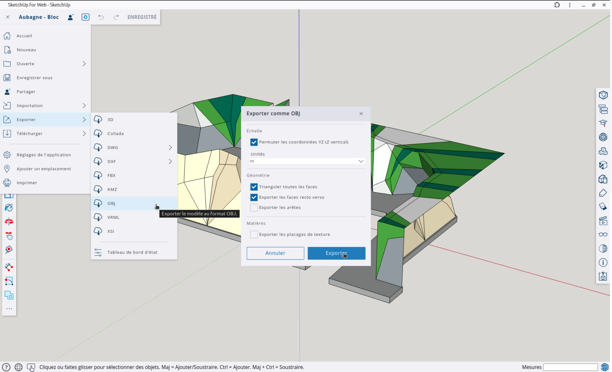](../../../assets/images/sketchup-export-obj.png)

## Étape 5 : Importer votre fichier sur Oblyk

Maintenant que vous avez exporté vos espaces de Sketchup, nous pouvons les importer sur vos espaces.

Voici comment procéder.

Quand vous vous rendez sur un espace, vous devrez avoir un message qui vous invite à importer votre fichier 3D.

{: .images }
[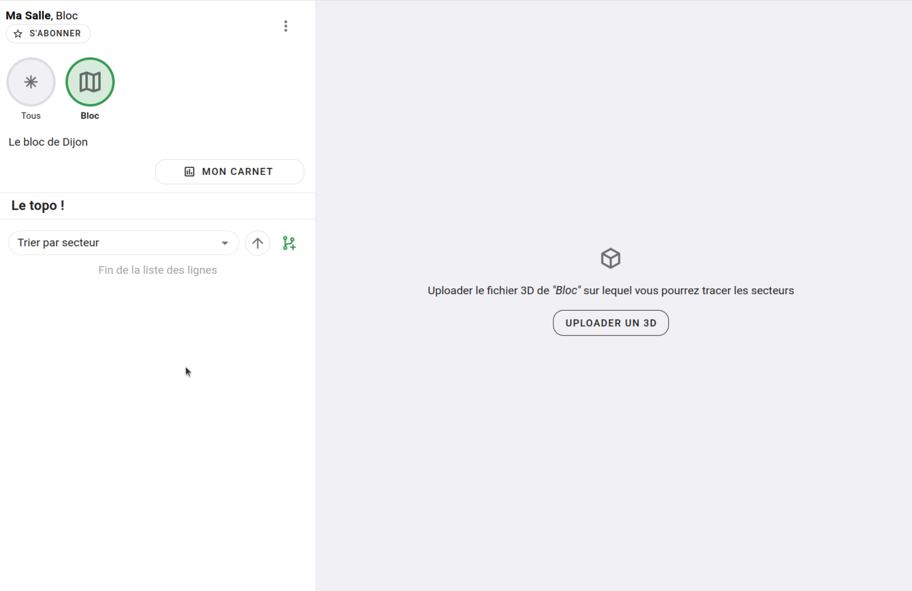](../../../assets/images/import_3d_page_espace.png)

Cliquez sur (UPLOADER UN 3D), et aller chercher le fichier .obj.zip que vous avez précédemment exporté.

Note : Si Oblyk vous propose d'Uploader un Plan, donc une image, c'est que votre espace est paramétré en 2D, modifiez-le et choisissez 3D dans le type de représentation.

## Étape 6 : Créer la miniature de votre espace

Pour pouvoir représenter votre espace dans différent endroit d'Oblyk sans avoir besoin de charger le 3D, nous allons devoir faire une 'capture' de votre espace.  

_Heureusement tout est fait pour que ça soit simple !_

Sur la page de votre espace, cliquez sur les 3 points verticaux puis "Éditeur 3D"

{: .images }
[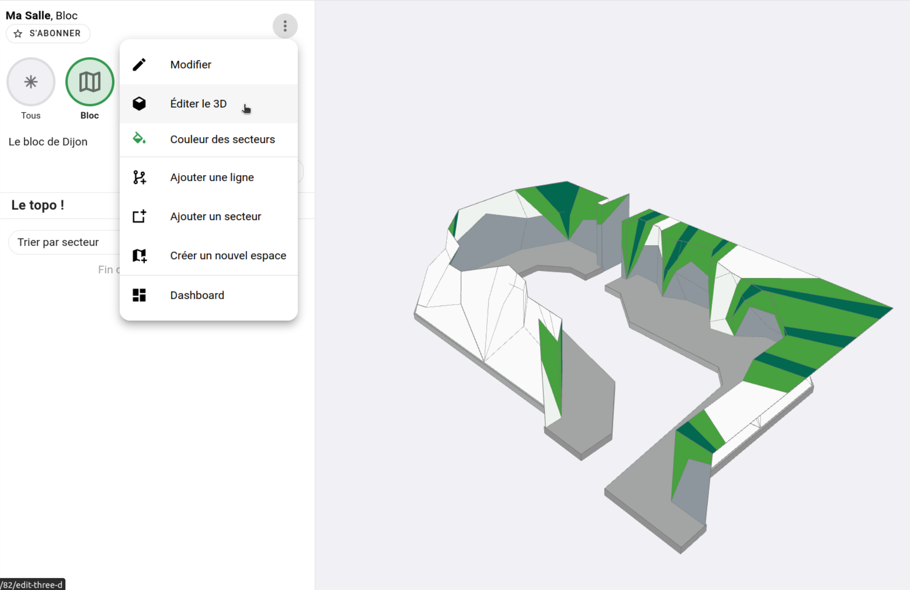](../../../assets/images/espace_3d_menu_editeur_3d.png)

De-nouveau les trois points verticaux, puis "Faire la miniature"

{: .images }
[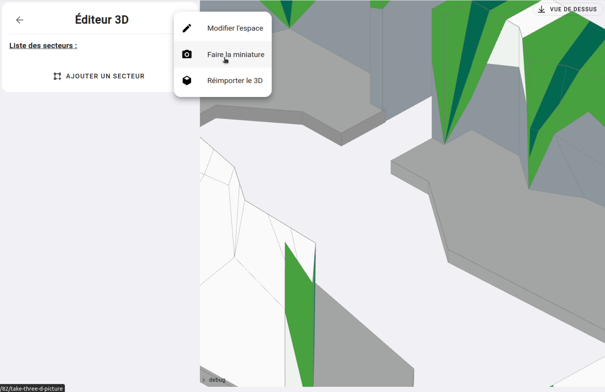](../../../assets/images/espace_3d_menu_prendre_la miniature.png)

Vous allez arriver sur une interface dédiée à la prise de cette fameuse miniature.

Placez votre espace dans le cadre pour qu'il présente son meilleur profile, le plus au centre et le plus gros possible !  
Puis cliquez sur l'icône d'appareil photo en bas à droite du cadre.

**Astuce :** Zoomez avec la roulette de votre souris, fait tourner votre espace en cliquant puis glissant, déplacez votre espace horizontalement ou verticalement en maintenant `[ctrl]` et en glissant la scène avec votre souris.

{: .images }

Et voilà !  
Nous avons (entre autre) notre petite miniature dans le sélecteur d'espace :

{: .images }
[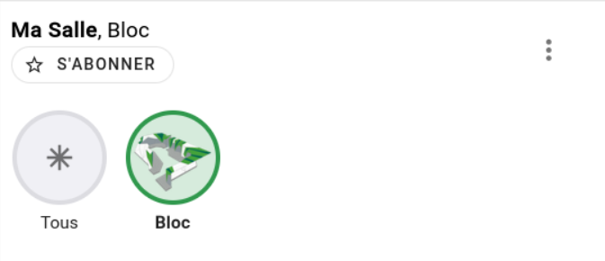](../../../assets/images/selecteur_espaces.png)

## Étape 7 : Placer vos espaces sur votre salle _(si vous avez plusieurs espaces)_

Si vous avez plusieurs espaces, nous avons une étape de plus à faire pour que votre salle rende bien !

Vu que vous importez espace par espace, nous avons besoin de les replacers les un par rapport aux autres.

Par exemple, j'ai ajouté l'espace de voie et l'espace de bloc à ma salle, et évidement, dans sa vue d'ensemble, les deux espaces se superposent :

{: .images }
[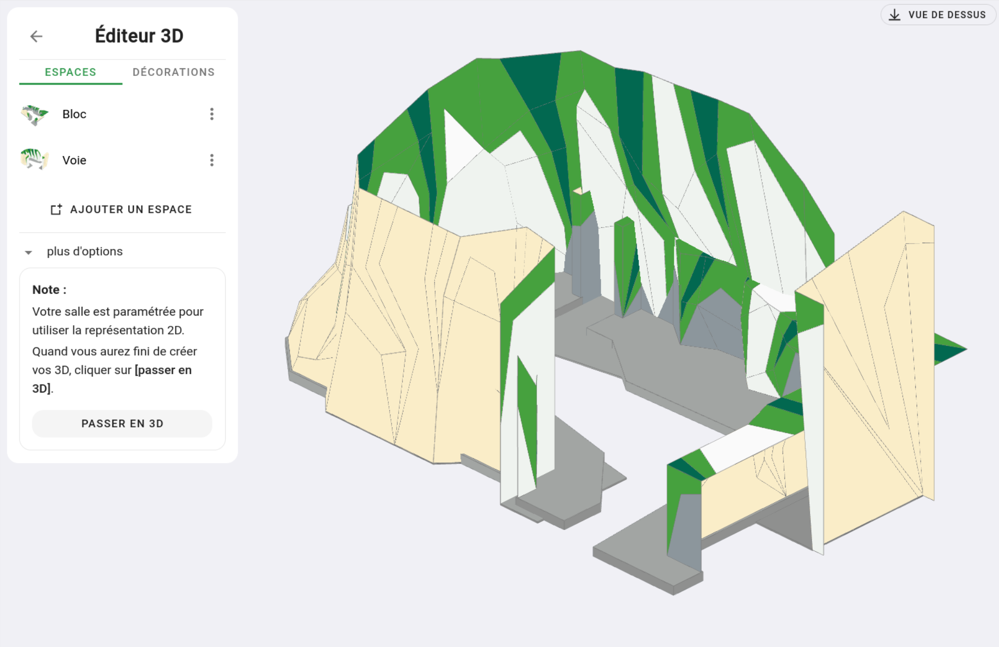](../../../assets/images/espace_3d_supperposition.png)

Pour arranger vos espaces, cliquer sur l'espace que vous voulez déplacer, et glissez-le à sa bonne place.  
Puis faite sauvegarder.

Un exemple en vidéo vous aidera :

<video class="videos" controls loop autoplay>
  <source src="../../../assets/videos/espaces_3d_placer_les_espaces.webm" type="video/webm" />
</video>

**Astuce :** Passer en vue de dessus pour bien vous rendre compte où sont vos espaces.

## Conclusion

Nous avons vu comment néttoyer vos fichiers SketchUp, comment les exporter et les importer sur Oblyk, faire la miniature et placer vos espaces les un par rapport aux autres.

Il nous reste plus qu'à tracer les secteurs !  
C'est ce que nous verrons dans la partie sur les secteurs 🙂

{: .text-right }
[Les secteurs](../secteur){: .btn }
