# Créer mon espace en 3D

Pour faire son espace en 3D, il faut d'abord le dessiner sur un logiciel de dessin en 3D.  
Dans notre exemple, nous allons prendre SketchUp, car il a une version navigateur et qu'il est facile à prendre en main.

D'autres logiciels de dessin 3D peuvent être utilisés, à condition que vous puissiez exporter votre modèle au format `.gltf` ou `.obj` _(les deux formats actuellement supportés par Oblyk)_.

**Note :** si vous découpez votre salle en plusieurs espaces, il faudra un fichier 3D par espace.

**Note 2 :** il est très probable que le constructeur de votre mur ait déjà les plans. Demandez-les, ce sera beaucoup plus rapide que de les redessiner vous-même.

Dans ce tutoriel, je pars du principe que vous avez déjà les fichiers 3D de votre salle.  
Sinon, je vous invite à trouver des tutoriels en ligne pour apprendre les bases de SketchUp afin de dessiner votre mur, ou à plutôt faire [vos espaces en 2D](le-plan-d-un-espace).

## Étape 1 : Lancer SketchUp, faire une copie et importer le modèle

Dans un premier temps, assurez-vous de bien conserver une copie du modèle d'origine fourni par votre constructeur. Faites une copie sur laquelle nous allons travailler.

Ouvrez SketchUp sur votre navigateur : [https://app.sketchup.com/](https://app.sketchup.com/) et suivez la procédure d'inscription.

Cliquez sur "Créer nouveau" → "Décimal - mètres".

{: .images }
[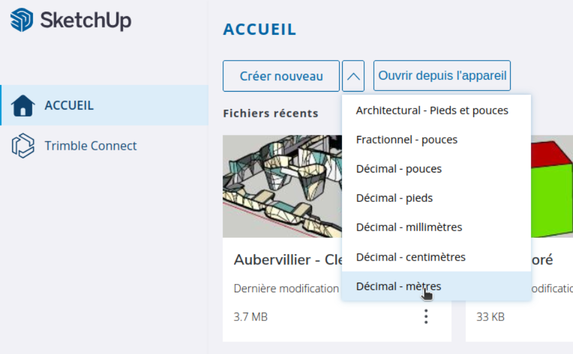](../../../assets/images/sketchup-nouveau-model.png)

Cliquez en haut à gauche sur "Importation" → "Mon appareil" et récupérez le fichier SketchUp de votre salle.

{: .images }
[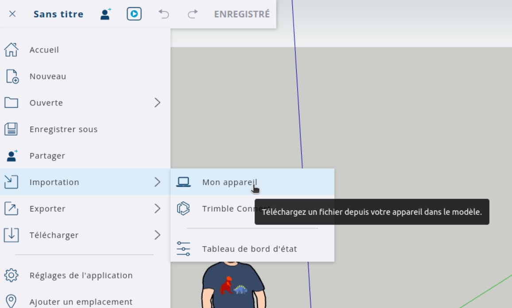](../../../assets/images/sketchup-importer.png)

## Étape 2 : Rendre votre mur d'escalade le plus léger possible !

Dans le fichier que vous a fourni votre constructeur, il y aura des éléments qui ne nous sont pas utiles, comme les trous d'inserts, le bâti, les vestiaires, etc.

Le but est de conserver uniquement les structures d'escalade (et pourquoi pas les tapis, à vous de voir).  
Le fichier 3D pour un espace doit être le plus léger possible !

Voici comment faire :

### Supprimer les éléments en trop

Sur votre modèle, supprimez tous les éléments comme les poutres, piliers, murs du bâtiment, sol, toit, accueil, etc.  

Supprimez aussi certains détails des murs comme les trous d'inserts, les relais, les emplacements pour les fiches, les auto-enrouleurs, etc.

_Vous pensez avoir tout supprimé ? Pas sûr..._

Il se peut qu'il reste des éléments cachés ou des éléments que vous n'arrivez pas à sélectionner.  
Ce sont souvent des éléments qui font partie d'un groupe.

Pour vous assurer qu'il n'y a rien de caché : sélectionnez tous les éléments de votre modèle (`Ctrl + A`), faites un clic droit et choisissez "Éclater".

{: .images }
[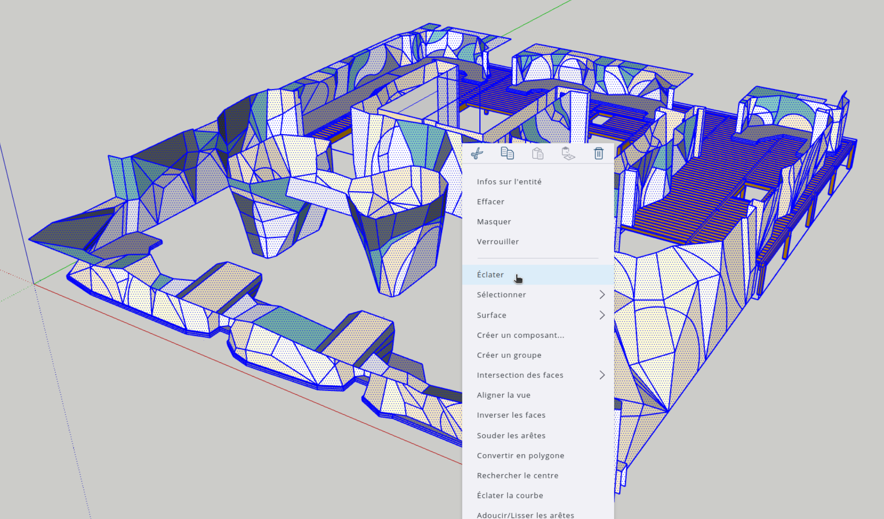](../../../assets/images/3d-purge-ecalter.png)

Répétez l'opération jusqu'à ce que SketchUp grise cette option : cela signifie que vous avez bien dégroupé tous les groupes et sous-groupes.

Vous pourrez ensuite supprimer les éléments inaccessibles ou cachés.

### Supprimer les textures

Toujours dans le but d'alléger votre modèle 3D, il faut supprimer les textures pour les remplacer par des couleurs.

Vous avez, par exemple, des tapis avec une texture ressemblant à du feutre, ou des murs en bois ? Tout cela doit être remplacé par des couleurs.

Pour gagner du temps, vous pouvez sélectionner toutes les faces ayant la même texture et les remplacer par une couleur proche en une seule fois.

{: .images }
[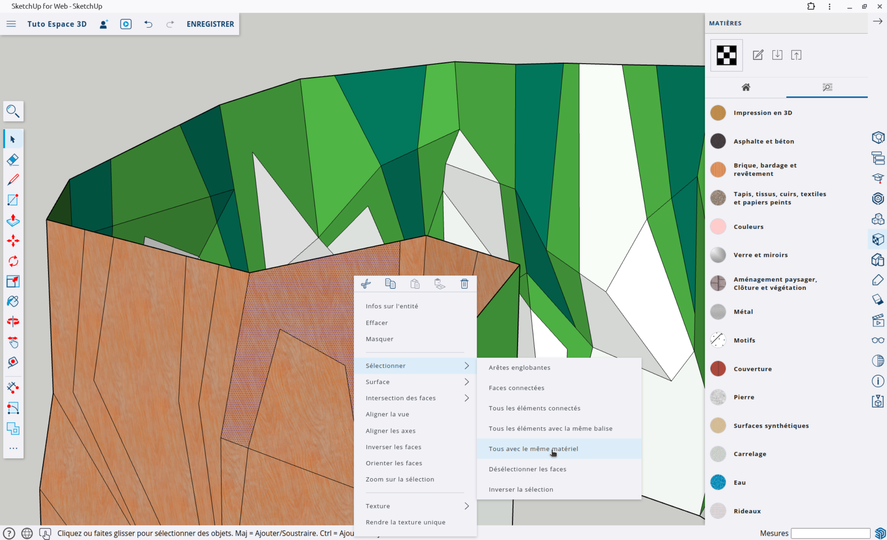](../../../assets/images/sketchup-selectionner-texture.png)

### Fusionner les arêtes

Dernière étape de l'allègement de votre modèle 3D : souder les arêtes.

Pour réduire le nombre d'arêtes de votre modèle et obtenir un rendu plus propre sur Oblyk, il faut souder les arêtes !  

_Heureusement, c'est très simple 🙂_

Sélectionnez tout (`Ctrl + A`), faites un clic droit et choisissez "Souder les arêtes".

{: .images }
[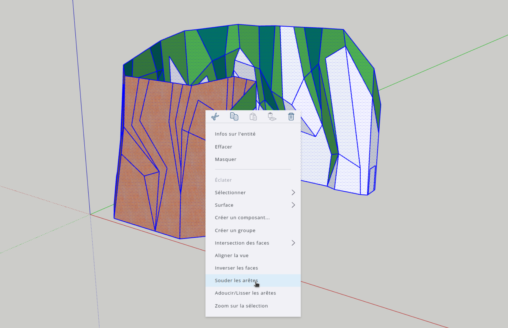](../../../assets/images/sketchup-souder-les-aretes.png)

Notre allègement est terminé !  
Voici à quoi pourrait ressembler votre salle avant et après l'avoir "purgée".

**Avant la purge des éléments inutiles :**

{: .images }
[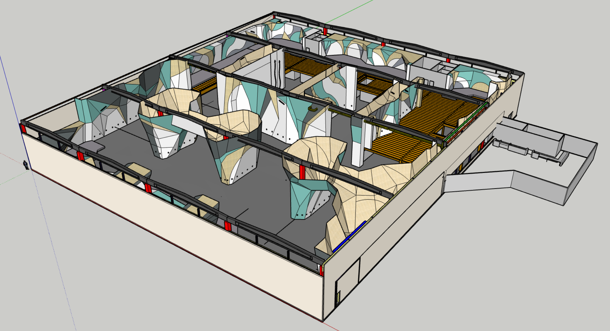](../../../assets/images/3d-purge-avant.png)

**Après la purge :**

{: .images }
[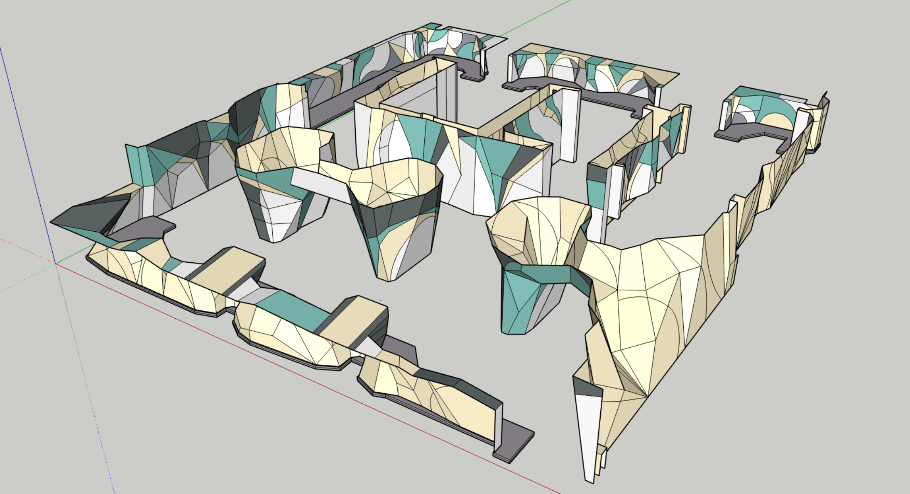](../../../assets/images/3d-purge-apres.png)

## Étape 3 : Un fichier par espace

Maintenant que vous avez purgé votre salle des éléments en trop, supprimé les textures et fusionné les arêtes,  
vous devez créer un fichier 3D par espace que vous souhaitez importer sur Oblyk.

Par exemple, pour une salle avec un espace de bloc et un espace de voie, copiez-collez votre bloc dans un autre fichier et enregistrez-le.  
Faites de même pour votre espace de voie.

{: .images }
[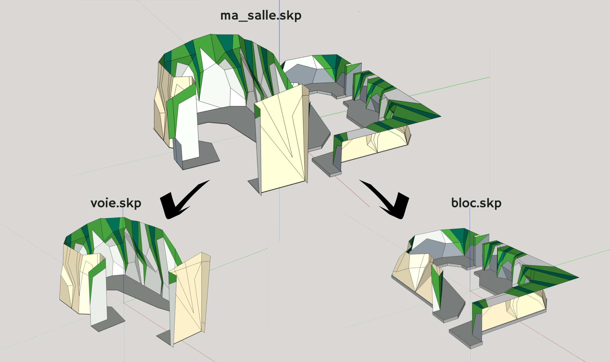](../../../assets/images/sketchup-division.png)

## Étape 4 : Exporter vos fichiers 3D

Pour importer les 3D comme espace sur Oblyk, il faut d'abord les exporter au format `.obj` depuis SketchUp.  
Malheureusement, cette fonctionnalité est payante sur SketchUp. Vous pouvez profiter de l'essai gratuit de 7 jours pour faire vos exports, ou nous envoyer vos fichiers `.skp`, nous ferons l'export pour vous.

Pour faire l'export, allez dans : _Menu / Exporter / OBJ_

- [X] Cochez "Permuter les coordonnées YX (Z vertical)"  
- Choisissez "m" dans "Unités"  
- [X] Cochez "Trianguler toutes les faces"  
- [X] Cochez "Exporter les faces recto verso"  
- [ ] Décochez "Exporter les arêtes"  
- [ ] Décochez "Exporter les placages de texture"

{: .images }
[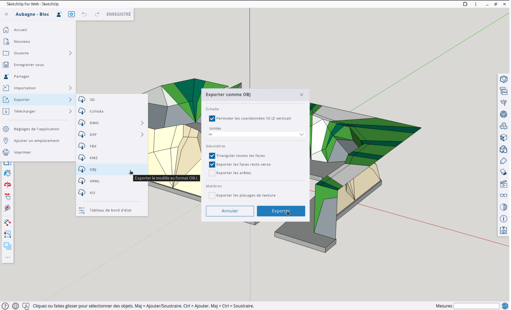](../../../assets/images/sketchup-export-obj.png)

## Étape 5 : Importer votre fichier sur Oblyk

Maintenant que vous avez exporté vos espaces depuis SketchUp, nous pouvons les importer sur vos espaces.

Voici comment procéder :

Quand vous vous rendez sur un espace, vous devriez voir un message vous invitant à importer votre fichier 3D.

{: .images }
[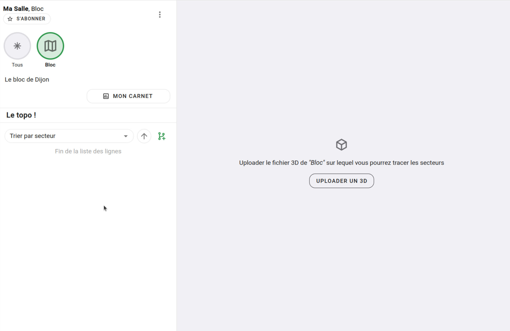](../../../assets/images/import_3d_page_espace.png)

Cliquez sur **UPLOADER UN 3D**, puis sélectionnez le fichier `.obj.zip` que vous avez précédemment exporté.

**Note :** si Oblyk vous propose d'uploader un plan (une image), c'est que votre espace est paramétré en 2D.  
Modifiez-le et choisissez **3D** dans le type de représentation.

## Étape 6 : Créer la miniature de votre espace

Pour pouvoir représenter votre espace à différents endroits d'Oblyk sans avoir besoin de charger le 3D, nous allons devoir faire une "capture" de votre espace.  

_Heureusement, tout est fait pour que ce soit simple !_

Sur la page de votre espace, cliquez sur les trois points verticaux puis sur "Éditeur 3D" :

{: .images }
[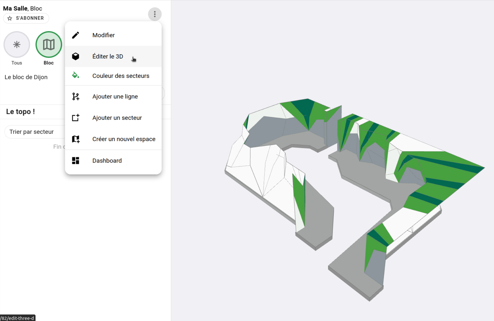](../../../assets/images/espace_3d_menu_editeur_3d.png)

De nouveau, cliquez sur les trois points verticaux, puis sur "Faire la miniature" :

{: .images }

Vous arriverez sur une interface dédiée à la prise de cette fameuse miniature.

Placez votre espace dans le cadre pour qu'il présente son meilleur profil, bien centré et le plus grand possible.  
Puis cliquez sur l'icône d'appareil photo en bas à droite du cadre.

**Astuce :** zoomez avec la molette de votre souris, faites tourner votre espace en cliquant et glissant, déplacez votre espace horizontalement ou verticalement en maintenant `[Ctrl]` et en glissant la scène avec votre souris.

{: .images }
[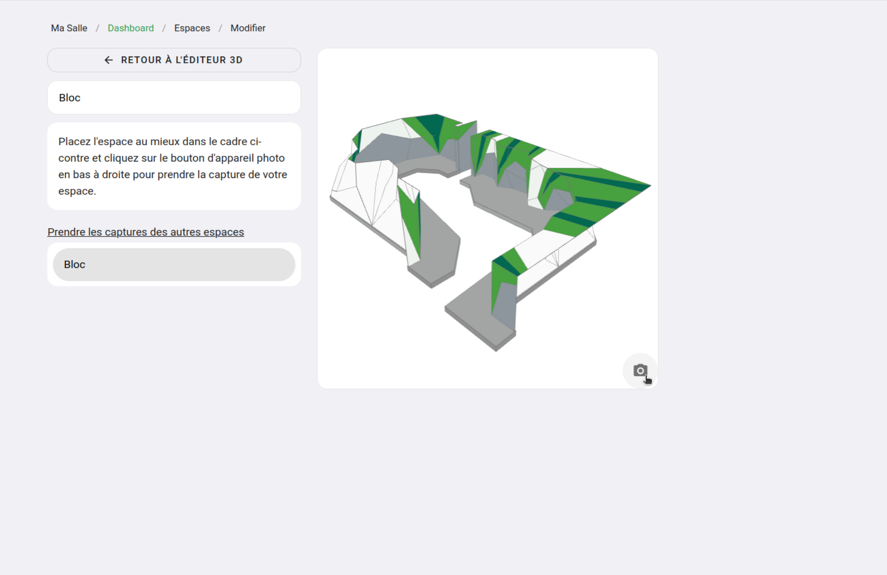](../../../assets/images/espace_3d_faire_la_miniature.png)

Et voilà !  
Nous avons (entre autres) notre petite miniature dans le sélecteur d'espaces :

{: .images }
[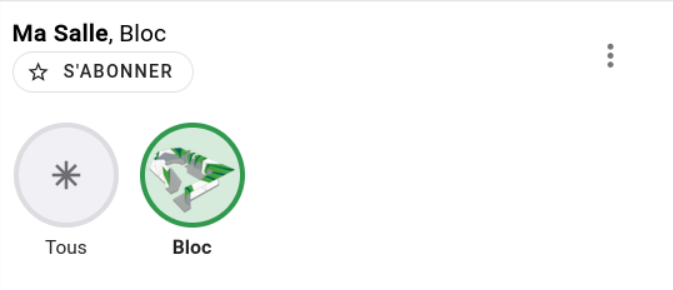](../../../assets/images/selecteur_espaces.png)

## Étape 7 : Placer vos espaces dans votre salle _(si vous avez plusieurs espaces)_

Si vous avez plusieurs espaces, nous avons une étape de plus à faire pour que votre salle rende bien !

Puisque vous importez les espaces un par un, nous devons les replacer les uns par rapport aux autres.

Par exemple, j'ai ajouté l'espace de voie et l'espace de bloc à ma salle, et évidemment, dans la vue d'ensemble, les deux espaces se superposent :

{: .images }
[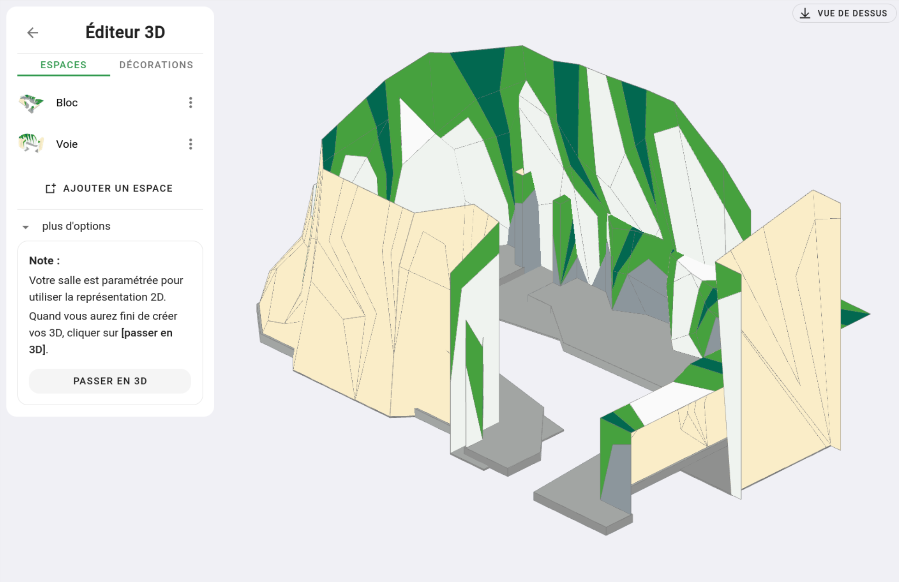](../../../assets/images/espace_3d_supperposition.png)

Pour arranger vos espaces, cliquez sur celui que vous souhaitez déplacer et glissez-le à sa bonne place.  
Puis sauvegardez.

Un exemple en vidéo vous aidera :

<video class="videos" controls loop autoplay>
  <source src="../../../assets/videos/espaces_3d_placer_les_espaces.webm" type="video/webm" />
</video>

**Astuce :** passez en vue de dessus pour bien vous rendre compte de la position de vos espaces.

## Conclusion

Nous avons vu comment nettoyer vos fichiers SketchUp, les exporter et les importer sur Oblyk, faire la miniature et placer vos espaces les uns par rapport aux autres.

Il ne reste plus qu'à tracer les secteurs !  
C'est ce que nous verrons dans la partie sur les secteurs 🙂

{: .text-right }
[Les secteurs](../secteur){: .btn }
