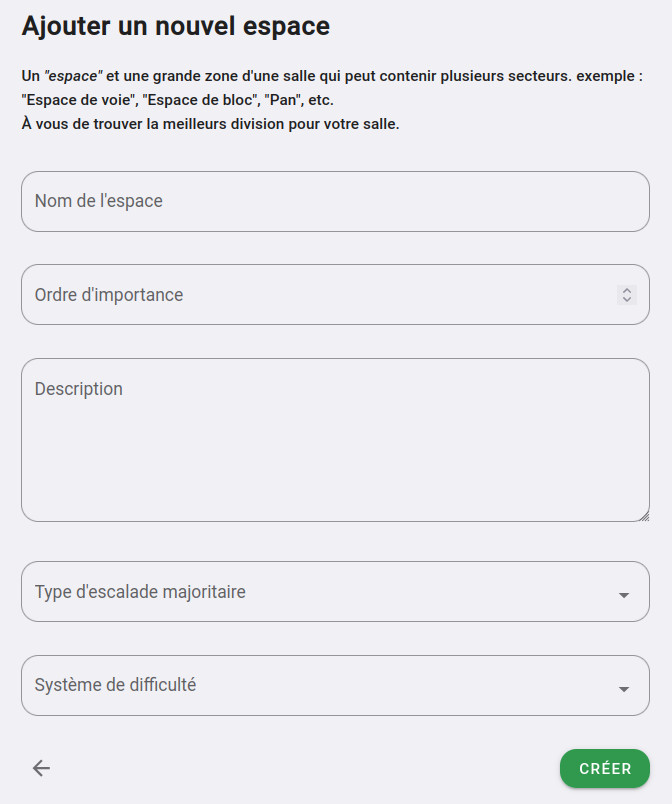

# Créer un espace

Pour créer un espace, rendez-vous sur l'espace d'administration de votre salle (section "Mes salles" dans le menu de gauche)

Cliquez sur **"+ Nouvel espace"**

Vous arriverez sur un formulaire telle que celui-ci :

{: .images }

Ce formulaire contient les champs suivants :

**Nom**  
Le nom que vous voulez donner à l'espace, il sera visible par vos grimpeurs et grimpeuses

**Ordre d'importance**  
Ça sera l'ordre par défaut de l'affichage de vos espaces, vous pouvez donner "1" pour le plus important ou un autre ordre qui vous semble logique.

**Description**  
La description est affiché sur la page de votre espace, elle est prévue pour résumer brièvement l'Espace.

**Type d'escalade majoritaire**  
Par défaut les secteurs au sien de votre espace seront du style que vous choisissez là, et les voies ou blocs aussi.

**Système de difficulté**  
Choisissez le système de difficulté qui correspond le mieux aux voies et blocs que vous allez créer dans cet espace.

Consulté la section ["Système de difficulté"](../systeme-de-difficulte) pour plus d'information sur les systèmes de difficulté.

{: .text-right }
[Ajouter un plan à votre espace](le-plan-d-un-espace){: .btn }