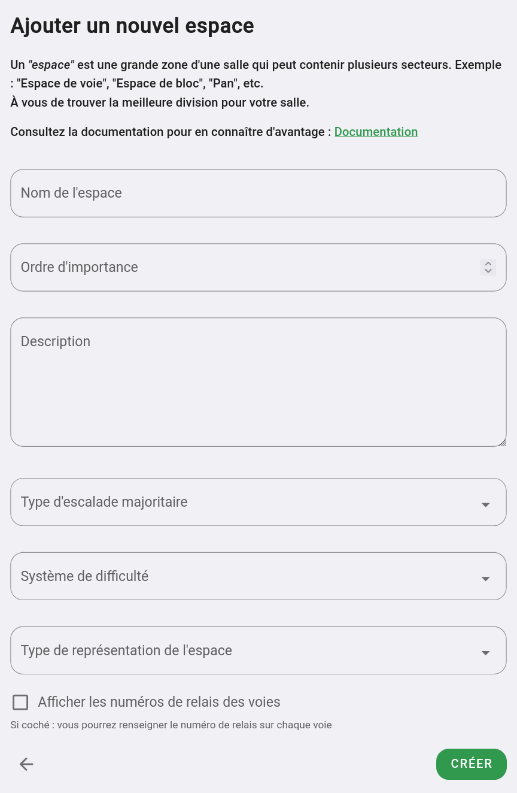

# Créer un espace

Pour créer un espace, rendez-vous sur l'espace d'administration de votre salle (section "Mes salles" dans le menu de gauche).

Cliquez sur **"+ Nouvel espace"**.

Vous arriverez sur un formulaire tel que celui-ci :

{: .images }

Ce formulaire contient les champs suivants :

**Nom**  
Le nom que vous voulez donner à l'espace, il sera visible par vos grimpeurs et grimpeuses.

**Ordre d'importance**  
Ce sera l'ordre par défaut de l'affichage de vos espaces. Vous pouvez donner "1" pour le plus important, ou un autre ordre qui vous semble logique.

**Description**  
La description est affichée sur la page de votre espace, elle est prévue pour résumer brièvement l'espace.

**Type d'escalade majoritaire**  
Par défaut, les secteurs au sein de votre espace seront du style que vous choisissez ici, et les voies ou blocs également.

**Système de difficulté**  
Choisissez le système de difficulté qui correspond le mieux aux voies et blocs que vous allez créer dans cet espace.

**Type de représentation de l'espace**  
Choisissez si vous voulez importer une image pour représenter votre espace ou un fichier 3D.

**Afficher les numéros de relais des voies**  
Dans le cas d'un espace de voie, vous pouvez choisir ici si vous voulez renseigner, par voie, son numéro de relais (recommandé).

Consultez la section ["Système de difficulté"](../systeme-de-difficulte) pour plus d'informations sur les systèmes de difficulté.

Une fois votre espace créé, vous avez deux solutions pour le représenter. 

{: .text-right }
[Deux solutions pour représenter mon espace](representation-d-un-espace){: .btn }
