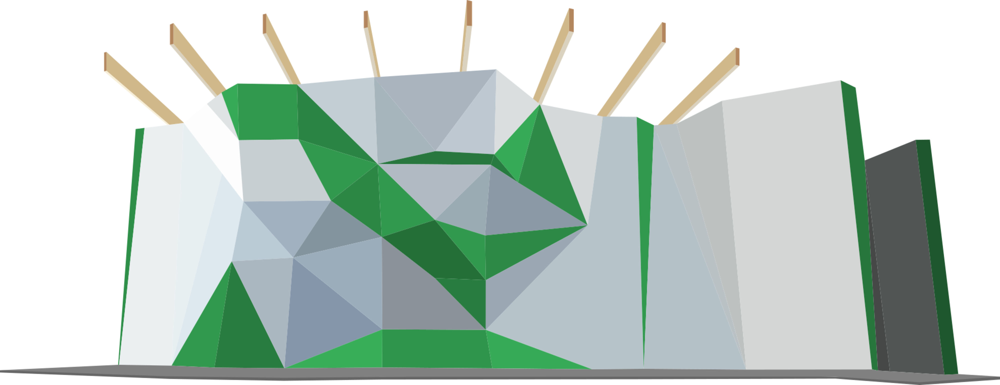
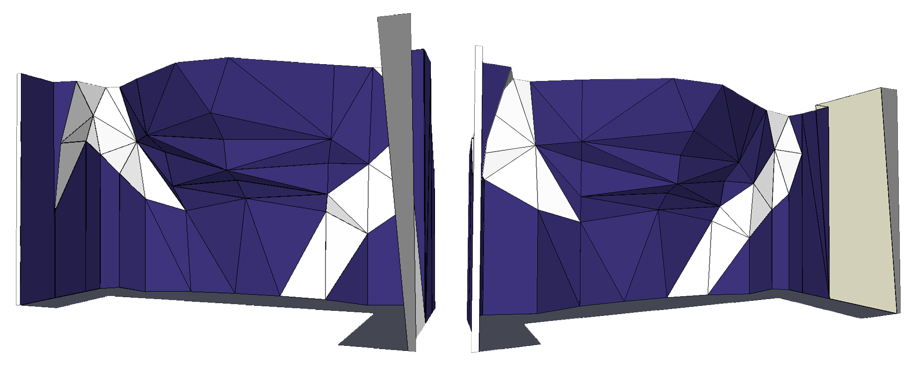
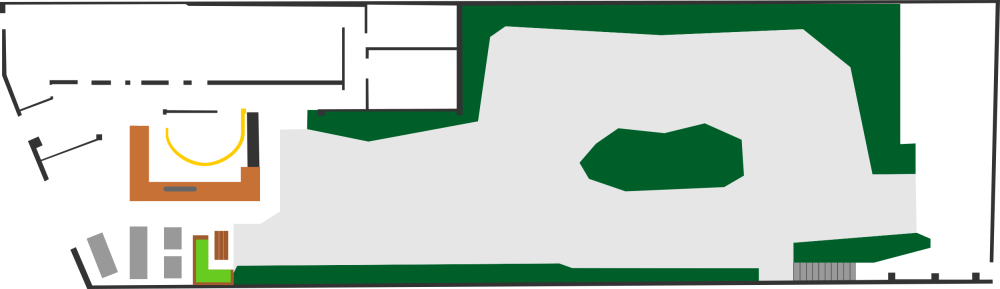

# Le plan 2D d'un espace

Le plan d'un espace est une image qui représente votre espace, ça sera le support pour tracer les différents secteurs de votre espace.

Le fait que vous puissiez télécharger une image pour représenter votre espace vous donne une très grande liberté dans la représentation de votre espace d'escalade.  
Le problème est qu'il vous incombe de créer cette image.

Pour inspiration, voici quelques exemples d'espace créé par d'autre salle :  
_(cliquez pour agrandir les images)_

{: .images .side-by-side .no-shadow }

Comme vous pouvez le voir vous pouvez représenter vos espaces de différentes manières, vue de face, vue de dessus, de deux vues sur le même plan.

Pour créer cette image vous pouvez :
- Si vous avez assez de recul vous pouvez prendre une photo de vos murs et les retravailler sur un logiciel de dessin _(méthode utilisée sur le premier exemple)_ ;
- Vous pouvez demander au constructeur de votre mur de vous fournir les plans 3D de votre structure. Vous pourrez faire des captures de ce mur _(méthode utilisée pour la deuxième capture)_ ;
- Vous pouvez partir du plan d'évacuation de votre salle pour faire un plan vu de dessus _(méthode utilisée pour la troisième capture)_ ;
- Vous pouvez faire un croquis à main levé ou via un logiciel de dessin si vous avez cette compétence.

{: .alert .info }
N'hésitez pas à nous [contacter](https://oblyk.org) si vous avez besoin d'aide sur cette partie. Nous serons ravis de vous aider ou vous conseiller sur la création de votre plan.

Une fois l'image de votre plan faite vous pouvez l'uploader sur l'espace. Allez sur l'espace en question, si vous n'avez pas encore téléchargé de plan vous aurez un encart sur la partie droite, sinon allez dans les 3 points verticaux à droite du nom de l'espace.

{: .text-right }
[Les secteurs](../secteur){: .btn }

