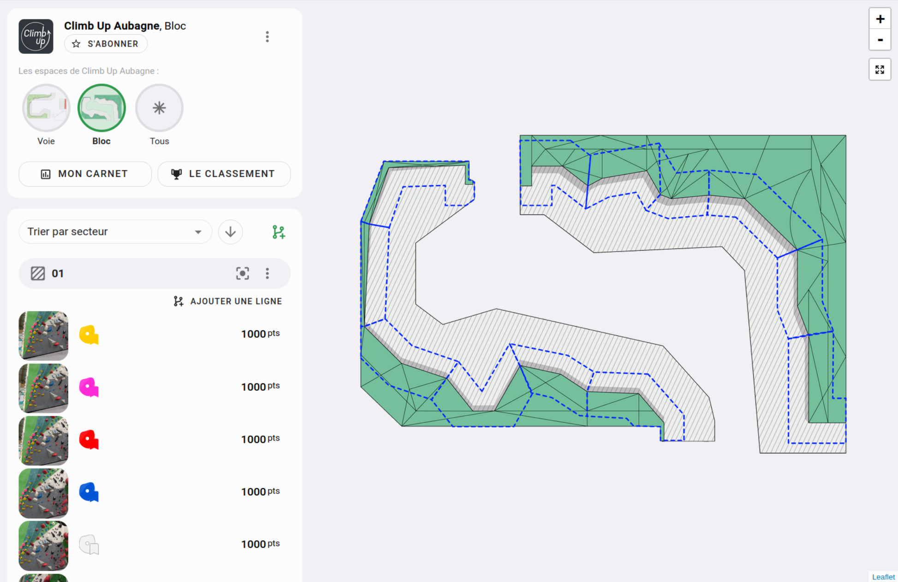

# Deux types de représentation d'un espace

Pour représenter votre espace, vous avez deux solutions :

## Solution 1 : Une image

Vous téléchargez une **image** sur laquelle vous pourrez tracer vos secteurs.

_Exemple :_

{: .images }

{: .text-right }
[Représenter mon espace sur une image !](le-plan-d-un-espace){: .btn }

## Solution 2 : Un fichier 3D

Vous téléchargez un **fichier 3D** issue de Sketchup (par exemple) sur lequel vous pourrez tracer vos secteurs.

_Exemple :_

<video class="videos" controls loop autoplay>
  <source src="../../../assets/videos/exemple-salle-3d.webm" type="video/webm" />
</video>

{: .text-right }
[Créer mon espace en 3D !](creer-mon-espace-en-3d){: .btn }

**Note**

Vous pouvez passer de l'un à l'autre à tout moment.
