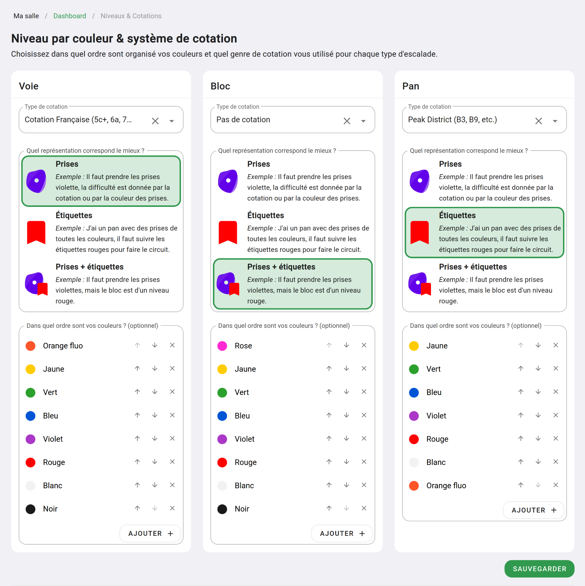
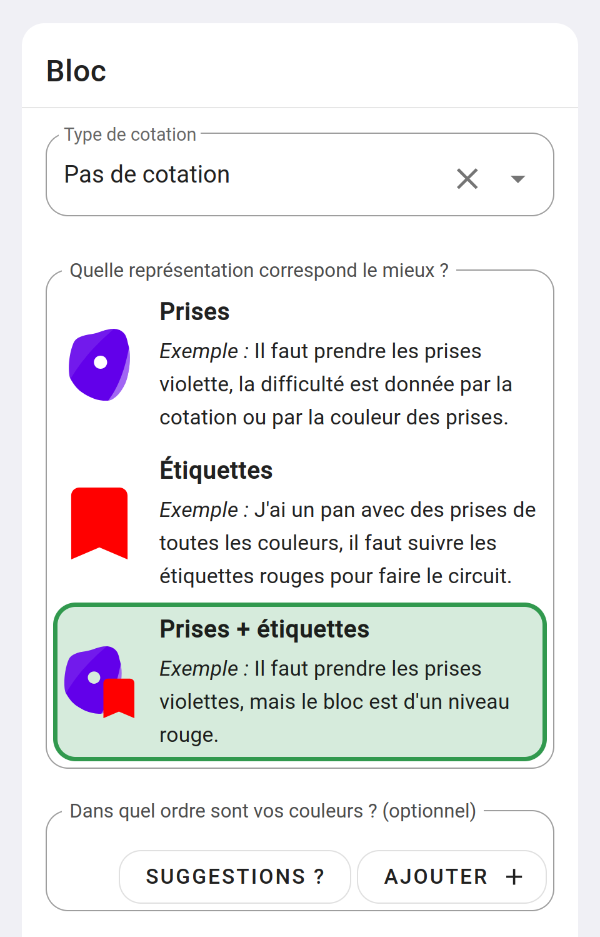
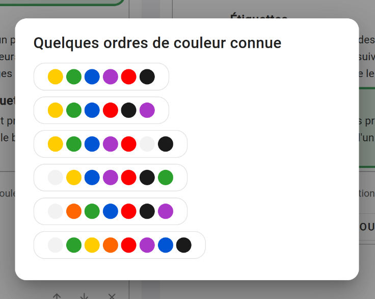

# Les niveaux et cotations

Pour chaque typologie d'escalade dans votre salle _(voie, bloc et pan/traversée)_, vous pouvez décider de l'ordre des couleurs pour vos niveaux, quel genre de cotations vous utilisez et comment sont représenté vos voies ou bloc sur votre topo.

Pour paramétrer les niveaux et cotations rendez-vous sur votre espace d'administration _(partie "Mes salles" dans le menu de gauche)_  
Cliquer sur le bouton **"Niveaux & Cotations"**.

Vous tomberez sur cette page, ou vous pouvez choisir pour chaque type d'escalade comment fonctionne les niveaux de difficultés de votre salle.

{: .images }

Pour chaque type d'escalade, vous pouvez choisir les éléments suivants :

**Type de cotation :**  
Quel genre de cotation utilisez-vous pour vos voies, blocs ou traversé ? Cotation française : 7a, 6b+, etc. Cotation Anglaise B1, B2, etc. ou pas de cotation ?

**Quelle représentation correspond le mieux ?**
Comment est-ce qu'un grimpeur ou grimpeuse comprend comment faire votre voie :    
- Il faut suivre la couleur des prises ?
- Il faut suivre les étiquettes ? _(comme un circuit dans un pan)_
- Il faut suivre les prises, mais c'est l'étiquette qui donne la difficulté de la voie

**Ordre des couleurs :**  
Si vous utilisez des couleurs d'étiquettes ou la couleur des prises pour donner la difficulté d'une voie ou d'un bloc, c'est ici que vous pouvez les paramétrer.

Vous avez le chois d'ajouter vos couleurs une à une :

{: .images }

Mais vous pouvez aussi cliquer sur "Suggestions ?" pour partir d'un ordre de couleurs souvent utilisé dans d'autres salles :

{: .images }

Une fois que vous avez paramétré vos niveaux et cotations, vous pouvez passer au paramétrage des classements !

{: .text-right }
[Les systèmes de classement](../systeme-de-classement){: .btn }