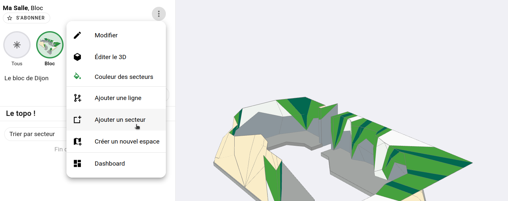
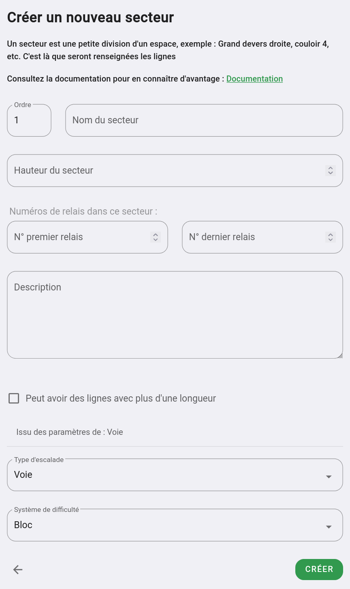

# Créer un secteur

Pour créer un secteur, rendez-vous sur l'espace dans lequel vous voulez créer un secteur.

Dans le menu à droite du nom de l'espace (représenté par 3 points verticaux)

Cliquez sur "Ajouter un secteur"

{: .images }

Vous arriverez sur un formulaire telle que celui-ci :

{: .images }

Ce formulaire contient les champs suivants :

**Nom**  
Le nom que vous voulez donner au secteur, il sera visible par vos grimpeurs et grimpeuses.

**Hauteur du secteur**  
La hauteur en mètre du secteur. Cette donnée sera utile pour le carnet de croix de vos grimpeurs et grimpeuses.

**Numéros des relais dans ce secteur**  
Ces champs s'affichent uniquement si vous avez choisi d'afficher les numéros de relais dans votre espace.  
Vous pouvez ici stipuler le numéro du premier et dernier relais de votre secteur. Au moment de renseigner vos voies, oblyk vous suggéra les bons relais.

**Description**  
La description est informative. Elle n'est pour l'instant pas affiché à vos grimpeurs et grimpeuses.

**Peut avoir des lignes de plusieurs longueurs**  
Si le secteur que vous êtes en train de créer peut comporter des voies de plusieurs longueurs, cochez cette case. Vous aurez des options supplémentaires pour créer des voies de plusieurs longueurs lors de l'ajout de vos lignes. 

**Type d'escalade et système de difficulté**  
Ces deux paramètres sont issus du paramétrage que vous avez fait au niveau de l'espace, vous aurez sûrement pas besoin de les changer.

**Prochaine étape :** tracer les secteurs sur votre plan ou sur votre modèle 3D. 

{: .text-right }
[Tracer un secteur](tracer-un-secteur){: .btn }