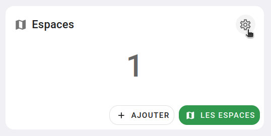
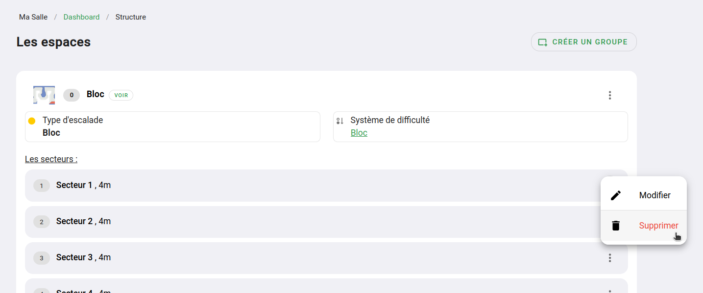

# Supprimer un secteur

La suppression d'un secteur et volontairement indisponible dans les options d'un secteur,
telle que _'Démonter les lignes'_, _'Tracer le secteur sur le plan'_, etc.
Notamment pour éviter les mauvaises manipulations et
parce que c'est une fonction dont vous avez besoin uniquement lors de la phase de création de votre topo.

Pour supprimer un secteur il faut vous rendre sur la page de gestion de vos espaces et secteurs, qui est accessible via
l'icône d'engrenage dans la boîte "Espace" de votre interface d'administration.

{: .images }

{: .text-center }
_L'icône en haut à droite de la boîte 'Espaces'_

Une fois sur la page de gestion des espaces et secteurs, trouver le bouton avec trois points verticaux à côté du secteur à supprimer. 
Vous aurez l'option de suppression du secteur dans ce menu.

{: .images }

