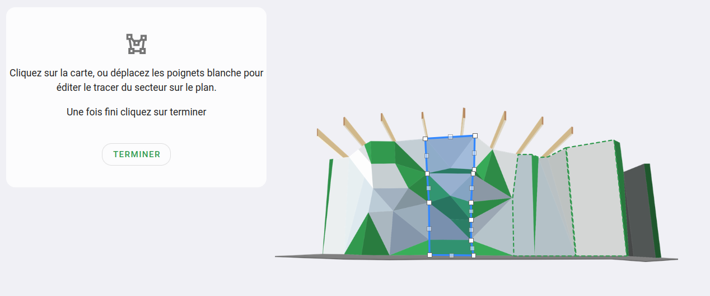

# Tracer un secteur 2D sur le plan

{: .alert .info }
Si votre topo est en 3D, cette page ne vous concerne pas, rendez-vous sur le [tracé des secteurs en 3D](tracer-un-secteur-3d) !

Après avoir créé votre secteur, vous pouvez le dessiner sur votre plan. Cela permet aux grimpeuses et grimpeurs de situer rapidement où se situe une voie ou voir les voies depuis un secteur.  

Pour tracer un secteur sur un plan, rendez-vous sur l'espace où se trouve votre secteur : 
- triez vos voies par secteur ;
- cliquez sur le menu à droite du nom d'un secteur (représenter par 3 points verticaux)
- cliquez sur **"Tracer le secteur sur le plan"**

{: .images }

Vous arriverez sur une interface comme celle-ci :

{: .images }

Cliquez sur les angles de votre secteur pour le dessiner sur le plan

{: .images }

{: .alert .info }
**Astuce :** Pour être plus précis vous pouvez zoom avec la roulette de votre souris ou utiliser le + / - en haut de l'écran à droite.  

Continuer le tracer jusqu'à avoir la forme désirée.

{: .images }

**Astuce pour modifier le tracer de votre secteur :** 
- vous pouvez déplacer les carrés blancs opaques pour ajuster un point ;
- vous pouvez cliquer sur les carrés semi-transparent pour ajouter un point à votre tracé ;
- vous pouvez cliquer sur un carré blanc opaque pour le supprimer.

Une fois votre tracé fini : cliquez sur **"Terminer"**

{: .text-right }
[Les voies et blocs](../voie-et-bloc){: .btn }