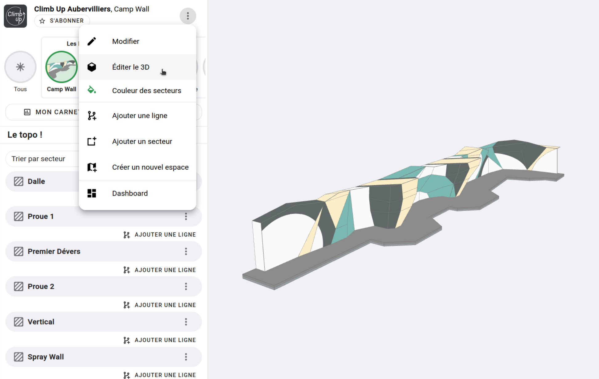

# Tracer un secteur sur un modèle 3D

{: .alert .info }
Si votre topo est en 2D, cette page ne vous concerne pas, rendez-vous sur le [tracé des secteurs en 2D](tracer-un-secteur-sur-le-plan) !

Une fois que vous avez créé vos secteurs, il faut les situer sur votre espace 3D.  
Voici comment procéder.

Rendez-vous dans l'éditeur 3D de votre espace

{: .images }

**Tracer votre premier secteur :**

Passer en vue de dessus, zoomez et déplacez votre modèle pour être correctement placé au-dessus de votre futur secteur.
Cliquez sur le secteur que vous voulez tracer dans la liste de gauche, puis cliquez sur le modèle pour délimiter votre secteur.  
Une fois que le détourage de votre secteur vous satisfait, sauvegarder.

<video class="videos" controls loop autoplay>
  <source src="../../../assets/videos/secteur-3d-1-premier-tracer.webm" type="video/webm" />
</video>

**Ajuster la hauteur de votre secteur :**

Par défaut la boîte englobante de votre secteur prend la hauteur de votre espace, vous pouvez ajuster sa hauteur en la changeant dans la boîte de gauche 

<video class="videos" controls loop autoplay>
  <source src="../../../assets/videos/secteur-3d-2-ajuster-la-hauteur.webm" type="video/webm" />
</video>

**Déplacer, ajouter, supprimer des points de votre tracé :**

Vous pouvez reprendre les points du tracer de votre secteur :
- en glissant les points rouges pour les déplacer
- en cliquant sur les points blancs pour ajouter un point
- en cliquant sur un point rouge pour le supprimer

<video class="videos" controls loop autoplay>
  <source src="../../../assets/videos/secteur-3d-3-reprendre-le-tracer.webm" type="video/webm" />
</video>

**Astuce :** Supprimer un tracé

Vous avez mis des points de partout ? votre secteur ne ressemble à rien et vous êtes perdu ?  
Supprimer le tracé de votre secteur et recommencé : )

<video class="videos" controls loop autoplay>
  <source src="../../../assets/videos/secteur-3d-4-supprimer-un-tracer.webm" type="video/webm" />
</video>

Tracer tous vos secteurs, prenez votre temps, vous le ferez qu'une fois : )  
Dans la prochaine étape, nous verrons comment ajouter les voies et blocs de votre salle !

{: .text-right }
[Les voies et blocs](../voie-et-bloc){: .btn }