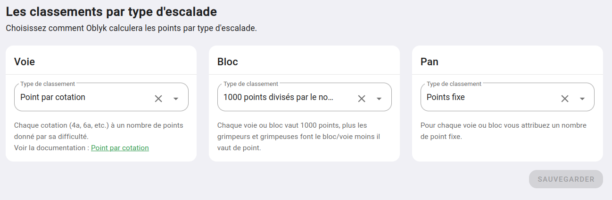
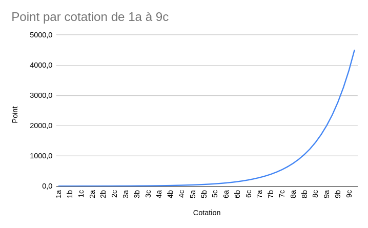

# Les systèmes de classement

Pour chaque typologie d'escalade dans votre salle _(voie, bloc et pan/traversée)_, vous pouvez décider de comment Oblyk réalisera le classement mensuel de vos grimpeurs et grimpeuses.

Pour paramétrer les systèmes de classement rendez-vous sur votre espace d'administration _(partie "Mes salles" dans le menu de gauche)_  
Cliquer sur le bouton **"Les classements"**.

Vous tomberez sur cette page, ou vous pouvez choisir pour chaque type d'escalade la méthodologie de calcul de point que vous souhaitez.

{: .images }

**1000 points divisés par le nombre d'ascensions :**  
Chaque voie, bloc ou pan vaut 1000 points, plus cette ligne est répétée, moins elle vaut de point, exemple :
- 0 ou une ascension : 1000 points
- 2 ascensions : 500 points
- 3 ascensions : 333 points
- 4 ascensions : 250 points
- etc.

C'est le système le plus couramment utilisé pour le **bloc** 

**Point par cotation :**  
Suivant la cotation d'une voie (4a, 6a+, 7b, etc.) un nombre de points défini lui est attribué.  
Ce nombre de points suit un schéma exponentiel, ainsi un 1a vaut 1 point, un 9a vaut 2000 points.

{: .images }

**Points fixed :**  
Vous choisissez de ne pas utiliser l'un des systèmes précédents et il vous sera demander de donner un nombre de points à chaque voie/bloc que vous ajoutez à votre topo.  
(Vous pouvez donner un nombre de points par niveau dans votre système de difficulté pour préfixer une valeur par rapport à vos couleurs de prises ou d'étiquettes)

{: .text-right }
[Les espaces](../espace){: .btn }