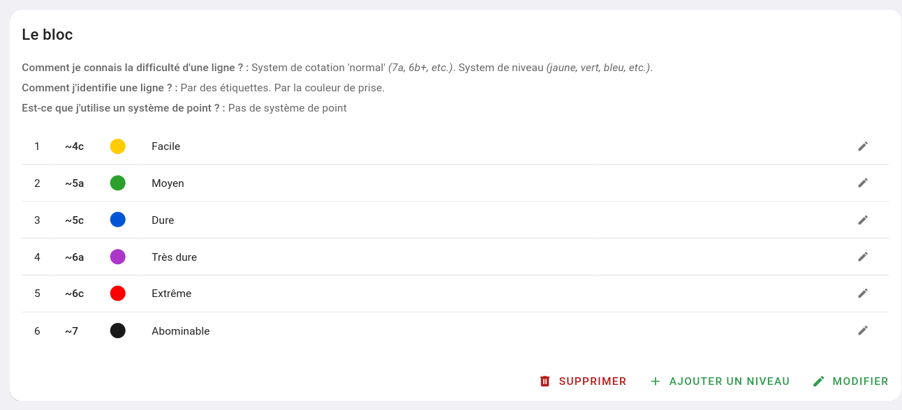
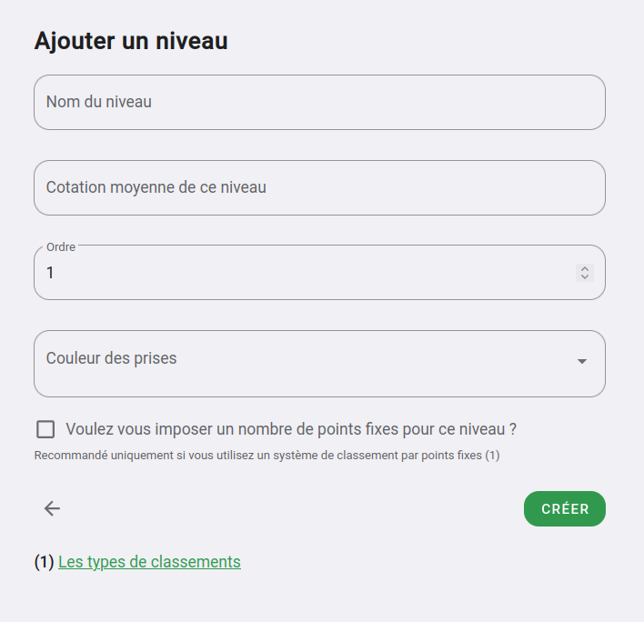

# Les niveaux au sien de mon système de difficulté

Maintenant que vous avez établie le fonctionnement général de votre système de difficulté, vous allez pouvoir créer les niveaux que contient votre système.

{: .alert .info }
Si vos couleurs d'étiquettes ou de prises ne représentent pas la difficulté, vous n'avez pas besoin de créer un des niveaux de difficultés.

Les niveaux vous permettent de définir dans quel ordre fonctionnent vos couleurs, mais aussi de donner une cotation pour chaque couleur (et ainsi gagner du temps lors du renseignement de vos voies)

Exemple d'un système configuré avec des niveaux.

{: .images }

Pour ajouter un niveau de difficulté, aller dans sur le système en question et cliquez sur **"Ajouter un niveau de difficulté""**

Vous verrez ce formulaire :

{: .images }

**Nom :**  
Donner un nom comme qui correspond par exemple à la difficulté, exemple : facile, moyen, dure, etc.

**Cotation moyenne :**  
Vous pouvez donner une cotation par défaut à ce niveau, si par exemple vos voies violettes sont généralement des 6a, renseigner 6a.  
Ainsi quand vous renseignerez une voie de niveau violet, la cotation sera près renseignée, vous aurez plus qu'à l'ajuster.

**Ordre :**  
L'ordre au sien de votre système. Le plus facile sera 1, puis 2, et ainsi de suite

**Couleur des prises / étiquette :**  
Donnez la couleur de prise, ou d'étiquette que vous utilisez pour indiquer ce niveau.

**Imposer un nombre de points :**  
Oblyk peut classer vos grimpeurs suivant plusieurs types de classement, comme : chaque bloc vaut 1000pt divisé par le nombre d'ascensions, un nombre de points par rapport à la cotation, etc.  
Mais vous pouvez décider de créer vous-même un système en donnant arbitrairement un nombre de points lié au niveau que vous êtes en train de créer.

{: .text-right }
[Les systèmes de classement](../systeme-de-classement){: .btn }