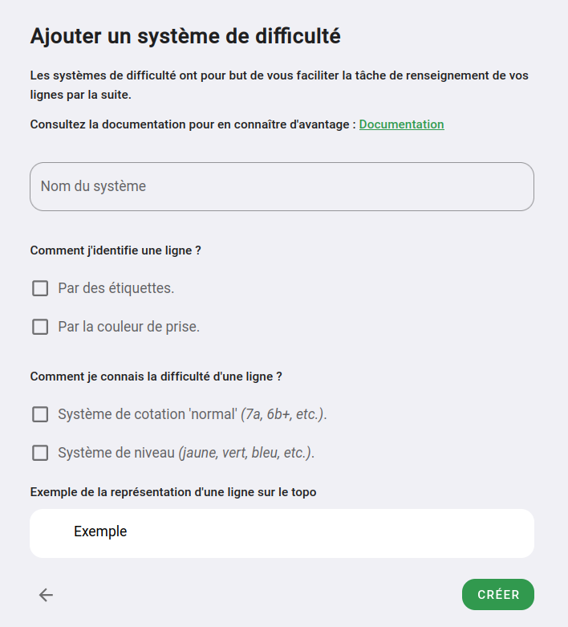

# Créer un système de difficulté

Pour créer un système de difficulté rendez-vous sur votre espace d'administration _(partie "Mes salles" dans le menu de gauche)_  
Cliquer sur le bouton **"Les systèmes"**, puis **"+ Ajouter un système"**

Voici comme se présente le formulaire de création :

{: .images }

## Nom
Le nom du système est informatif, il vous permet de l'identifier, il n'est pas affiché à vos grimpeurs / grimpeuses

## Comment j'identifie une ligne
En tant que grimpeur comment je sais quelles prises prendre pour faire le bloc / voie.

- Les prises ont la même couleur au sein la ligne (presque toujours le cas hormis dans les traversés sur le pan)  
  👉 Dans ce cas cocher **"Couleur des prises"**

- S'il y a des étiquettes pour marquer les prises à prendre, ou sur le départ des blocs / voies  
  👉 Cochez **"Par des étiquettes"**  
  _(si les étiquettes sont toujours de la même couleur que les prises, vous pouvez ne pas cocher cette option)_

## Comment je connais la difficulté d'une ligne
En tant que grimpeur / grimpeuse, quand j'arrive dans votre salle, comment je repère qu'une voie est plus dure d'une autre :

- parce qu'une cotation type '5c, 6a, 7a' est donnée pour les voies / blocs.  
  👉 Dans ce cas cocher **"Système de cotation normale"**

- parce que les prises ou une étiquette donne le niveau de la voie _(par exemple le bloc jaune sont plus faciles que les blocs rouges)_  
  👉 Dans ce cas, cocher **"Système de niveau"**

Vous pouvez très bien avoir les deux systèmes, avoir une couleur de prise qui donne un niveau général, et une cotation pour le niveau réel.  
Dans ce cas, cochez les deux cases.

## Est-ce que j'utilise un système de point

En complément de la difficulté donnée par la couleur de prise, les étiquettes ou la cotation, vous pouvez définir un système de point.

Nous prenons en charge 2 systèmes de points :

- Les points fixes, quand vous fait un bloc ou une voie, on vous donne un nombre établi de points pour cette ligne  
  👉 Si vous voulez utiliser ce système, cochez **"Un nombre de points fixe"**

- Les points divisés par le nombre d'ascensions. Chaque ligne vaut 1000 points, plus la ligne est grimpée, moins elle vaut de point  
  👉 Si vous voulez utiliser ce système, cochez **"1000pt / divisé par le nombre d'ascensions"**

Vous pouvez ne pas utiliser de système de point.

{: .text-right }
[Créer un niveau au sein de mon système](creer-un-niveau){: .btn }