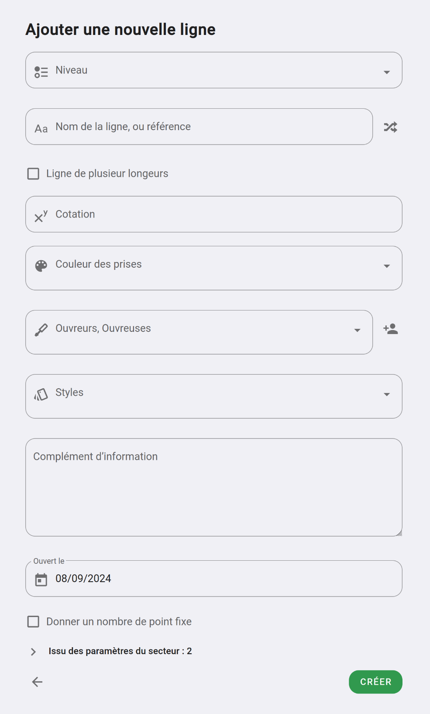

# Créer une voie ou un bloc

Pour ajouter une nouvelle voie ou bloc à un secteur, rendez-vous sur l'espace dans lequel se trouve votre secteur.

Vous pouvez cliquer sur l'icône "+" à côté du tri par ligne ou trier vos lignes par secteur pour avoir des boutons **"Ajouter une ligne"** sur chacun de vos secteurs.

{: .images }

Oblyk vous demandera de choisir le secteur sur lequel vous voulez ajouter une ligne.

{: .images }

Voici à quoi ressemble le formulaire d'ajout d'une voie :

{: .images }

{: .alert .info }
Suivant votre paramétrage de votre système de difficulté les champs peuvent être différent

Sur ce formulaire vous trouverez les champs suivants :

**Niveau :**  
Si vous avez prédéfini des niveaux dans votre système de difficulté, vos différents niveaux s'afficheront ici.  
En choisissant un niveau Oblyk préremplira pour vous les champs cotation et couleur d'étiquette et / ou de prise 

**Nom :**  
Vous pouvez donner optionnellement un nom ou une référence à votre ligne.  
Vous pouvez cliquer sur le bouton à droite du champ pour qu'Oblyk récupère un nom aléatoire parmi les 100 000 lignes outdoor que nous avons en base de donnée.  

**Ligne de plusieurs longueurs :**  
Cocher cette case si la voie fait plusieurs longueurs. Cette option est visible uniquement si vous avez défini que votre secteur peut avoir des voies de plusieurs longueurs.

**Cotation :**  
La cotation genre 6a, 5c de votre ligne.

**Couleurs de prise / couleur d'étiquette :**  
Sélectionnez la ou les couleurs des prises de la ligne.

**Ouvreurs, ouvreuses :**  
Sélectionné un ou plusieurs ouvreurs ou ouvreuses qui ont monté la ligne. Vous pouvez ajouter vos ouvreurs·euses à la volée en cliquant sur le bouton à droite du champ.

**Styles :**  
Vous pouvez donner des styles à votre ligne avec en favoris ce que vous avez paramétré dans vos styles.

**Complément d'information :**  
Vous pouvez ajouter une description à votre ligne

**Date d'ouverture :**  
Par défaut à la date du jour

Quand vous aurez créé votre ligne une fenêtre vous demandera si vous voulez ajouter une photo à cette voie, si vous voulez continuer de créer ou aller à la voie que vous venez de créer.
