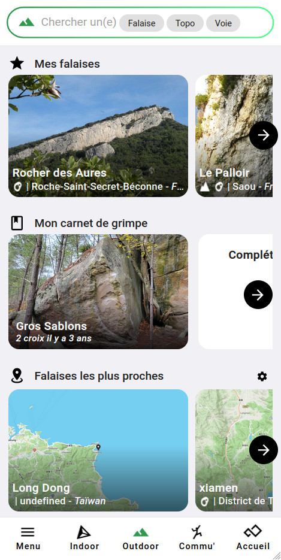
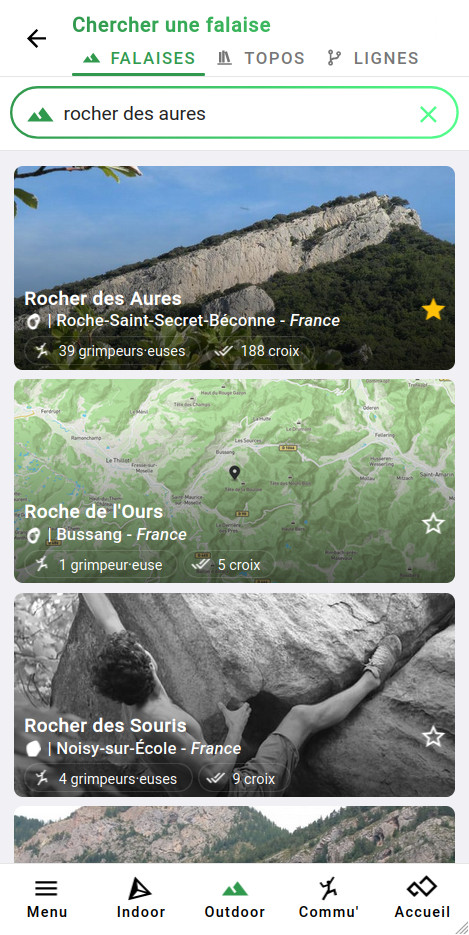
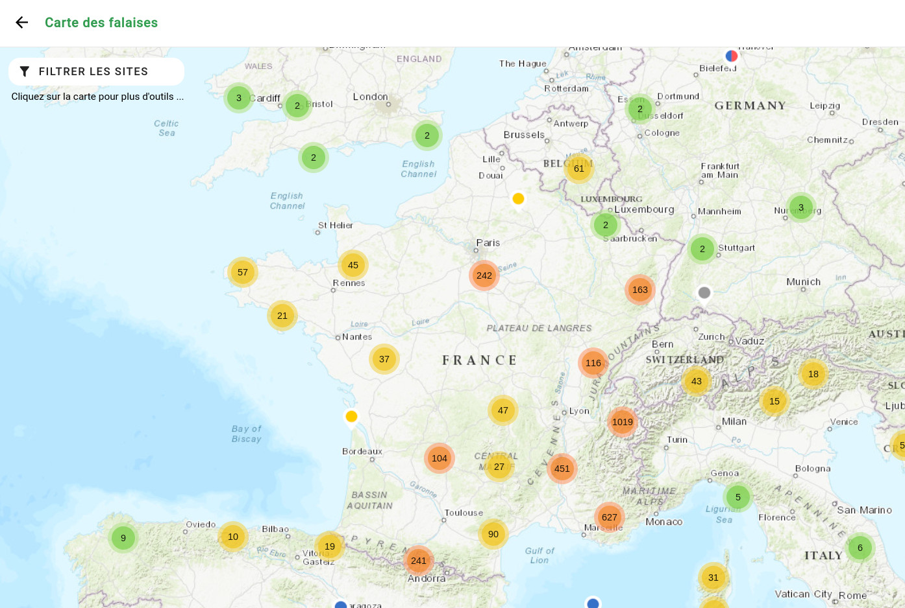
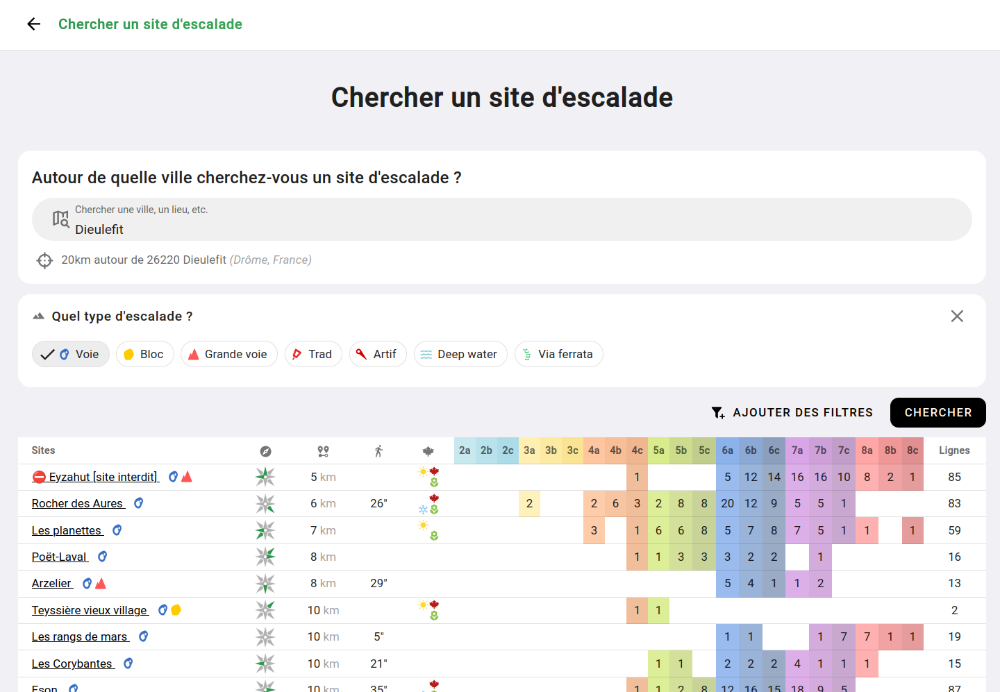
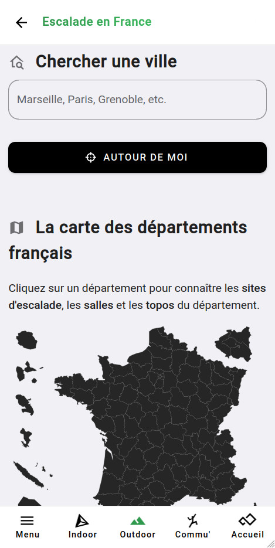

# Trouver un site naturel

Vous avez de multiple manière de trouver un site d'escalade sur Oblyk.

### La recherche

Depuis votre interface principale "Outdoor", cliquez sur le champ de recherche en haut.

{: .images }

Puis cherchez le nom de votre site.

{: .images }

## La carte des falaises.

Vous pouvez trouver tous les sites d'escalade depuis la **carte des falaises** _(accéssible depuis votre interface outdoor, ou depuis la recherche, ou dans le menu)_.  
La carte des falaises est accéssible à ce lien : [https://oblyk.org/maps/crags](https://oblyk.org/maps/crags)

{: .images }

## La recherche avancée.

Depuis votre interface outdoor, ou la recherche, ou dans le menu, rendez-vous sur la **recherche avancée**.  

Renseignez la ville autour de laquelle vous voulez faire une recherche, sélectionnez les critères de recherche que vous voulez appliquer, puis faite "Rechercher".

{: .images }

La recherche avancée est disponible à ce lien : [https://oblyk.org/crags/search](https://oblyk.org/crags/search)

## Par département et ville

Vous pouvez chercher un site d'escalade par département, puis par ville en vous rendant à ce lien : [https://oblyk.org/escalade-en/france](https://oblyk.org/escalade-en/france) 

{: .images }
