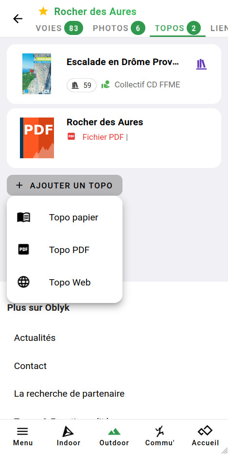
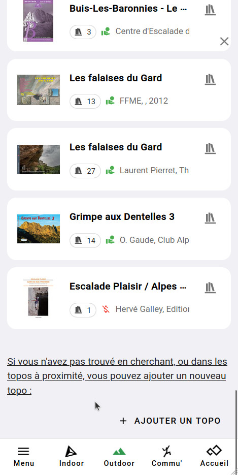
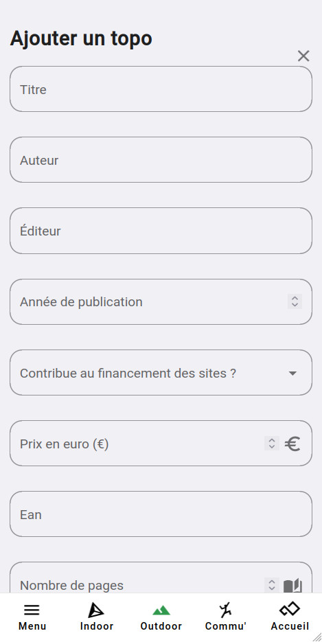

# Ajouter un topo papier à Oblyk

Voici les étapes à suivre pour ajouter un topo papier à la base d'Oblyk :

**1. Rendez-vous sur la page d'une des falaises de votre topo** _(voir : [Trouver un site](../../sites-naturels/trouver-un-site))_.  
Si la falaise n'éxiste pas, créez-la _(voir : [Ajouter un site](../../sites-naturels/ajouter-un-site))_

**2. Rendez-vous sur l'onglet _[TOPOS]_**, faite **_[AJOUTER UN TOPO]_**, puis sélectionnez l'option : **_Topo papier_**

{: .images }

**3. Oblyk vous proposera les topos proches**, vérifiez que le topo que vous souhaitez ajouter n'existe pas déjà, puis rendez-vous à la fin de la page et faite **_[+ AJOUTER UN TOPO]_**.

{: .images }

**4. Complétez les informations du topo** : titre, auteur, éditeur, etc.

{: .images }

_Qu'est-ce que l'EAN ?_  
L'EAN est le numéro sous le code bar présent sur la plus-part des topos, il est l'identifiant du topo.

**5. Une fois votre topo créé**, vous pouvez :
- Ajouter une couverture en cliquant : sur **_[CHANGER LA COUVERTURE]_** ;
- Ajouter les autres falaises présentent dans le topo en cliquant sur **_[+ AJOUTER UN SITE À CE TOPO]_** en bas de la page.

{: .text-right }
[Ajouter un topo PDF](pdf){: .btn }
