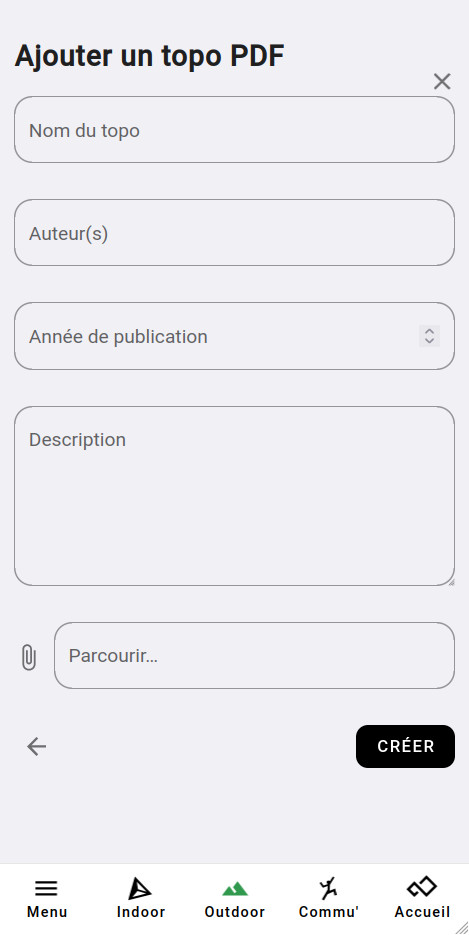

# Ajouter un topo pdf à Oblyk

Voici les étapes à suivre pour ajouter un topo PDF à un site.

**1. Rendez-vous sur la page de la falaise** sur laquelle vous voulez ajouter un topo PDF _(voir : [Trouver un site](../../sites-naturels/trouver-un-site))_.

**2. Rendez-vous sur l'onglet _[TOPOS]_**, faite **_[AJOUTER UN TOPO]_**, puis sélectionnez l'option : **_Topo PDF_**

{: .images }

**3. Complétez les infos et sélectionnez un PDF à télécharger.**

{: .images }

**4. Cliquez sur [CRÉER](){: .black-btn }**, voilà ! Vous avez ajouté un topo PDF.

{: .text-right }
[Ajouter un topo Web](web){: .btn }
